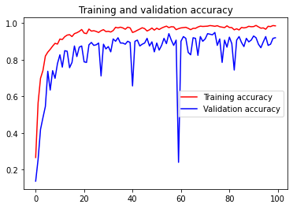
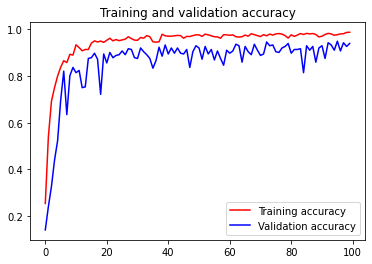
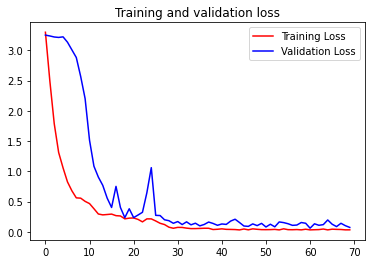

```python
import numpy as np
import pandas as pd
import matplotlib.pyplot as plt
#import seaborn as sns
import tensorflow as tf
from tensorflow import keras
from pathlib import Path
from sklearn.preprocessing import LabelEncoder
import PIL
import cv2
import os
```


```python
from tensorflow.keras.preprocessing.image import ImageDataGenerator
train_datagen = ImageDataGenerator(rotation_range=20,
    shear_range=10,
    validation_split=0.2)
```


```python
train_generator = train_datagen.flow_from_directory(
    './images/',
    target_size=(28, 28),
    batch_size = 32,
    class_mode='categorical',
    subset='training') # set as training data

val_generator = train_datagen.flow_from_directory(
    './images/', # same directory as training data
    target_size=(28, 28),
    class_mode='categorical',
    batch_size = 32,
    subset='validation')
```

    Found 1248 images belonging to 26 classes.
    Found 312 images belonging to 26 classes.
    

# Testing 1 (Using Conv2d & Flatten without dropout)


```python
from keras import backend as K
from keras import layers as L
from keras.models import Model,load_model
from keras.regularizers import l2
from keras.callbacks import ModelCheckpoint,ReduceLROnPlateau,EarlyStopping
from tensorflow.keras.optimizers import Adam,SGD
from keras import regularizers
from keras.constraints import max_norm

model_ckpt = ModelCheckpoint('BrailleNet.h5',save_best_only=True)
reduce_lr = ReduceLROnPlateau(patience=8,verbose=0)

class myCallback(tf.keras.callbacks.Callback):
    def on_epoch_end(self, epoch, logs={}):
        if(logs.get('val_accuracy') > 0.98):
            print("Validation accuracy is reach 98% cancel training")
            self.model.stop_training = True

entry = L.Input(shape=(28,28,3))
x = L.Conv2D(128,(3,3),activation='relu')(entry)
x = L.MaxPooling2D((2,2))(x)
x = L.BatchNormalization()(x)

x = L.Conv2D(256,(3,3),activation='relu')(x)
x = L.MaxPooling2D((2,2))(x)
x = L.BatchNormalization()(x)

x = L.Conv2D(512,(2,2),activation='relu')(x)
x = L.MaxPooling2D((2,2))(x)
x = L.BatchNormalization()(x)

x = L.Flatten()(x)

x = L.Dense(256)(x)
x = L.ReLU()(x)
x = L.Dense(128)(x)
x = L.ReLU()(x)
x = L.Dense(26,activation='softmax')(x)

callbacks = myCallback()
model = Model(entry,x)
model.compile(optimizer="Adam",loss='categorical_crossentropy',metrics=['accuracy'])

history = model.fit(train_generator,
                              validation_data=val_generator,
                              epochs=100,
                              callbacks=[model_ckpt,callbacks],
                              verbose=1)
```

    Epoch 1/100
    39/39 [==============================] - 8s 200ms/step - loss: 2.3975 - accuracy: 0.3173 - val_loss: 12.2094 - val_accuracy: 0.1090
    Epoch 2/100
    39/39 [==============================] - 7s 186ms/step - loss: 1.3012 - accuracy: 0.6002 - val_loss: 8.0912 - val_accuracy: 0.1763
    Epoch 3/100
    39/39 [==============================] - 7s 189ms/step - loss: 0.7999 - accuracy: 0.7492 - val_loss: 1.8555 - val_accuracy: 0.5513
    Epoch 4/100
    39/39 [==============================] - 7s 187ms/step - loss: 0.6441 - accuracy: 0.8101 - val_loss: 1.5131 - val_accuracy: 0.6635
    Epoch 5/100
    39/39 [==============================] - 7s 184ms/step - loss: 0.5333 - accuracy: 0.8341 - val_loss: 1.3657 - val_accuracy: 0.6763
    Epoch 6/100
    39/39 [==============================] - 7s 184ms/step - loss: 0.4369 - accuracy: 0.8598 - val_loss: 1.2902 - val_accuracy: 0.6923
    Epoch 7/100
    39/39 [==============================] - 8s 189ms/step - loss: 0.3317 - accuracy: 0.8998 - val_loss: 1.8814 - val_accuracy: 0.6314
    Epoch 8/100
    39/39 [==============================] - 8s 193ms/step - loss: 0.3479 - accuracy: 0.8894 - val_loss: 0.7525 - val_accuracy: 0.8173
    Epoch 9/100
    39/39 [==============================] - 7s 190ms/step - loss: 0.3392 - accuracy: 0.8886 - val_loss: 0.9275 - val_accuracy: 0.8109
    Epoch 10/100
    39/39 [==============================] - 8s 206ms/step - loss: 0.3003 - accuracy: 0.9014 - val_loss: 0.5365 - val_accuracy: 0.8526
    Epoch 11/100
    39/39 [==============================] - 8s 201ms/step - loss: 0.2447 - accuracy: 0.9279 - val_loss: 0.5602 - val_accuracy: 0.8654
    Epoch 12/100
    39/39 [==============================] - 7s 177ms/step - loss: 0.1713 - accuracy: 0.9447 - val_loss: 0.4952 - val_accuracy: 0.8814
    Epoch 13/100
    39/39 [==============================] - 6s 163ms/step - loss: 0.1991 - accuracy: 0.9431 - val_loss: 0.5904 - val_accuracy: 0.8526
    Epoch 14/100
    39/39 [==============================] - 7s 166ms/step - loss: 0.1620 - accuracy: 0.9511 - val_loss: 0.5761 - val_accuracy: 0.8718
    Epoch 15/100
    39/39 [==============================] - 7s 169ms/step - loss: 0.1648 - accuracy: 0.9479 - val_loss: 0.6880 - val_accuracy: 0.8622
    Epoch 16/100
    39/39 [==============================] - 6s 163ms/step - loss: 0.1839 - accuracy: 0.9463 - val_loss: 0.4953 - val_accuracy: 0.8814
    Epoch 17/100
    39/39 [==============================] - 6s 163ms/step - loss: 0.1470 - accuracy: 0.9527 - val_loss: 0.4282 - val_accuracy: 0.8974
    Epoch 18/100
    39/39 [==============================] - 6s 165ms/step - loss: 0.1575 - accuracy: 0.9431 - val_loss: 0.4243 - val_accuracy: 0.8942
    Epoch 19/100
    39/39 [==============================] - 6s 163ms/step - loss: 0.1490 - accuracy: 0.9495 - val_loss: 0.6458 - val_accuracy: 0.8846
    Epoch 20/100
    39/39 [==============================] - 6s 162ms/step - loss: 0.1564 - accuracy: 0.9487 - val_loss: 0.7324 - val_accuracy: 0.8590
    Epoch 21/100
    39/39 [==============================] - 6s 161ms/step - loss: 0.1739 - accuracy: 0.9447 - val_loss: 0.4314 - val_accuracy: 0.8974
    Epoch 22/100
    39/39 [==============================] - 6s 164ms/step - loss: 0.1402 - accuracy: 0.9567 - val_loss: 0.4141 - val_accuracy: 0.9167
    Epoch 23/100
    39/39 [==============================] - 6s 164ms/step - loss: 0.1066 - accuracy: 0.9671 - val_loss: 0.4318 - val_accuracy: 0.9135
    Epoch 24/100
    39/39 [==============================] - 6s 161ms/step - loss: 0.0901 - accuracy: 0.9744 - val_loss: 0.4166 - val_accuracy: 0.9135
    Epoch 25/100
    39/39 [==============================] - 6s 164ms/step - loss: 0.1747 - accuracy: 0.9519 - val_loss: 0.9988 - val_accuracy: 0.7917
    Epoch 26/100
    39/39 [==============================] - 6s 164ms/step - loss: 0.1808 - accuracy: 0.9439 - val_loss: 0.6155 - val_accuracy: 0.8462
    Epoch 27/100
    39/39 [==============================] - 6s 161ms/step - loss: 0.1705 - accuracy: 0.9511 - val_loss: 0.6051 - val_accuracy: 0.8526
    Epoch 28/100
    39/39 [==============================] - 6s 163ms/step - loss: 0.1327 - accuracy: 0.9591 - val_loss: 0.4283 - val_accuracy: 0.9006
    Epoch 29/100
    39/39 [==============================] - 6s 161ms/step - loss: 0.0775 - accuracy: 0.9760 - val_loss: 0.4587 - val_accuracy: 0.9071
    Epoch 30/100
    39/39 [==============================] - 6s 164ms/step - loss: 0.0943 - accuracy: 0.9688 - val_loss: 0.4131 - val_accuracy: 0.9231
    Epoch 31/100
    39/39 [==============================] - 7s 166ms/step - loss: 0.0799 - accuracy: 0.9736 - val_loss: 0.3632 - val_accuracy: 0.8910
    Epoch 32/100
    39/39 [==============================] - 6s 163ms/step - loss: 0.1009 - accuracy: 0.9720 - val_loss: 0.6025 - val_accuracy: 0.8494
    Epoch 33/100
    39/39 [==============================] - 7s 167ms/step - loss: 0.1145 - accuracy: 0.9615 - val_loss: 0.5177 - val_accuracy: 0.8910
    Epoch 34/100
    39/39 [==============================] - 6s 164ms/step - loss: 0.0849 - accuracy: 0.9792 - val_loss: 0.3434 - val_accuracy: 0.9167
    Epoch 35/100
    39/39 [==============================] - 6s 163ms/step - loss: 0.0801 - accuracy: 0.9736 - val_loss: 0.4225 - val_accuracy: 0.9103
    Epoch 36/100
    39/39 [==============================] - 6s 162ms/step - loss: 0.0580 - accuracy: 0.9800 - val_loss: 0.4169 - val_accuracy: 0.9263
    Epoch 37/100
    39/39 [==============================] - 7s 175ms/step - loss: 0.0760 - accuracy: 0.9744 - val_loss: 0.3671 - val_accuracy: 0.9135
    Epoch 38/100
    39/39 [==============================] - 7s 166ms/step - loss: 0.1067 - accuracy: 0.9655 - val_loss: 0.6180 - val_accuracy: 0.8654
    Epoch 39/100
    39/39 [==============================] - 7s 169ms/step - loss: 0.1434 - accuracy: 0.9575 - val_loss: 0.6624 - val_accuracy: 0.8429
    Epoch 40/100
    39/39 [==============================] - 6s 165ms/step - loss: 0.1657 - accuracy: 0.9559 - val_loss: 0.8012 - val_accuracy: 0.8558
    Epoch 41/100
    39/39 [==============================] - 6s 163ms/step - loss: 0.1379 - accuracy: 0.9599 - val_loss: 0.4810 - val_accuracy: 0.9135
    Epoch 42/100
    39/39 [==============================] - 6s 163ms/step - loss: 0.1480 - accuracy: 0.9575 - val_loss: 0.3351 - val_accuracy: 0.9167
    Epoch 43/100
    39/39 [==============================] - 6s 163ms/step - loss: 0.0612 - accuracy: 0.9800 - val_loss: 0.3298 - val_accuracy: 0.9231
    Epoch 44/100
    39/39 [==============================] - 7s 166ms/step - loss: 0.0843 - accuracy: 0.9752 - val_loss: 0.3738 - val_accuracy: 0.9071
    Epoch 45/100
    39/39 [==============================] - 7s 168ms/step - loss: 0.1335 - accuracy: 0.9623 - val_loss: 0.5404 - val_accuracy: 0.8750
    Epoch 46/100
    39/39 [==============================] - 7s 172ms/step - loss: 0.1111 - accuracy: 0.9647 - val_loss: 0.5471 - val_accuracy: 0.9006
    Epoch 47/100
    39/39 [==============================] - 6s 163ms/step - loss: 0.1078 - accuracy: 0.9720 - val_loss: 0.4941 - val_accuracy: 0.9135
    Epoch 48/100
    39/39 [==============================] - 7s 168ms/step - loss: 0.1048 - accuracy: 0.9639 - val_loss: 0.5301 - val_accuracy: 0.9038
    Epoch 49/100
    39/39 [==============================] - 8s 210ms/step - loss: 0.1164 - accuracy: 0.9631 - val_loss: 0.4127 - val_accuracy: 0.9135
    Epoch 50/100
    39/39 [==============================] - 9s 229ms/step - loss: 0.0663 - accuracy: 0.9840 - val_loss: 0.4487 - val_accuracy: 0.9231
    Epoch 51/100
    39/39 [==============================] - 8s 199ms/step - loss: 0.0470 - accuracy: 0.9808 - val_loss: 0.2598 - val_accuracy: 0.9519
    Epoch 52/100
    39/39 [==============================] - 8s 199ms/step - loss: 0.0571 - accuracy: 0.9856 - val_loss: 0.3907 - val_accuracy: 0.8942
    Epoch 53/100
    39/39 [==============================] - 8s 209ms/step - loss: 0.0963 - accuracy: 0.9712 - val_loss: 0.5617 - val_accuracy: 0.8814
    Epoch 54/100
    39/39 [==============================] - 9s 226ms/step - loss: 0.0558 - accuracy: 0.9800 - val_loss: 0.5736 - val_accuracy: 0.8910
    Epoch 55/100
    39/39 [==============================] - 8s 207ms/step - loss: 0.0942 - accuracy: 0.9696 - val_loss: 0.4746 - val_accuracy: 0.9103
    Epoch 56/100
    39/39 [==============================] - 8s 191ms/step - loss: 0.0775 - accuracy: 0.9776 - val_loss: 0.5126 - val_accuracy: 0.8942
    Epoch 57/100
    39/39 [==============================] - 8s 215ms/step - loss: 0.0550 - accuracy: 0.9840 - val_loss: 0.5019 - val_accuracy: 0.9135
    Epoch 58/100
    39/39 [==============================] - 8s 204ms/step - loss: 0.0583 - accuracy: 0.9824 - val_loss: 0.6809 - val_accuracy: 0.9071
    Epoch 59/100
    39/39 [==============================] - 9s 221ms/step - loss: 0.0898 - accuracy: 0.9712 - val_loss: 0.4504 - val_accuracy: 0.9263
    Epoch 60/100
    39/39 [==============================] - 8s 200ms/step - loss: 0.1260 - accuracy: 0.9671 - val_loss: 0.5089 - val_accuracy: 0.8942
    Epoch 61/100
    39/39 [==============================] - 7s 187ms/step - loss: 0.1080 - accuracy: 0.9671 - val_loss: 0.4661 - val_accuracy: 0.8878
    Epoch 62/100
    39/39 [==============================] - 7s 190ms/step - loss: 0.1257 - accuracy: 0.9688 - val_loss: 0.3347 - val_accuracy: 0.9231
    Epoch 63/100
    39/39 [==============================] - 7s 180ms/step - loss: 0.1167 - accuracy: 0.9728 - val_loss: 0.5219 - val_accuracy: 0.8974
    Epoch 64/100
    39/39 [==============================] - 7s 184ms/step - loss: 0.1278 - accuracy: 0.9663 - val_loss: 0.3760 - val_accuracy: 0.9167
    Epoch 65/100
    39/39 [==============================] - 7s 174ms/step - loss: 0.0871 - accuracy: 0.9768 - val_loss: 0.4480 - val_accuracy: 0.9071
    Epoch 66/100
    39/39 [==============================] - 7s 173ms/step - loss: 0.0667 - accuracy: 0.9784 - val_loss: 0.4300 - val_accuracy: 0.9263
    Epoch 67/100
    39/39 [==============================] - 8s 197ms/step - loss: 0.0642 - accuracy: 0.9848 - val_loss: 0.4154 - val_accuracy: 0.9103
    Epoch 68/100
    39/39 [==============================] - 8s 211ms/step - loss: 0.0490 - accuracy: 0.9816 - val_loss: 0.5158 - val_accuracy: 0.8878
    Epoch 69/100
    39/39 [==============================] - 8s 202ms/step - loss: 0.0675 - accuracy: 0.9816 - val_loss: 0.4885 - val_accuracy: 0.9071
    Epoch 70/100
    39/39 [==============================] - 8s 212ms/step - loss: 0.0690 - accuracy: 0.9784 - val_loss: 0.3606 - val_accuracy: 0.9327
    Epoch 71/100
    39/39 [==============================] - 8s 211ms/step - loss: 0.0750 - accuracy: 0.9808 - val_loss: 0.3013 - val_accuracy: 0.9455 loss: 0
    Epoch 72/100
    39/39 [==============================] - 8s 213ms/step - loss: 0.0419 - accuracy: 0.9888 - val_loss: 0.2930 - val_accuracy: 0.9423
    Epoch 73/100
    39/39 [==============================] - 9s 234ms/step - loss: 0.0397 - accuracy: 0.9864 - val_loss: 0.4381 - val_accuracy: 0.9199
    Epoch 74/100
    39/39 [==============================] - 7s 180ms/step - loss: 0.0706 - accuracy: 0.9800 - val_loss: 2.1890 - val_accuracy: 0.6923
    Epoch 75/100
    39/39 [==============================] - 8s 203ms/step - loss: 0.0512 - accuracy: 0.9848 - val_loss: 0.4532 - val_accuracy: 0.9135
    Epoch 76/100
    39/39 [==============================] - 10s 254ms/step - loss: 0.0937 - accuracy: 0.9792 - val_loss: 0.5745 - val_accuracy: 0.8974
    Epoch 77/100
    39/39 [==============================] - 23s 583ms/step - loss: 0.1198 - accuracy: 0.9663 - val_loss: 0.4731 - val_accuracy: 0.9167
    Epoch 78/100
    39/39 [==============================] - 9s 219ms/step - loss: 0.0947 - accuracy: 0.9728 - val_loss: 0.4041 - val_accuracy: 0.9199
    Epoch 79/100
    39/39 [==============================] - 10s 250ms/step - loss: 0.0437 - accuracy: 0.9888 - val_loss: 0.2914 - val_accuracy: 0.9487
    Epoch 80/100
    39/39 [==============================] - 19s 483ms/step - loss: 0.0335 - accuracy: 0.9904 - val_loss: 0.2395 - val_accuracy: 0.9615
    Epoch 81/100
    39/39 [==============================] - 14s 352ms/step - loss: 0.0508 - accuracy: 0.9848 - val_loss: 0.2851 - val_accuracy: 0.9327
    Epoch 82/100
    39/39 [==============================] - 20s 503ms/step - loss: 0.0504 - accuracy: 0.9856 - val_loss: 0.4135 - val_accuracy: 0.9327
    Epoch 83/100
    39/39 [==============================] - 14s 357ms/step - loss: 0.0407 - accuracy: 0.9880 - val_loss: 0.3355 - val_accuracy: 0.9487
    Epoch 84/100
    39/39 [==============================] - 11s 284ms/step - loss: 0.0342 - accuracy: 0.9904 - val_loss: 0.3092 - val_accuracy: 0.9359
    Epoch 85/100
    39/39 [==============================] - 8s 215ms/step - loss: 0.0440 - accuracy: 0.9896 - val_loss: 0.5577 - val_accuracy: 0.9231
    Epoch 86/100
    39/39 [==============================] - 7s 188ms/step - loss: 0.0851 - accuracy: 0.9776 - val_loss: 0.6158 - val_accuracy: 0.9038
    Epoch 87/100
    39/39 [==============================] - 10s 250ms/step - loss: 0.0784 - accuracy: 0.9808 - val_loss: 0.8777 - val_accuracy: 0.8718
    Epoch 88/100
    39/39 [==============================] - 12s 320ms/step - loss: 0.0953 - accuracy: 0.9752 - val_loss: 0.7020 - val_accuracy: 0.8910
    Epoch 89/100
    39/39 [==============================] - 15s 385ms/step - loss: 0.0802 - accuracy: 0.9784 - val_loss: 0.6615 - val_accuracy: 0.8846
    Epoch 90/100
    39/39 [==============================] - 15s 371ms/step - loss: 0.0433 - accuracy: 0.9832 - val_loss: 0.4341 - val_accuracy: 0.9199
    Epoch 91/100
    39/39 [==============================] - 14s 350ms/step - loss: 0.0405 - accuracy: 0.9856 - val_loss: 0.5198 - val_accuracy: 0.9135
    Epoch 92/100
    39/39 [==============================] - 13s 335ms/step - loss: 0.0747 - accuracy: 0.9792 - val_loss: 0.4503 - val_accuracy: 0.9327
    Epoch 93/100
    39/39 [==============================] - 16s 406ms/step - loss: 0.0710 - accuracy: 0.9768 - val_loss: 0.7692 - val_accuracy: 0.8622
    Epoch 94/100
    39/39 [==============================] - 16s 404ms/step - loss: 0.0551 - accuracy: 0.9848 - val_loss: 0.6301 - val_accuracy: 0.9071
    Epoch 95/100
    39/39 [==============================] - 13s 333ms/step - loss: 0.0710 - accuracy: 0.9776 - val_loss: 0.4480 - val_accuracy: 0.9327
    Epoch 96/100
    39/39 [==============================] - 13s 333ms/step - loss: 0.0501 - accuracy: 0.9824 - val_loss: 0.4474 - val_accuracy: 0.9327
    Epoch 97/100
    39/39 [==============================] - 10s 250ms/step - loss: 0.0662 - accuracy: 0.9808 - val_loss: 0.7279 - val_accuracy: 0.9006
    Epoch 98/100
    39/39 [==============================] - 13s 322ms/step - loss: 0.0631 - accuracy: 0.9832 - val_loss: 0.3903 - val_accuracy: 0.9359
    Epoch 99/100
    39/39 [==============================] - 16s 408ms/step - loss: 0.0817 - accuracy: 0.9824 - val_loss: 0.5400 - val_accuracy: 0.9295
    Epoch 100/100
    39/39 [==============================] - 13s 330ms/step - loss: 0.0525 - accuracy: 0.9824 - val_loss: 0.6141 - val_accuracy: 0.8846
    


```python
# Plot the chart for accuracy and loss on both training and validation
%matplotlib inline
import matplotlib.pyplot as plt
acc = history.history['accuracy']
val_acc = history.history['val_accuracy']
loss = history.history['loss']
val_loss = history.history['val_loss']

epochs = range(len(acc))

plt.plot(epochs, acc, 'r', label='Training accuracy')
plt.plot(epochs, val_acc, 'b', label='Validation accuracy')
plt.title('Training and validation accuracy')
plt.legend()
plt.figure()

plt.plot(epochs, loss, 'r', label='Training Loss')
plt.plot(epochs, val_loss, 'b', label='Validation Loss')
plt.title('Training and validation loss')
plt.legend()

plt.show()
```


    

    


    

    


# Testing 2 (Same with 1,but with Dropout 0.2) 


```python
from keras import backend as K
from keras import layers as L
from keras.models import Model,load_model
from keras.regularizers import l2
from keras.callbacks import ModelCheckpoint,ReduceLROnPlateau,EarlyStopping
from tensorflow.keras.optimizers import Adam,SGD
from keras import regularizers
from keras.constraints import max_norm

model_ckpt = ModelCheckpoint('BrailleNet.h5',save_best_only=True)
reduce_lr = ReduceLROnPlateau(patience=8,verbose=0)

class myCallback(tf.keras.callbacks.Callback):
    def on_epoch_end(self, epoch, logs={}):
        if(logs.get('val_accuracy') > 0.98):
            print("Validation accuracy is reach 98% cancel training")
            self.model.stop_training = True

entry = L.Input(shape=(28,28,3))
x = L.Conv2D(128,(3,3),activation='relu')(entry)
x = L.MaxPooling2D((2,2))(x)
x = L.BatchNormalization()(x)

x = L.Conv2D(256,(3,3),activation='relu')(x)
x = L.MaxPooling2D((2,2))(x)
x = L.BatchNormalization()(x)

x = L.Conv2D(512,(2,2),activation='relu')(x)
x = L.MaxPooling2D((2,2))(x)
x = L.BatchNormalization()(x)

x = L.Flatten()(x)

x = L.Dropout(0.2)(x)
x = L.Dense(256)(x)
x = L.ReLU()(x)
x = L.Dense(128)(x)
x = L.ReLU()(x)
x = L.Dense(26,activation='softmax')(x)

callbacks = myCallback()
model = Model(entry,x)
model.compile(optimizer="Adam",loss='categorical_crossentropy',metrics=['accuracy'])

history = model.fit(train_generator,
                              validation_data=val_generator,
                              epochs=100,
                              callbacks=[model_ckpt,callbacks],
                              verbose=1)
```

    Epoch 1/100
    39/39 [==============================] - 16s 369ms/step - loss: 2.5893 - accuracy: 0.2668 - val_loss: 13.2718 - val_accuracy: 0.1378
    Epoch 2/100
    39/39 [==============================] - 16s 400ms/step - loss: 1.4250 - accuracy: 0.5649 - val_loss: 6.0095 - val_accuracy: 0.2564
    Epoch 3/100
    39/39 [==============================] - 14s 356ms/step - loss: 1.0192 - accuracy: 0.6987 - val_loss: 3.0575 - val_accuracy: 0.4199
    Epoch 4/100
    39/39 [==============================] - 13s 345ms/step - loss: 0.8091 - accuracy: 0.7412 - val_loss: 2.3724 - val_accuracy: 0.4840
    Epoch 5/100
    39/39 [==============================] - 15s 372ms/step - loss: 0.6080 - accuracy: 0.8197 - val_loss: 2.3241 - val_accuracy: 0.5449
    Epoch 6/100
    39/39 [==============================] - 13s 333ms/step - loss: 0.4938 - accuracy: 0.8413 - val_loss: 1.0781 - val_accuracy: 0.7372
    Epoch 7/100
    39/39 [==============================] - 13s 329ms/step - loss: 0.4175 - accuracy: 0.8566 - val_loss: 1.6212 - val_accuracy: 0.6346
    Epoch 8/100
    39/39 [==============================] - 13s 331ms/step - loss: 0.3819 - accuracy: 0.8742 - val_loss: 1.1579 - val_accuracy: 0.7404
    Epoch 9/100
    39/39 [==============================] - 14s 346ms/step - loss: 0.3485 - accuracy: 0.8894 - val_loss: 1.3829 - val_accuracy: 0.6987
    Epoch 10/100
    39/39 [==============================] - 14s 360ms/step - loss: 0.3398 - accuracy: 0.8854 - val_loss: 0.9411 - val_accuracy: 0.7788
    Epoch 11/100
    39/39 [==============================] - 14s 364ms/step - loss: 0.2911 - accuracy: 0.9127 - val_loss: 0.7624 - val_accuracy: 0.8269
    Epoch 12/100
    39/39 [==============================] - 13s 326ms/step - loss: 0.2823 - accuracy: 0.9103 - val_loss: 1.1199 - val_accuracy: 0.7596
    Epoch 13/100
    39/39 [==============================] - 13s 337ms/step - loss: 0.2434 - accuracy: 0.9255 - val_loss: 0.7742 - val_accuracy: 0.8494
    Epoch 14/100
    39/39 [==============================] - 13s 335ms/step - loss: 0.2197 - accuracy: 0.9343 - val_loss: 0.6842 - val_accuracy: 0.8462
    Epoch 15/100
    39/39 [==============================] - 13s 333ms/step - loss: 0.1847 - accuracy: 0.9367 - val_loss: 1.0084 - val_accuracy: 0.7564
    Epoch 16/100
    39/39 [==============================] - 13s 339ms/step - loss: 0.2060 - accuracy: 0.9263 - val_loss: 0.9650 - val_accuracy: 0.7853
    Epoch 17/100
    39/39 [==============================] - 13s 326ms/step - loss: 0.1619 - accuracy: 0.9423 - val_loss: 0.5631 - val_accuracy: 0.8750
    Epoch 18/100
    39/39 [==============================] - 13s 322ms/step - loss: 0.1768 - accuracy: 0.9471 - val_loss: 0.9311 - val_accuracy: 0.8173
    Epoch 19/100
    39/39 [==============================] - 13s 334ms/step - loss: 0.1676 - accuracy: 0.9543 - val_loss: 0.4787 - val_accuracy: 0.8686
    Epoch 20/100
    39/39 [==============================] - 13s 335ms/step - loss: 0.1091 - accuracy: 0.9647 - val_loss: 0.6223 - val_accuracy: 0.8750
    Epoch 21/100
    39/39 [==============================] - 14s 349ms/step - loss: 0.1625 - accuracy: 0.9455 - val_loss: 0.7302 - val_accuracy: 0.7885
    Epoch 22/100
    39/39 [==============================] - 14s 352ms/step - loss: 0.1584 - accuracy: 0.9423 - val_loss: 0.8236 - val_accuracy: 0.7853
    Epoch 23/100
    39/39 [==============================] - 13s 335ms/step - loss: 0.1156 - accuracy: 0.9671 - val_loss: 0.5574 - val_accuracy: 0.8814
    Epoch 24/100
    39/39 [==============================] - 13s 332ms/step - loss: 0.1449 - accuracy: 0.9559 - val_loss: 0.5247 - val_accuracy: 0.8942
    Epoch 25/100
    39/39 [==============================] - 13s 341ms/step - loss: 0.1372 - accuracy: 0.9583 - val_loss: 0.6352 - val_accuracy: 0.8782
    Epoch 26/100
    39/39 [==============================] - 13s 329ms/step - loss: 0.1451 - accuracy: 0.9543 - val_loss: 0.6705 - val_accuracy: 0.8814
    Epoch 27/100
    39/39 [==============================] - 13s 328ms/step - loss: 0.1673 - accuracy: 0.9487 - val_loss: 0.5520 - val_accuracy: 0.8910
    Epoch 28/100
    39/39 [==============================] - 14s 346ms/step - loss: 0.1437 - accuracy: 0.9583 - val_loss: 1.3523 - val_accuracy: 0.7115
    Epoch 29/100
    39/39 [==============================] - 13s 335ms/step - loss: 0.1122 - accuracy: 0.9639 - val_loss: 0.5967 - val_accuracy: 0.8846
    Epoch 30/100
    39/39 [==============================] - 13s 327ms/step - loss: 0.1379 - accuracy: 0.9535 - val_loss: 0.7065 - val_accuracy: 0.8590
    Epoch 31/100
    39/39 [==============================] - 13s 322ms/step - loss: 0.1714 - accuracy: 0.9551 - val_loss: 0.5040 - val_accuracy: 0.8718
    Epoch 32/100
    39/39 [==============================] - 13s 330ms/step - loss: 0.1512 - accuracy: 0.9511 - val_loss: 0.6671 - val_accuracy: 0.8429
    Epoch 33/100
    39/39 [==============================] - 14s 362ms/step - loss: 0.1274 - accuracy: 0.9591 - val_loss: 0.4468 - val_accuracy: 0.9135
    Epoch 34/100
    39/39 [==============================] - 13s 331ms/step - loss: 0.0671 - accuracy: 0.9768 - val_loss: 0.5192 - val_accuracy: 0.9006
    Epoch 35/100
    39/39 [==============================] - 14s 352ms/step - loss: 0.0796 - accuracy: 0.9736 - val_loss: 0.4184 - val_accuracy: 0.9199
    Epoch 36/100
    39/39 [==============================] - 14s 354ms/step - loss: 0.0716 - accuracy: 0.9776 - val_loss: 0.4957 - val_accuracy: 0.8910
    Epoch 37/100
    39/39 [==============================] - 12s 295ms/step - loss: 0.0747 - accuracy: 0.9736 - val_loss: 0.5863 - val_accuracy: 0.8910
    Epoch 38/100
    39/39 [==============================] - 13s 320ms/step - loss: 0.0889 - accuracy: 0.9663 - val_loss: 0.6249 - val_accuracy: 0.8846
    Epoch 39/100
    39/39 [==============================] - 12s 319ms/step - loss: 0.0795 - accuracy: 0.9776 - val_loss: 0.5347 - val_accuracy: 0.9006
    Epoch 40/100
    39/39 [==============================] - 12s 300ms/step - loss: 0.0983 - accuracy: 0.9736 - val_loss: 0.5282 - val_accuracy: 0.8942
    Epoch 41/100
    39/39 [==============================] - 12s 304ms/step - loss: 0.1520 - accuracy: 0.9487 - val_loss: 2.5607 - val_accuracy: 0.6571
    Epoch 42/100
    39/39 [==============================] - 12s 313ms/step - loss: 0.1348 - accuracy: 0.9535 - val_loss: 0.5456 - val_accuracy: 0.9006
    Epoch 43/100
    39/39 [==============================] - 14s 365ms/step - loss: 0.1205 - accuracy: 0.9607 - val_loss: 0.5934 - val_accuracy: 0.9071
    Epoch 44/100
    39/39 [==============================] - 14s 364ms/step - loss: 0.1043 - accuracy: 0.9671 - val_loss: 0.7140 - val_accuracy: 0.8750
    Epoch 45/100
    39/39 [==============================] - 13s 333ms/step - loss: 0.0963 - accuracy: 0.9744 - val_loss: 0.5726 - val_accuracy: 0.8846
    Epoch 46/100
    39/39 [==============================] - 11s 291ms/step - loss: 0.0878 - accuracy: 0.9696 - val_loss: 0.6227 - val_accuracy: 0.8910
    Epoch 47/100
    39/39 [==============================] - 11s 268ms/step - loss: 0.1557 - accuracy: 0.9567 - val_loss: 0.4972 - val_accuracy: 0.9167
    Epoch 48/100
    39/39 [==============================] - 12s 311ms/step - loss: 0.1107 - accuracy: 0.9631 - val_loss: 0.6999 - val_accuracy: 0.8750
    Epoch 49/100
    39/39 [==============================] - 13s 322ms/step - loss: 0.0841 - accuracy: 0.9728 - val_loss: 0.4614 - val_accuracy: 0.8974
    Epoch 50/100
    39/39 [==============================] - 13s 324ms/step - loss: 0.1144 - accuracy: 0.9615 - val_loss: 1.1985 - val_accuracy: 0.8429
    Epoch 51/100
    39/39 [==============================] - 13s 331ms/step - loss: 0.0942 - accuracy: 0.9720 - val_loss: 0.6206 - val_accuracy: 0.8910
    Epoch 52/100
    39/39 [==============================] - 12s 317ms/step - loss: 0.0963 - accuracy: 0.9647 - val_loss: 0.7534 - val_accuracy: 0.8526
    Epoch 53/100
    39/39 [==============================] - 12s 305ms/step - loss: 0.1067 - accuracy: 0.9728 - val_loss: 0.6756 - val_accuracy: 0.8782
    Epoch 54/100
    39/39 [==============================] - 11s 290ms/step - loss: 0.0806 - accuracy: 0.9784 - val_loss: 0.3608 - val_accuracy: 0.9167
    Epoch 55/100
    39/39 [==============================] - 11s 293ms/step - loss: 0.0493 - accuracy: 0.9832 - val_loss: 0.4256 - val_accuracy: 0.8878
    Epoch 56/100
    39/39 [==============================] - 12s 308ms/step - loss: 0.0716 - accuracy: 0.9752 - val_loss: 0.2663 - val_accuracy: 0.9423
    Epoch 57/100
    39/39 [==============================] - 12s 315ms/step - loss: 0.0836 - accuracy: 0.9800 - val_loss: 0.4573 - val_accuracy: 0.9071
    Epoch 58/100
    39/39 [==============================] - 14s 354ms/step - loss: 0.0626 - accuracy: 0.9792 - val_loss: 0.5857 - val_accuracy: 0.8782
    Epoch 59/100
    39/39 [==============================] - 13s 334ms/step - loss: 0.1093 - accuracy: 0.9639 - val_loss: 0.5983 - val_accuracy: 0.9071
    Epoch 60/100
    39/39 [==============================] - 14s 351ms/step - loss: 0.1239 - accuracy: 0.9696 - val_loss: 91.9942 - val_accuracy: 0.2404
    Epoch 61/100
    39/39 [==============================] - 13s 331ms/step - loss: 0.0758 - accuracy: 0.9736 - val_loss: 0.5062 - val_accuracy: 0.9006
    Epoch 62/100
    39/39 [==============================] - 14s 353ms/step - loss: 0.1100 - accuracy: 0.9752 - val_loss: 0.3929 - val_accuracy: 0.9263
    Epoch 63/100
    39/39 [==============================] - 14s 346ms/step - loss: 0.0886 - accuracy: 0.9768 - val_loss: 0.4676 - val_accuracy: 0.9167
    Epoch 64/100
    39/39 [==============================] - 13s 333ms/step - loss: 0.0970 - accuracy: 0.9712 - val_loss: 0.7718 - val_accuracy: 0.8397
    Epoch 65/100
    39/39 [==============================] - 14s 345ms/step - loss: 0.1305 - accuracy: 0.9639 - val_loss: 0.8357 - val_accuracy: 0.8269
    Epoch 66/100
    39/39 [==============================] - 13s 319ms/step - loss: 0.0791 - accuracy: 0.9712 - val_loss: 0.4907 - val_accuracy: 0.9199
    Epoch 67/100
    39/39 [==============================] - 13s 322ms/step - loss: 0.0846 - accuracy: 0.9712 - val_loss: 0.3737 - val_accuracy: 0.9167
    Epoch 68/100
    39/39 [==============================] - 13s 326ms/step - loss: 0.0559 - accuracy: 0.9784 - val_loss: 1.0129 - val_accuracy: 0.8237
    Epoch 69/100
    39/39 [==============================] - 12s 301ms/step - loss: 0.0518 - accuracy: 0.9832 - val_loss: 0.4353 - val_accuracy: 0.9263
    Epoch 70/100
    39/39 [==============================] - 12s 308ms/step - loss: 0.0625 - accuracy: 0.9816 - val_loss: 0.5923 - val_accuracy: 0.9006
    Epoch 71/100
    39/39 [==============================] - 12s 315ms/step - loss: 0.0603 - accuracy: 0.9824 - val_loss: 0.3872 - val_accuracy: 0.9135
    Epoch 72/100
    39/39 [==============================] - 11s 275ms/step - loss: 0.0544 - accuracy: 0.9832 - val_loss: 0.2732 - val_accuracy: 0.9423
    Epoch 73/100
    39/39 [==============================] - 12s 313ms/step - loss: 0.0374 - accuracy: 0.9864 - val_loss: 0.3285 - val_accuracy: 0.9391
    Epoch 74/100
    39/39 [==============================] - 12s 311ms/step - loss: 0.0518 - accuracy: 0.9848 - val_loss: 0.3630 - val_accuracy: 0.9359
    Epoch 75/100
    39/39 [==============================] - 13s 332ms/step - loss: 0.0507 - accuracy: 0.9824 - val_loss: 0.3115 - val_accuracy: 0.9487
    Epoch 76/100
    39/39 [==============================] - 14s 346ms/step - loss: 0.0553 - accuracy: 0.9856 - val_loss: 0.8928 - val_accuracy: 0.8782
    Epoch 77/100
    39/39 [==============================] - 12s 306ms/step - loss: 0.0675 - accuracy: 0.9800 - val_loss: 0.4282 - val_accuracy: 0.9135
    Epoch 78/100
    39/39 [==============================] - 11s 291ms/step - loss: 0.1118 - accuracy: 0.9776 - val_loss: 1.0106 - val_accuracy: 0.7853
    Epoch 79/100
    39/39 [==============================] - 11s 290ms/step - loss: 0.0979 - accuracy: 0.9752 - val_loss: 0.4302 - val_accuracy: 0.9071
    Epoch 80/100
    39/39 [==============================] - 13s 335ms/step - loss: 0.0479 - accuracy: 0.9848 - val_loss: 0.5938 - val_accuracy: 0.8686
    Epoch 81/100
    39/39 [==============================] - 14s 350ms/step - loss: 0.0697 - accuracy: 0.9760 - val_loss: 0.3655 - val_accuracy: 0.9231
    Epoch 82/100
    39/39 [==============================] - 13s 345ms/step - loss: 0.0846 - accuracy: 0.9752 - val_loss: 0.5173 - val_accuracy: 0.8878
    Epoch 83/100
    39/39 [==============================] - 13s 327ms/step - loss: 0.1297 - accuracy: 0.9631 - val_loss: 1.5715 - val_accuracy: 0.7436
    Epoch 84/100
    39/39 [==============================] - 14s 355ms/step - loss: 0.1118 - accuracy: 0.9688 - val_loss: 0.5375 - val_accuracy: 0.9071
    Epoch 85/100
    39/39 [==============================] - 13s 338ms/step - loss: 0.1063 - accuracy: 0.9623 - val_loss: 0.4322 - val_accuracy: 0.9263
    Epoch 86/100
    39/39 [==============================] - 13s 325ms/step - loss: 0.0830 - accuracy: 0.9760 - val_loss: 0.6150 - val_accuracy: 0.8942
    Epoch 87/100
    39/39 [==============================] - 12s 311ms/step - loss: 0.0897 - accuracy: 0.9736 - val_loss: 0.4897 - val_accuracy: 0.8718
    Epoch 88/100
    39/39 [==============================] - 12s 315ms/step - loss: 0.0752 - accuracy: 0.9760 - val_loss: 0.3913 - val_accuracy: 0.9167
    Epoch 89/100
    39/39 [==============================] - 13s 324ms/step - loss: 0.0485 - accuracy: 0.9824 - val_loss: 0.7673 - val_accuracy: 0.8974
    Epoch 90/100
    39/39 [==============================] - 13s 331ms/step - loss: 0.0748 - accuracy: 0.9800 - val_loss: 0.6001 - val_accuracy: 0.9071
    Epoch 91/100
    39/39 [==============================] - 12s 315ms/step - loss: 0.0673 - accuracy: 0.9808 - val_loss: 0.4760 - val_accuracy: 0.9295
    Epoch 92/100
    39/39 [==============================] - 12s 319ms/step - loss: 0.0513 - accuracy: 0.9872 - val_loss: 0.4333 - val_accuracy: 0.9199
    Epoch 93/100
    39/39 [==============================] - 13s 340ms/step - loss: 0.0799 - accuracy: 0.9792 - val_loss: 0.5845 - val_accuracy: 0.8846
    Epoch 94/100
    39/39 [==============================] - 14s 365ms/step - loss: 0.1006 - accuracy: 0.9720 - val_loss: 0.6157 - val_accuracy: 0.8654
    Epoch 95/100
    39/39 [==============================] - 14s 360ms/step - loss: 0.0910 - accuracy: 0.9736 - val_loss: 0.6573 - val_accuracy: 0.8974
    Epoch 96/100
    39/39 [==============================] - 13s 328ms/step - loss: 0.0958 - accuracy: 0.9663 - val_loss: 0.4653 - val_accuracy: 0.9263
    Epoch 97/100
    39/39 [==============================] - 13s 331ms/step - loss: 0.0589 - accuracy: 0.9824 - val_loss: 0.7965 - val_accuracy: 0.8782
    Epoch 98/100
    39/39 [==============================] - 13s 342ms/step - loss: 0.0810 - accuracy: 0.9808 - val_loss: 0.5535 - val_accuracy: 0.8846
    Epoch 99/100
    39/39 [==============================] - 12s 298ms/step - loss: 0.0504 - accuracy: 0.9864 - val_loss: 0.4435 - val_accuracy: 0.9167
    Epoch 100/100
    39/39 [==============================] - 12s 303ms/step - loss: 0.0543 - accuracy: 0.9848 - val_loss: 0.4591 - val_accuracy: 0.9199
    


```python
# Plot the chart for accuracy and loss on both training and validation
%matplotlib inline
import matplotlib.pyplot as plt
acc = history.history['accuracy']
val_acc = history.history['val_accuracy']
loss = history.history['loss']
val_loss = history.history['val_loss']

epochs = range(len(acc))

plt.plot(epochs, acc, 'r', label='Training accuracy')
plt.plot(epochs, val_acc, 'b', label='Validation accuracy')
plt.title('Training and validation accuracy')
plt.legend()
plt.figure()

plt.plot(epochs, loss, 'r', label='Training Loss')
plt.plot(epochs, val_loss, 'b', label='Validation Loss')
plt.title('Training and validation loss')
plt.legend()

plt.show()
```


    

    


    

    


# Testing 3 (Using 0.3 Dropout)


```python
from keras import backend as K
from keras import layers as L
from keras.models import Model,load_model
from keras.regularizers import l2
from keras.callbacks import ModelCheckpoint,ReduceLROnPlateau,EarlyStopping
from tensorflow.keras.optimizers import Adam,SGD
from keras import regularizers
from keras.constraints import max_norm

model_ckpt = ModelCheckpoint('BrailleNet.h5',save_best_only=True)
reduce_lr = ReduceLROnPlateau(patience=8,verbose=0)

class myCallback(tf.keras.callbacks.Callback):
    def on_epoch_end(self, epoch, logs={}):
        if(logs.get('val_accuracy') > 0.98):
            print("Validation accuracy is reach 98% cancel training")
            self.model.stop_training = True

entry = L.Input(shape=(28,28,3))
x = L.Conv2D(128,(3,3),activation='relu')(entry)
x = L.MaxPooling2D((2,2))(x)
x = L.BatchNormalization()(x)

x = L.Conv2D(256,(3,3),activation='relu')(x)
x = L.MaxPooling2D((2,2))(x)
x = L.BatchNormalization()(x)

x = L.Conv2D(512,(2,2),activation='relu')(x)
x = L.MaxPooling2D((2,2))(x)
x = L.BatchNormalization()(x)

x = L.Flatten()(x)

x = L.Dropout(0.3)(x)
x = L.Dense(256)(x)
x = L.ReLU()(x)
x = L.Dense(128)(x)
x = L.ReLU()(x)
x = L.Dense(26,activation='softmax')(x)

callbacks = myCallback()
model = Model(entry,x)
model.compile(optimizer="Adam",loss='categorical_crossentropy',metrics=['accuracy'])

history = model.fit(train_generator,
                              validation_data=val_generator,
                              epochs=100,
                              callbacks=[model_ckpt,callbacks],
                              verbose=1)
```

    Epoch 1/100
    39/39 [==============================] - 9s 216ms/step - loss: 2.6915 - accuracy: 0.2540 - val_loss: 18.9618 - val_accuracy: 0.1410
    Epoch 2/100
    39/39 [==============================] - 7s 186ms/step - loss: 1.4748 - accuracy: 0.5393 - val_loss: 6.9655 - val_accuracy: 0.2404
    Epoch 3/100
    39/39 [==============================] - 7s 191ms/step - loss: 1.0091 - accuracy: 0.6915 - val_loss: 4.6444 - val_accuracy: 0.3269
    Epoch 4/100
    39/39 [==============================] - 8s 199ms/step - loss: 0.8158 - accuracy: 0.7500 - val_loss: 3.5563 - val_accuracy: 0.4391
    Epoch 5/100
    39/39 [==============================] - 8s 204ms/step - loss: 0.6229 - accuracy: 0.7997 - val_loss: 2.2439 - val_accuracy: 0.5224
    Epoch 6/100
    39/39 [==============================] - 8s 200ms/step - loss: 0.5014 - accuracy: 0.8373 - val_loss: 1.1590 - val_accuracy: 0.6955
    Epoch 7/100
    39/39 [==============================] - 8s 196ms/step - loss: 0.4313 - accuracy: 0.8654 - val_loss: 0.7234 - val_accuracy: 0.8205
    Epoch 8/100
    39/39 [==============================] - 7s 166ms/step - loss: 0.4360 - accuracy: 0.8574 - val_loss: 1.8173 - val_accuracy: 0.6346
    Epoch 9/100
    39/39 [==============================] - 7s 170ms/step - loss: 0.3455 - accuracy: 0.8926 - val_loss: 0.8090 - val_accuracy: 0.8013
    Epoch 10/100
    39/39 [==============================] - 7s 178ms/step - loss: 0.3546 - accuracy: 0.8894 - val_loss: 0.6742 - val_accuracy: 0.8365
    Epoch 11/100
    39/39 [==============================] - 6s 165ms/step - loss: 0.2332 - accuracy: 0.9335 - val_loss: 0.7092 - val_accuracy: 0.8141
    Epoch 12/100
    39/39 [==============================] - 7s 165ms/step - loss: 0.2563 - accuracy: 0.9215 - val_loss: 0.8562 - val_accuracy: 0.8237
    Epoch 13/100
    39/39 [==============================] - 6s 163ms/step - loss: 0.2655 - accuracy: 0.9079 - val_loss: 1.0356 - val_accuracy: 0.7500
    Epoch 14/100
    39/39 [==============================] - 7s 168ms/step - loss: 0.2716 - accuracy: 0.9135 - val_loss: 1.1693 - val_accuracy: 0.7532
    Epoch 15/100
    39/39 [==============================] - 7s 165ms/step - loss: 0.2427 - accuracy: 0.9135 - val_loss: 0.6757 - val_accuracy: 0.8750
    Epoch 16/100
    39/39 [==============================] - 8s 196ms/step - loss: 0.1767 - accuracy: 0.9407 - val_loss: 0.5357 - val_accuracy: 0.8782
    Epoch 17/100
    39/39 [==============================] - 7s 176ms/step - loss: 0.1455 - accuracy: 0.9503 - val_loss: 0.4478 - val_accuracy: 0.8974
    Epoch 18/100
    39/39 [==============================] - 7s 168ms/step - loss: 0.1694 - accuracy: 0.9455 - val_loss: 0.4593 - val_accuracy: 0.8718
    Epoch 19/100
    39/39 [==============================] - 6s 164ms/step - loss: 0.1817 - accuracy: 0.9495 - val_loss: 1.4987 - val_accuracy: 0.7212
    Epoch 20/100
    39/39 [==============================] - 6s 164ms/step - loss: 0.1727 - accuracy: 0.9439 - val_loss: 0.5084 - val_accuracy: 0.8942
    Epoch 21/100
    39/39 [==============================] - 7s 166ms/step - loss: 0.1256 - accuracy: 0.9527 - val_loss: 0.6814 - val_accuracy: 0.8558
    Epoch 22/100
    39/39 [==============================] - 7s 175ms/step - loss: 0.1188 - accuracy: 0.9615 - val_loss: 0.3903 - val_accuracy: 0.9006
    Epoch 23/100
    39/39 [==============================] - 6s 163ms/step - loss: 0.1444 - accuracy: 0.9503 - val_loss: 0.6381 - val_accuracy: 0.8782
    Epoch 24/100
    39/39 [==============================] - 7s 166ms/step - loss: 0.1461 - accuracy: 0.9559 - val_loss: 0.6432 - val_accuracy: 0.8878
    Epoch 25/100
    39/39 [==============================] - 6s 164ms/step - loss: 0.1636 - accuracy: 0.9511 - val_loss: 0.4810 - val_accuracy: 0.8910
    Epoch 26/100
    39/39 [==============================] - 8s 197ms/step - loss: 0.1450 - accuracy: 0.9543 - val_loss: 0.3350 - val_accuracy: 0.9071
    Epoch 27/100
    39/39 [==============================] - 6s 164ms/step - loss: 0.1211 - accuracy: 0.9575 - val_loss: 0.4608 - val_accuracy: 0.8910
    Epoch 28/100
    39/39 [==============================] - 6s 162ms/step - loss: 0.1090 - accuracy: 0.9679 - val_loss: 0.4380 - val_accuracy: 0.9167
    Epoch 29/100
    39/39 [==============================] - 6s 162ms/step - loss: 0.1267 - accuracy: 0.9599 - val_loss: 0.4321 - val_accuracy: 0.9135
    Epoch 30/100
    39/39 [==============================] - 7s 168ms/step - loss: 0.1397 - accuracy: 0.9535 - val_loss: 0.5022 - val_accuracy: 0.8782
    Epoch 31/100
    39/39 [==============================] - 6s 163ms/step - loss: 0.1274 - accuracy: 0.9527 - val_loss: 0.7961 - val_accuracy: 0.8750
    Epoch 32/100
    39/39 [==============================] - 6s 163ms/step - loss: 0.1154 - accuracy: 0.9647 - val_loss: 0.4469 - val_accuracy: 0.9199
    Epoch 33/100
    39/39 [==============================] - 6s 165ms/step - loss: 0.1048 - accuracy: 0.9615 - val_loss: 0.4497 - val_accuracy: 0.9038
    Epoch 34/100
    39/39 [==============================] - 6s 165ms/step - loss: 0.0900 - accuracy: 0.9728 - val_loss: 0.4424 - val_accuracy: 0.8910
    Epoch 35/100
    39/39 [==============================] - 6s 163ms/step - loss: 0.0878 - accuracy: 0.9679 - val_loss: 0.6313 - val_accuracy: 0.8750
    Epoch 36/100
    39/39 [==============================] - 6s 162ms/step - loss: 0.1848 - accuracy: 0.9463 - val_loss: 0.6435 - val_accuracy: 0.8333
    Epoch 37/100
    39/39 [==============================] - 7s 167ms/step - loss: 0.1763 - accuracy: 0.9447 - val_loss: 0.6336 - val_accuracy: 0.8654
    Epoch 38/100
    39/39 [==============================] - 7s 166ms/step - loss: 0.1710 - accuracy: 0.9463 - val_loss: 0.4284 - val_accuracy: 0.9231
    Epoch 39/100
    39/39 [==============================] - 7s 165ms/step - loss: 0.0701 - accuracy: 0.9784 - val_loss: 0.6642 - val_accuracy: 0.8846
    Epoch 40/100
    39/39 [==============================] - 6s 165ms/step - loss: 0.0977 - accuracy: 0.9720 - val_loss: 0.3470 - val_accuracy: 0.9327
    Epoch 41/100
    39/39 [==============================] - 6s 164ms/step - loss: 0.0756 - accuracy: 0.9704 - val_loss: 0.4470 - val_accuracy: 0.8942
    Epoch 42/100
    39/39 [==============================] - 6s 164ms/step - loss: 0.0826 - accuracy: 0.9704 - val_loss: 0.4436 - val_accuracy: 0.9199
    Epoch 43/100
    39/39 [==============================] - 7s 167ms/step - loss: 0.0907 - accuracy: 0.9720 - val_loss: 0.5213 - val_accuracy: 0.8974
    Epoch 44/100
    39/39 [==============================] - 7s 166ms/step - loss: 0.0740 - accuracy: 0.9736 - val_loss: 0.4545 - val_accuracy: 0.9199
    Epoch 45/100
    39/39 [==============================] - 6s 164ms/step - loss: 0.0912 - accuracy: 0.9728 - val_loss: 0.5633 - val_accuracy: 0.8974
    Epoch 46/100
    39/39 [==============================] - 6s 164ms/step - loss: 0.1104 - accuracy: 0.9615 - val_loss: 0.4575 - val_accuracy: 0.8942
    Epoch 47/100
    39/39 [==============================] - 6s 160ms/step - loss: 0.1094 - accuracy: 0.9696 - val_loss: 0.5016 - val_accuracy: 0.9135
    Epoch 48/100
    39/39 [==============================] - 6s 162ms/step - loss: 0.1131 - accuracy: 0.9688 - val_loss: 0.9127 - val_accuracy: 0.8365
    Epoch 49/100
    39/39 [==============================] - 6s 164ms/step - loss: 0.0814 - accuracy: 0.9728 - val_loss: 0.5102 - val_accuracy: 0.9038
    Epoch 50/100
    39/39 [==============================] - 6s 162ms/step - loss: 0.0694 - accuracy: 0.9760 - val_loss: 0.4119 - val_accuracy: 0.9295
    Epoch 51/100
    39/39 [==============================] - 6s 165ms/step - loss: 0.0833 - accuracy: 0.9760 - val_loss: 0.4547 - val_accuracy: 0.9199
    Epoch 52/100
    39/39 [==============================] - 6s 163ms/step - loss: 0.0842 - accuracy: 0.9696 - val_loss: 0.7368 - val_accuracy: 0.8718
    Epoch 53/100
    39/39 [==============================] - 6s 161ms/step - loss: 0.0705 - accuracy: 0.9792 - val_loss: 0.3948 - val_accuracy: 0.9263
    Epoch 54/100
    39/39 [==============================] - 7s 170ms/step - loss: 0.0784 - accuracy: 0.9760 - val_loss: 0.3939 - val_accuracy: 0.8942
    Epoch 55/100
    39/39 [==============================] - 7s 171ms/step - loss: 0.1046 - accuracy: 0.9720 - val_loss: 0.4661 - val_accuracy: 0.9135
    Epoch 56/100
    39/39 [==============================] - 7s 173ms/step - loss: 0.1134 - accuracy: 0.9679 - val_loss: 0.6450 - val_accuracy: 0.8686
    Epoch 57/100
    39/39 [==============================] - 7s 178ms/step - loss: 0.0950 - accuracy: 0.9671 - val_loss: 0.5155 - val_accuracy: 0.9071
    Epoch 58/100
    39/39 [==============================] - 7s 174ms/step - loss: 0.1216 - accuracy: 0.9615 - val_loss: 0.7557 - val_accuracy: 0.8750
    Epoch 59/100
    39/39 [==============================] - 7s 167ms/step - loss: 0.0888 - accuracy: 0.9768 - val_loss: 0.8367 - val_accuracy: 0.8462
    Epoch 60/100
    39/39 [==============================] - 7s 171ms/step - loss: 0.0677 - accuracy: 0.9760 - val_loss: 0.5527 - val_accuracy: 0.9103
    Epoch 61/100
    39/39 [==============================] - 7s 168ms/step - loss: 0.0982 - accuracy: 0.9744 - val_loss: 0.5411 - val_accuracy: 0.8974
    Epoch 62/100
    39/39 [==============================] - 7s 167ms/step - loss: 0.0812 - accuracy: 0.9760 - val_loss: 0.5588 - val_accuracy: 0.9071
    Epoch 63/100
    39/39 [==============================] - 7s 176ms/step - loss: 0.1051 - accuracy: 0.9679 - val_loss: 0.3444 - val_accuracy: 0.9359
    Epoch 64/100
    39/39 [==============================] - 7s 168ms/step - loss: 0.1143 - accuracy: 0.9663 - val_loss: 0.3390 - val_accuracy: 0.9295
    Epoch 65/100
    39/39 [==============================] - 7s 167ms/step - loss: 0.1032 - accuracy: 0.9679 - val_loss: 0.6612 - val_accuracy: 0.8590
    Epoch 66/100
    39/39 [==============================] - 7s 166ms/step - loss: 0.0861 - accuracy: 0.9752 - val_loss: 0.4043 - val_accuracy: 0.9263
    Epoch 67/100
    39/39 [==============================] - 7s 166ms/step - loss: 0.1089 - accuracy: 0.9704 - val_loss: 0.4556 - val_accuracy: 0.9038
    Epoch 68/100
    39/39 [==============================] - 7s 166ms/step - loss: 0.0728 - accuracy: 0.9808 - val_loss: 0.6967 - val_accuracy: 0.8910
    Epoch 69/100
    39/39 [==============================] - 7s 168ms/step - loss: 0.0855 - accuracy: 0.9768 - val_loss: 0.3438 - val_accuracy: 0.9359
    Epoch 70/100
    39/39 [==============================] - 7s 167ms/step - loss: 0.1020 - accuracy: 0.9728 - val_loss: 0.3858 - val_accuracy: 0.9103
    Epoch 71/100
    39/39 [==============================] - 6s 165ms/step - loss: 0.0974 - accuracy: 0.9688 - val_loss: 0.5641 - val_accuracy: 0.8878
    Epoch 72/100
    39/39 [==============================] - 6s 165ms/step - loss: 0.0835 - accuracy: 0.9768 - val_loss: 0.4144 - val_accuracy: 0.8942
    Epoch 73/100
    39/39 [==============================] - 7s 167ms/step - loss: 0.0812 - accuracy: 0.9720 - val_loss: 0.3371 - val_accuracy: 0.9455
    Epoch 74/100
    39/39 [==============================] - 7s 169ms/step - loss: 0.0584 - accuracy: 0.9792 - val_loss: 0.5040 - val_accuracy: 0.9295
    Epoch 75/100
    39/39 [==============================] - 7s 171ms/step - loss: 0.0555 - accuracy: 0.9752 - val_loss: 0.3839 - val_accuracy: 0.9327
    Epoch 76/100
    39/39 [==============================] - 7s 167ms/step - loss: 0.0538 - accuracy: 0.9800 - val_loss: 0.6162 - val_accuracy: 0.9038
    Epoch 77/100
    39/39 [==============================] - 7s 167ms/step - loss: 0.0601 - accuracy: 0.9816 - val_loss: 0.5329 - val_accuracy: 0.9006
    Epoch 78/100
    39/39 [==============================] - 7s 168ms/step - loss: 0.0724 - accuracy: 0.9792 - val_loss: 0.5872 - val_accuracy: 0.9199
    Epoch 79/100
    39/39 [==============================] - 7s 169ms/step - loss: 0.0959 - accuracy: 0.9728 - val_loss: 0.5370 - val_accuracy: 0.9263
    Epoch 80/100
    39/39 [==============================] - 7s 167ms/step - loss: 0.1343 - accuracy: 0.9623 - val_loss: 0.3791 - val_accuracy: 0.9391
    Epoch 81/100
    39/39 [==============================] - 7s 171ms/step - loss: 0.0883 - accuracy: 0.9760 - val_loss: 0.6479 - val_accuracy: 0.8974
    Epoch 82/100
    39/39 [==============================] - 7s 170ms/step - loss: 0.1066 - accuracy: 0.9696 - val_loss: 0.4001 - val_accuracy: 0.9135
    Epoch 83/100
    39/39 [==============================] - 7s 169ms/step - loss: 0.0766 - accuracy: 0.9752 - val_loss: 0.4551 - val_accuracy: 0.9135
    Epoch 84/100
    39/39 [==============================] - 7s 167ms/step - loss: 0.0740 - accuracy: 0.9816 - val_loss: 0.4484 - val_accuracy: 0.9167
    Epoch 85/100
    39/39 [==============================] - 7s 172ms/step - loss: 0.0689 - accuracy: 0.9776 - val_loss: 0.7495 - val_accuracy: 0.8141
    Epoch 86/100
    39/39 [==============================] - 7s 167ms/step - loss: 0.0550 - accuracy: 0.9824 - val_loss: 0.4337 - val_accuracy: 0.9295
    Epoch 87/100
    39/39 [==============================] - 7s 169ms/step - loss: 0.0716 - accuracy: 0.9800 - val_loss: 0.5096 - val_accuracy: 0.9103
    Epoch 88/100
    39/39 [==============================] - 7s 171ms/step - loss: 0.0802 - accuracy: 0.9816 - val_loss: 0.4052 - val_accuracy: 0.9263
    Epoch 89/100
    39/39 [==============================] - 7s 169ms/step - loss: 0.0908 - accuracy: 0.9776 - val_loss: 0.8237 - val_accuracy: 0.8590
    Epoch 90/100
    39/39 [==============================] - 7s 169ms/step - loss: 0.1305 - accuracy: 0.9671 - val_loss: 0.5258 - val_accuracy: 0.9199
    Epoch 91/100
    39/39 [==============================] - 7s 169ms/step - loss: 0.0930 - accuracy: 0.9704 - val_loss: 0.4342 - val_accuracy: 0.9295
    Epoch 92/100
    39/39 [==============================] - 7s 170ms/step - loss: 0.0784 - accuracy: 0.9776 - val_loss: 0.8096 - val_accuracy: 0.8750
    Epoch 93/100
    39/39 [==============================] - 7s 169ms/step - loss: 0.0642 - accuracy: 0.9824 - val_loss: 0.3791 - val_accuracy: 0.9423
    Epoch 94/100
    39/39 [==============================] - 7s 169ms/step - loss: 0.0594 - accuracy: 0.9800 - val_loss: 0.4281 - val_accuracy: 0.9327
    Epoch 95/100
    39/39 [==============================] - 7s 167ms/step - loss: 0.0891 - accuracy: 0.9744 - val_loss: 0.5171 - val_accuracy: 0.9103
    Epoch 96/100
    39/39 [==============================] - 7s 180ms/step - loss: 0.0692 - accuracy: 0.9768 - val_loss: 0.2759 - val_accuracy: 0.9487
    Epoch 97/100
    39/39 [==============================] - 7s 167ms/step - loss: 0.0672 - accuracy: 0.9800 - val_loss: 0.3917 - val_accuracy: 0.9071
    Epoch 98/100
    39/39 [==============================] - 7s 171ms/step - loss: 0.0431 - accuracy: 0.9808 - val_loss: 0.3431 - val_accuracy: 0.9423
    Epoch 99/100
    39/39 [==============================] - 7s 165ms/step - loss: 0.0369 - accuracy: 0.9864 - val_loss: 0.3354 - val_accuracy: 0.9263
    Epoch 100/100
    39/39 [==============================] - 7s 170ms/step - loss: 0.0449 - accuracy: 0.9872 - val_loss: 0.2759 - val_accuracy: 0.9391
    


```python
# Plot the chart for accuracy and loss on both training and validation
%matplotlib inline
import matplotlib.pyplot as plt
acc = history.history['accuracy']
val_acc = history.history['val_accuracy']
loss = history.history['loss']
val_loss = history.history['val_loss']

epochs = range(len(acc))

plt.plot(epochs, acc, 'r', label='Training accuracy')
plt.plot(epochs, val_acc, 'b', label='Validation accuracy')
plt.title('Training and validation accuracy')
plt.legend()
plt.figure()

plt.plot(epochs, loss, 'r', label='Training Loss')
plt.plot(epochs, val_loss, 'b', label='Validation Loss')
plt.title('Training and validation loss')
plt.legend()

plt.show()
```


    

    


    

    


# Testing 4 (Using 0.4 Dropout)


```python
from keras import backend as K
from keras import layers as L
from keras.models import Model,load_model
from keras.regularizers import l2
from keras.callbacks import ModelCheckpoint,ReduceLROnPlateau,EarlyStopping
from tensorflow.keras.optimizers import Adam,SGD
from keras import regularizers
from keras.constraints import max_norm

model_ckpt = ModelCheckpoint('BrailleNet.h5',save_best_only=True)
reduce_lr = ReduceLROnPlateau(patience=8,verbose=0)

class myCallback(tf.keras.callbacks.Callback):
    def on_epoch_end(self, epoch, logs={}):
        if(logs.get('val_accuracy') > 0.98):
            print("Validation accuracy is reach 98% cancel training")
            self.model.stop_training = True

entry = L.Input(shape=(28,28,3))
x = L.Conv2D(128,(3,3),activation='relu')(entry)
x = L.MaxPooling2D((2,2))(x)
x = L.BatchNormalization()(x)

x = L.Conv2D(256,(3,3),activation='relu')(x)
x = L.MaxPooling2D((2,2))(x)
x = L.BatchNormalization()(x)

x = L.Conv2D(512,(2,2),activation='relu')(x)
x = L.MaxPooling2D((2,2))(x)
x = L.BatchNormalization()(x)

x = L.Flatten()(x)

x = L.Dropout(0.3)(x)
x = L.Dense(256)(x)
x = L.ReLU()(x)
x = L.Dense(128)(x)
x = L.ReLU()(x)
x = L.Dense(26,activation='softmax')(x)

callbacks = myCallback()
model = Model(entry,x)
model.compile(optimizer="Adam",loss='categorical_crossentropy',metrics=['accuracy'])

history = model.fit(train_generator,
                              validation_data=val_generator,
                              epochs=100,
                              callbacks=[model_ckpt,callbacks],
                              verbose=1)
```

    Epoch 1/100
    39/39 [==============================] - 8s 182ms/step - loss: 2.6414 - accuracy: 0.2588 - val_loss: 16.6905 - val_accuracy: 0.0513
    Epoch 2/100
    39/39 [==============================] - 9s 222ms/step - loss: 1.4794 - accuracy: 0.5553 - val_loss: 5.4207 - val_accuracy: 0.2724
    Epoch 3/100
    39/39 [==============================] - 8s 212ms/step - loss: 0.9789 - accuracy: 0.6987 - val_loss: 2.8334 - val_accuracy: 0.3910
    Epoch 4/100
    39/39 [==============================] - 9s 239ms/step - loss: 0.7712 - accuracy: 0.7588 - val_loss: 2.2685 - val_accuracy: 0.5577
    Epoch 5/100
    39/39 [==============================] - 8s 206ms/step - loss: 0.6402 - accuracy: 0.8061 - val_loss: 1.9158 - val_accuracy: 0.5641
    Epoch 6/100
    39/39 [==============================] - 8s 209ms/step - loss: 0.5491 - accuracy: 0.8269 - val_loss: 1.5732 - val_accuracy: 0.6635
    Epoch 7/100
    39/39 [==============================] - 8s 194ms/step - loss: 0.5089 - accuracy: 0.8470 - val_loss: 1.2064 - val_accuracy: 0.7468
    Epoch 8/100
    39/39 [==============================] - 7s 186ms/step - loss: 0.3670 - accuracy: 0.8854 - val_loss: 0.8040 - val_accuracy: 0.8173
    Epoch 9/100
    39/39 [==============================] - 7s 169ms/step - loss: 0.3611 - accuracy: 0.8862 - val_loss: 1.2870 - val_accuracy: 0.7564
    Epoch 10/100
    39/39 [==============================] - 7s 168ms/step - loss: 0.2754 - accuracy: 0.9046 - val_loss: 0.9855 - val_accuracy: 0.7756
    Epoch 11/100
    39/39 [==============================] - 7s 176ms/step - loss: 0.3178 - accuracy: 0.8998 - val_loss: 0.6651 - val_accuracy: 0.8590
    Epoch 12/100
    39/39 [==============================] - 6s 163ms/step - loss: 0.2725 - accuracy: 0.9087 - val_loss: 2.1075 - val_accuracy: 0.6538
    Epoch 13/100
    39/39 [==============================] - 7s 179ms/step - loss: 0.2342 - accuracy: 0.9351 - val_loss: 0.6068 - val_accuracy: 0.8654
    Epoch 14/100
    39/39 [==============================] - 7s 178ms/step - loss: 0.2412 - accuracy: 0.9255 - val_loss: 0.5494 - val_accuracy: 0.8526
    Epoch 15/100
    39/39 [==============================] - 7s 169ms/step - loss: 0.2273 - accuracy: 0.9223 - val_loss: 0.6450 - val_accuracy: 0.8397
    Epoch 16/100
    39/39 [==============================] - 7s 177ms/step - loss: 0.2348 - accuracy: 0.9327 - val_loss: 0.5105 - val_accuracy: 0.8878
    Epoch 17/100
    39/39 [==============================] - 7s 167ms/step - loss: 0.1839 - accuracy: 0.9359 - val_loss: 0.5363 - val_accuracy: 0.8782
    Epoch 18/100
    39/39 [==============================] - 7s 167ms/step - loss: 0.2270 - accuracy: 0.9319 - val_loss: 1.2193 - val_accuracy: 0.7756
    Epoch 19/100
    39/39 [==============================] - 7s 168ms/step - loss: 0.1604 - accuracy: 0.9527 - val_loss: 0.6873 - val_accuracy: 0.8750
    Epoch 20/100
    39/39 [==============================] - 7s 166ms/step - loss: 0.1404 - accuracy: 0.9583 - val_loss: 0.9327 - val_accuracy: 0.8269
    Epoch 21/100
    39/39 [==============================] - 7s 191ms/step - loss: 0.1272 - accuracy: 0.9583 - val_loss: 0.4586 - val_accuracy: 0.9038
    Epoch 22/100
    39/39 [==============================] - 7s 167ms/step - loss: 0.1438 - accuracy: 0.9527 - val_loss: 1.0771 - val_accuracy: 0.7660
    Epoch 23/100
    39/39 [==============================] - 7s 169ms/step - loss: 0.1056 - accuracy: 0.9623 - val_loss: 0.5848 - val_accuracy: 0.8718
    Epoch 24/100
    39/39 [==============================] - 7s 180ms/step - loss: 0.1076 - accuracy: 0.9639 - val_loss: 0.4517 - val_accuracy: 0.9038
    Epoch 25/100
    39/39 [==============================] - 7s 173ms/step - loss: 0.1099 - accuracy: 0.9647 - val_loss: 0.4582 - val_accuracy: 0.8974
    Epoch 26/100
    39/39 [==============================] - 7s 167ms/step - loss: 0.1545 - accuracy: 0.9503 - val_loss: 0.5212 - val_accuracy: 0.8686
    Epoch 27/100
    39/39 [==============================] - 7s 165ms/step - loss: 0.1154 - accuracy: 0.9567 - val_loss: 0.6999 - val_accuracy: 0.7981
    Epoch 28/100
    39/39 [==============================] - 7s 166ms/step - loss: 0.1399 - accuracy: 0.9631 - val_loss: 0.6947 - val_accuracy: 0.8718
    Epoch 29/100
    39/39 [==============================] - 7s 179ms/step - loss: 0.1185 - accuracy: 0.9639 - val_loss: 0.3219 - val_accuracy: 0.9071
    Epoch 30/100
    39/39 [==============================] - 7s 167ms/step - loss: 0.1221 - accuracy: 0.9688 - val_loss: 0.4295 - val_accuracy: 0.9135
    Epoch 31/100
    39/39 [==============================] - 7s 167ms/step - loss: 0.1248 - accuracy: 0.9607 - val_loss: 0.4990 - val_accuracy: 0.9167
    Epoch 32/100
    39/39 [==============================] - 7s 167ms/step - loss: 0.1446 - accuracy: 0.9575 - val_loss: 0.3954 - val_accuracy: 0.8910
    Epoch 33/100
    39/39 [==============================] - 7s 168ms/step - loss: 0.1474 - accuracy: 0.9535 - val_loss: 0.6072 - val_accuracy: 0.8782
    Epoch 34/100
    39/39 [==============================] - 6s 165ms/step - loss: 0.1456 - accuracy: 0.9511 - val_loss: 0.4238 - val_accuracy: 0.8974
    Epoch 35/100
    39/39 [==============================] - 6s 165ms/step - loss: 0.1397 - accuracy: 0.9575 - val_loss: 0.3894 - val_accuracy: 0.9103
    Epoch 36/100
    39/39 [==============================] - 7s 167ms/step - loss: 0.1248 - accuracy: 0.9591 - val_loss: 0.5382 - val_accuracy: 0.8718
    Epoch 37/100
    39/39 [==============================] - 7s 166ms/step - loss: 0.1158 - accuracy: 0.9615 - val_loss: 0.4412 - val_accuracy: 0.9071
    Epoch 38/100
    39/39 [==============================] - 6s 165ms/step - loss: 0.0975 - accuracy: 0.9647 - val_loss: 0.6490 - val_accuracy: 0.8974
    Epoch 39/100
    39/39 [==============================] - 7s 168ms/step - loss: 0.0895 - accuracy: 0.9720 - val_loss: 0.4638 - val_accuracy: 0.9103
    Epoch 40/100
    39/39 [==============================] - 7s 192ms/step - loss: 0.0911 - accuracy: 0.9688 - val_loss: 0.4526 - val_accuracy: 0.9006
    Epoch 41/100
    39/39 [==============================] - 7s 191ms/step - loss: 0.0893 - accuracy: 0.9744 - val_loss: 0.4617 - val_accuracy: 0.8942
    Epoch 42/100
    39/39 [==============================] - 7s 167ms/step - loss: 0.1626 - accuracy: 0.9535 - val_loss: 0.7674 - val_accuracy: 0.8237
    Epoch 43/100
    39/39 [==============================] - 7s 166ms/step - loss: 0.1221 - accuracy: 0.9591 - val_loss: 0.8105 - val_accuracy: 0.8590
    Epoch 44/100
    39/39 [==============================] - 7s 170ms/step - loss: 0.0820 - accuracy: 0.9720 - val_loss: 0.3529 - val_accuracy: 0.9135
    Epoch 45/100
    39/39 [==============================] - 7s 168ms/step - loss: 0.0783 - accuracy: 0.9760 - val_loss: 0.5273 - val_accuracy: 0.8974
    Epoch 46/100
    39/39 [==============================] - 7s 168ms/step - loss: 0.0837 - accuracy: 0.9760 - val_loss: 0.5192 - val_accuracy: 0.9038
    Epoch 47/100
    39/39 [==============================] - 7s 169ms/step - loss: 0.0970 - accuracy: 0.9696 - val_loss: 1.0852 - val_accuracy: 0.8269
    Epoch 48/100
    39/39 [==============================] - 6s 165ms/step - loss: 0.1243 - accuracy: 0.9631 - val_loss: 0.4550 - val_accuracy: 0.9038
    Epoch 49/100
    39/39 [==============================] - 6s 164ms/step - loss: 0.0693 - accuracy: 0.9800 - val_loss: 0.4029 - val_accuracy: 0.9231
    Epoch 50/100
    39/39 [==============================] - 7s 168ms/step - loss: 0.0860 - accuracy: 0.9752 - val_loss: 0.4623 - val_accuracy: 0.8814
    Epoch 51/100
    39/39 [==============================] - 7s 169ms/step - loss: 0.1162 - accuracy: 0.9607 - val_loss: 0.7487 - val_accuracy: 0.8333
    Epoch 52/100
    39/39 [==============================] - 7s 169ms/step - loss: 0.1121 - accuracy: 0.9663 - val_loss: 1.0108 - val_accuracy: 0.8301
    Epoch 53/100
    39/39 [==============================] - 7s 167ms/step - loss: 0.0989 - accuracy: 0.9655 - val_loss: 0.8356 - val_accuracy: 0.8654
    Epoch 54/100
    39/39 [==============================] - 6s 165ms/step - loss: 0.1056 - accuracy: 0.9679 - val_loss: 0.3352 - val_accuracy: 0.9327
    Epoch 55/100
    39/39 [==============================] - 7s 177ms/step - loss: 0.0918 - accuracy: 0.9720 - val_loss: 0.3031 - val_accuracy: 0.9359
    Epoch 56/100
    39/39 [==============================] - 6s 166ms/step - loss: 0.0879 - accuracy: 0.9720 - val_loss: 0.3157 - val_accuracy: 0.9423
    Epoch 57/100
    39/39 [==============================] - 7s 179ms/step - loss: 0.0769 - accuracy: 0.9768 - val_loss: 0.2852 - val_accuracy: 0.9199
    Epoch 58/100
    39/39 [==============================] - 7s 167ms/step - loss: 0.0804 - accuracy: 0.9671 - val_loss: 0.3695 - val_accuracy: 0.9263
    Epoch 59/100
    39/39 [==============================] - 6s 162ms/step - loss: 0.0940 - accuracy: 0.9704 - val_loss: 0.6732 - val_accuracy: 0.8846
    Epoch 60/100
    39/39 [==============================] - 7s 166ms/step - loss: 0.1011 - accuracy: 0.9655 - val_loss: 0.5677 - val_accuracy: 0.9071
    Epoch 61/100
    39/39 [==============================] - 6s 165ms/step - loss: 0.1315 - accuracy: 0.9712 - val_loss: 0.5311 - val_accuracy: 0.8942
    Epoch 62/100
    39/39 [==============================] - 7s 171ms/step - loss: 0.1045 - accuracy: 0.9688 - val_loss: 0.5633 - val_accuracy: 0.9038
    Epoch 63/100
    39/39 [==============================] - 7s 165ms/step - loss: 0.0650 - accuracy: 0.9824 - val_loss: 0.3399 - val_accuracy: 0.9231
    Epoch 64/100
    39/39 [==============================] - 6s 165ms/step - loss: 0.0648 - accuracy: 0.9784 - val_loss: 0.6403 - val_accuracy: 0.8846
    Epoch 65/100
    39/39 [==============================] - 7s 167ms/step - loss: 0.0662 - accuracy: 0.9824 - val_loss: 0.4338 - val_accuracy: 0.9231
    Epoch 66/100
    39/39 [==============================] - 7s 167ms/step - loss: 0.0749 - accuracy: 0.9752 - val_loss: 0.4962 - val_accuracy: 0.9263
    Epoch 67/100
    39/39 [==============================] - 7s 166ms/step - loss: 0.0532 - accuracy: 0.9792 - val_loss: 0.3532 - val_accuracy: 0.9647
    Epoch 68/100
    39/39 [==============================] - 7s 166ms/step - loss: 0.1290 - accuracy: 0.9696 - val_loss: 0.4413 - val_accuracy: 0.8974
    Epoch 69/100
    39/39 [==============================] - 7s 168ms/step - loss: 0.1009 - accuracy: 0.9679 - val_loss: 0.5129 - val_accuracy: 0.9071
    Epoch 70/100
    39/39 [==============================] - 7s 171ms/step - loss: 0.1205 - accuracy: 0.9655 - val_loss: 0.6298 - val_accuracy: 0.9038
    Epoch 71/100
    39/39 [==============================] - 7s 171ms/step - loss: 0.1004 - accuracy: 0.9688 - val_loss: 0.4935 - val_accuracy: 0.9071
    Epoch 72/100
    39/39 [==============================] - 7s 180ms/step - loss: 0.1345 - accuracy: 0.9655 - val_loss: 0.2829 - val_accuracy: 0.9295
    Epoch 73/100
    39/39 [==============================] - 7s 167ms/step - loss: 0.1277 - accuracy: 0.9607 - val_loss: 0.4790 - val_accuracy: 0.8878
    Epoch 74/100
    39/39 [==============================] - 7s 168ms/step - loss: 0.0998 - accuracy: 0.9704 - val_loss: 0.4011 - val_accuracy: 0.9263
    Epoch 75/100
    39/39 [==============================] - 7s 168ms/step - loss: 0.0926 - accuracy: 0.9720 - val_loss: 0.4372 - val_accuracy: 0.9135
    Epoch 76/100
    39/39 [==============================] - 7s 169ms/step - loss: 0.0803 - accuracy: 0.9752 - val_loss: 0.3306 - val_accuracy: 0.9295
    Epoch 77/100
    39/39 [==============================] - 6s 165ms/step - loss: 0.0562 - accuracy: 0.9808 - val_loss: 0.4939 - val_accuracy: 0.9199
    Epoch 78/100
    39/39 [==============================] - 7s 172ms/step - loss: 0.0664 - accuracy: 0.9792 - val_loss: 0.5328 - val_accuracy: 0.9167
    Epoch 79/100
    39/39 [==============================] - 7s 176ms/step - loss: 0.0829 - accuracy: 0.9792 - val_loss: 0.5682 - val_accuracy: 0.9135
    Epoch 80/100
    39/39 [==============================] - 7s 178ms/step - loss: 0.0811 - accuracy: 0.9776 - val_loss: 0.2802 - val_accuracy: 0.9295
    Epoch 81/100
    39/39 [==============================] - 7s 167ms/step - loss: 0.0884 - accuracy: 0.9768 - val_loss: 0.3923 - val_accuracy: 0.9391
    Epoch 82/100
    39/39 [==============================] - 6s 165ms/step - loss: 0.0783 - accuracy: 0.9776 - val_loss: 0.3879 - val_accuracy: 0.9263
    Epoch 83/100
    39/39 [==============================] - 6s 165ms/step - loss: 0.0473 - accuracy: 0.9832 - val_loss: 0.3813 - val_accuracy: 0.9519
    Epoch 84/100
    39/39 [==============================] - 7s 172ms/step - loss: 0.0746 - accuracy: 0.9792 - val_loss: 0.3301 - val_accuracy: 0.9423
    Epoch 85/100
    39/39 [==============================] - 7s 169ms/step - loss: 0.0524 - accuracy: 0.9800 - val_loss: 0.3787 - val_accuracy: 0.9231
    Epoch 86/100
    39/39 [==============================] - 7s 182ms/step - loss: 0.0661 - accuracy: 0.9824 - val_loss: 0.2343 - val_accuracy: 0.9615
    Epoch 87/100
    39/39 [==============================] - 7s 166ms/step - loss: 0.0815 - accuracy: 0.9752 - val_loss: 0.6317 - val_accuracy: 0.9103
    Epoch 88/100
    39/39 [==============================] - 7s 168ms/step - loss: 0.1186 - accuracy: 0.9728 - val_loss: 0.4988 - val_accuracy: 0.9103
    Epoch 89/100
    39/39 [==============================] - 7s 168ms/step - loss: 0.0614 - accuracy: 0.9808 - val_loss: 0.4730 - val_accuracy: 0.9263
    Epoch 90/100
    39/39 [==============================] - 6s 164ms/step - loss: 0.0750 - accuracy: 0.9728 - val_loss: 0.5131 - val_accuracy: 0.9263
    Epoch 91/100
    39/39 [==============================] - 7s 173ms/step - loss: 0.1073 - accuracy: 0.9720 - val_loss: 0.4183 - val_accuracy: 0.9167
    Epoch 92/100
    39/39 [==============================] - 7s 168ms/step - loss: 0.0784 - accuracy: 0.9720 - val_loss: 0.2664 - val_accuracy: 0.9327
    Epoch 93/100
    39/39 [==============================] - 7s 168ms/step - loss: 0.0375 - accuracy: 0.9888 - val_loss: 0.4773 - val_accuracy: 0.9359
    Epoch 94/100
    39/39 [==============================] - 7s 167ms/step - loss: 0.0442 - accuracy: 0.9864 - val_loss: 0.2472 - val_accuracy: 0.9583
    Epoch 95/100
    39/39 [==============================] - 7s 167ms/step - loss: 0.0405 - accuracy: 0.9904 - val_loss: 0.3075 - val_accuracy: 0.9391
    Epoch 96/100
    39/39 [==============================] - 7s 167ms/step - loss: 0.0465 - accuracy: 0.9872 - val_loss: 0.5357 - val_accuracy: 0.9199
    Epoch 97/100
    39/39 [==============================] - 7s 166ms/step - loss: 0.0613 - accuracy: 0.9792 - val_loss: 0.4619 - val_accuracy: 0.9167
    Epoch 98/100
    39/39 [==============================] - 7s 165ms/step - loss: 0.1198 - accuracy: 0.9663 - val_loss: 0.6731 - val_accuracy: 0.8750
    Epoch 99/100
    39/39 [==============================] - 7s 169ms/step - loss: 0.1333 - accuracy: 0.9639 - val_loss: 0.7320 - val_accuracy: 0.9135
    Epoch 100/100
    39/39 [==============================] - 7s 165ms/step - loss: 0.0680 - accuracy: 0.9808 - val_loss: 0.4326 - val_accuracy: 0.9391
    


```python
# Plot the chart for accuracy and loss on both training and validation
%matplotlib inline
import matplotlib.pyplot as plt
acc = history.history['accuracy']
val_acc = history.history['val_accuracy']
loss = history.history['loss']
val_loss = history.history['val_loss']

epochs = range(len(acc))

plt.plot(epochs, acc, 'r', label='Training accuracy')
plt.plot(epochs, val_acc, 'b', label='Validation accuracy')
plt.title('Training and validation accuracy')
plt.legend()
plt.figure()

plt.plot(epochs, loss, 'r', label='Training Loss')
plt.plot(epochs, val_loss, 'b', label='Validation Loss')
plt.title('Training and validation loss')
plt.legend()

plt.show()
```


    

    


    

    


# Testing 5 (Using SeparableConv2D & Flatten)


```python
from keras import backend as K
from keras import layers as L
from keras.models import Model,load_model
from keras.regularizers import l2
from keras.callbacks import ModelCheckpoint,ReduceLROnPlateau,EarlyStopping
from tensorflow.keras.optimizers import Adam,SGD
from keras import regularizers
from keras.constraints import max_norm


model_ckpt = ModelCheckpoint('BrailleNet.h5',save_best_only=True)
reduce_lr = ReduceLROnPlateau(patience=8,verbose=0)

class myCallback(tf.keras.callbacks.Callback):
    def on_epoch_end(self, epoch, logs={}):
        if(logs.get('val_accuracy') > 0.98):
            print("Validation accuracy is reach 98% cancel training")
            self.model.stop_training = True

entry = L.Input(shape=(28,28,3))
x = L.SeparableConv2D(128,(3,3),activation='relu')(entry)
x = L.MaxPooling2D((2,2))(x)
x = L.BatchNormalization()(x)

x = L.SeparableConv2D(256,(3,3),activation='relu')(x)
x = L.MaxPooling2D((2,2))(x)
x = L.BatchNormalization()(x)

x = L.SeparableConv2D(512,(2,2),activation='relu')(x)
x = L.MaxPooling2D((2,2))(x)
x = L.BatchNormalization()(x)

x = L.Flatten()(x)

x = L.Dropout(0.2)(x)
x = L.Dense(256)(x)
x = L.ReLU()(x)
x = L.Dense(128)(x)
x = L.ReLU()(x)
x = L.Dense(26,activation='softmax')(x)

callbacks = myCallback()
model = Model(entry,x)
#opt=Adam(0.001)
#opt1 = SGD(learning_rate = 0.001)
model.compile(optimizer="Adam",loss='categorical_crossentropy',metrics=['accuracy'])

history = model.fit(train_generator,
                              validation_data=val_generator,
                              epochs=100,
                              callbacks=[model_ckpt,callbacks],
                              verbose=1)
```

    Epoch 1/100
    39/39 [==============================] - 8s 170ms/step - loss: 2.4157 - accuracy: 0.2989 - val_loss: 3.2257 - val_accuracy: 0.1314
    Epoch 2/100
    39/39 [==============================] - 6s 148ms/step - loss: 1.1970 - accuracy: 0.6434 - val_loss: 3.1730 - val_accuracy: 0.1699
    Epoch 3/100
    39/39 [==============================] - 6s 154ms/step - loss: 0.7826 - accuracy: 0.7532 - val_loss: 3.0775 - val_accuracy: 0.2788
    Epoch 4/100
    39/39 [==============================] - 6s 155ms/step - loss: 0.6130 - accuracy: 0.8061 - val_loss: 2.9959 - val_accuracy: 0.2115
    Epoch 5/100
    39/39 [==============================] - 7s 167ms/step - loss: 0.4888 - accuracy: 0.8470 - val_loss: 2.9661 - val_accuracy: 0.1218
    Epoch 6/100
    39/39 [==============================] - 7s 176ms/step - loss: 0.4204 - accuracy: 0.8686 - val_loss: 2.8134 - val_accuracy: 0.1282
    Epoch 7/100
    39/39 [==============================] - 7s 173ms/step - loss: 0.3029 - accuracy: 0.9103 - val_loss: 2.3876 - val_accuracy: 0.2981
    Epoch 8/100
    39/39 [==============================] - 7s 179ms/step - loss: 0.2278 - accuracy: 0.9271 - val_loss: 1.9752 - val_accuracy: 0.4038
    Epoch 9/100
    39/39 [==============================] - 7s 179ms/step - loss: 0.2417 - accuracy: 0.9279 - val_loss: 1.4809 - val_accuracy: 0.5801
    Epoch 10/100
    39/39 [==============================] - 6s 157ms/step - loss: 0.2438 - accuracy: 0.9183 - val_loss: 1.0518 - val_accuracy: 0.7051
    Epoch 11/100
    39/39 [==============================] - 7s 174ms/step - loss: 0.2251 - accuracy: 0.9295 - val_loss: 0.9153 - val_accuracy: 0.7340
    Epoch 12/100
    39/39 [==============================] - 7s 172ms/step - loss: 0.2231 - accuracy: 0.9303 - val_loss: 0.5731 - val_accuracy: 0.8494
    Epoch 13/100
    39/39 [==============================] - 6s 145ms/step - loss: 0.2129 - accuracy: 0.9311 - val_loss: 0.6352 - val_accuracy: 0.8109
    Epoch 14/100
    39/39 [==============================] - 6s 162ms/step - loss: 0.2106 - accuracy: 0.9335 - val_loss: 0.4853 - val_accuracy: 0.8686
    Epoch 15/100
    39/39 [==============================] - 6s 149ms/step - loss: 0.1960 - accuracy: 0.9375 - val_loss: 0.5379 - val_accuracy: 0.8558
    Epoch 16/100
    39/39 [==============================] - 7s 165ms/step - loss: 0.1739 - accuracy: 0.9383 - val_loss: 0.4750 - val_accuracy: 0.8910
    Epoch 17/100
    39/39 [==============================] - 6s 152ms/step - loss: 0.2014 - accuracy: 0.9383 - val_loss: 0.4948 - val_accuracy: 0.8942
    Epoch 18/100
    39/39 [==============================] - 6s 145ms/step - loss: 0.1698 - accuracy: 0.9463 - val_loss: 0.4274 - val_accuracy: 0.8782
    Epoch 19/100
    39/39 [==============================] - 6s 140ms/step - loss: 0.1608 - accuracy: 0.9519 - val_loss: 0.5557 - val_accuracy: 0.8878
    Epoch 20/100
    39/39 [==============================] - 6s 144ms/step - loss: 0.1673 - accuracy: 0.9471 - val_loss: 0.5162 - val_accuracy: 0.9006
    Epoch 21/100
    39/39 [==============================] - 6s 149ms/step - loss: 0.2304 - accuracy: 0.9223 - val_loss: 0.6116 - val_accuracy: 0.8846
    Epoch 22/100
    39/39 [==============================] - 6s 140ms/step - loss: 0.1252 - accuracy: 0.9631 - val_loss: 0.5206 - val_accuracy: 0.8814
    Epoch 23/100
    39/39 [==============================] - 5s 130ms/step - loss: 0.1564 - accuracy: 0.9495 - val_loss: 0.6795 - val_accuracy: 0.8878
    Epoch 24/100
    39/39 [==============================] - 7s 164ms/step - loss: 0.1238 - accuracy: 0.9551 - val_loss: 0.3498 - val_accuracy: 0.9295
    Epoch 25/100
    39/39 [==============================] - 6s 151ms/step - loss: 0.0945 - accuracy: 0.9704 - val_loss: 0.4645 - val_accuracy: 0.9071
    Epoch 26/100
    39/39 [==============================] - 6s 159ms/step - loss: 0.0645 - accuracy: 0.9776 - val_loss: 0.3391 - val_accuracy: 0.9295
    Epoch 27/100
    39/39 [==============================] - 6s 142ms/step - loss: 0.1085 - accuracy: 0.9623 - val_loss: 0.4540 - val_accuracy: 0.9038
    Epoch 28/100
    39/39 [==============================] - 6s 147ms/step - loss: 0.1029 - accuracy: 0.9679 - val_loss: 0.4189 - val_accuracy: 0.9006
    Epoch 29/100
    39/39 [==============================] - 6s 157ms/step - loss: 0.1705 - accuracy: 0.9447 - val_loss: 0.5244 - val_accuracy: 0.8942
    Epoch 30/100
    39/39 [==============================] - 6s 159ms/step - loss: 0.1143 - accuracy: 0.9639 - val_loss: 0.4111 - val_accuracy: 0.9295
    Epoch 31/100
    39/39 [==============================] - 6s 151ms/step - loss: 0.1021 - accuracy: 0.9655 - val_loss: 0.4694 - val_accuracy: 0.9071
    Epoch 32/100
    39/39 [==============================] - 5s 137ms/step - loss: 0.1066 - accuracy: 0.9696 - val_loss: 0.5301 - val_accuracy: 0.9038
    Epoch 33/100
    39/39 [==============================] - 6s 151ms/step - loss: 0.0641 - accuracy: 0.9792 - val_loss: 0.3649 - val_accuracy: 0.9263
    Epoch 34/100
    39/39 [==============================] - 6s 158ms/step - loss: 0.0555 - accuracy: 0.9792 - val_loss: 0.3604 - val_accuracy: 0.9327
    Epoch 35/100
    39/39 [==============================] - 6s 157ms/step - loss: 0.1064 - accuracy: 0.9639 - val_loss: 0.5651 - val_accuracy: 0.8910
    Epoch 36/100
    39/39 [==============================] - 6s 155ms/step - loss: 0.0716 - accuracy: 0.9792 - val_loss: 0.4355 - val_accuracy: 0.9038
    Epoch 37/100
    39/39 [==============================] - 6s 160ms/step - loss: 0.0919 - accuracy: 0.9744 - val_loss: 0.6607 - val_accuracy: 0.8974
    Epoch 38/100
    39/39 [==============================] - 6s 162ms/step - loss: 0.1282 - accuracy: 0.9655 - val_loss: 0.5510 - val_accuracy: 0.8782
    Epoch 39/100
    39/39 [==============================] - 6s 153ms/step - loss: 0.1183 - accuracy: 0.9647 - val_loss: 0.5310 - val_accuracy: 0.9103
    Epoch 40/100
    39/39 [==============================] - 6s 153ms/step - loss: 0.1144 - accuracy: 0.9655 - val_loss: 0.4039 - val_accuracy: 0.9038
    Epoch 41/100
    39/39 [==============================] - 6s 142ms/step - loss: 0.0895 - accuracy: 0.9744 - val_loss: 0.5182 - val_accuracy: 0.9006
    Epoch 42/100
    39/39 [==============================] - 6s 154ms/step - loss: 0.0825 - accuracy: 0.9744 - val_loss: 0.4334 - val_accuracy: 0.9135
    Epoch 43/100
    39/39 [==============================] - 6s 158ms/step - loss: 0.0849 - accuracy: 0.9752 - val_loss: 0.4575 - val_accuracy: 0.9135
    Epoch 44/100
    39/39 [==============================] - 6s 161ms/step - loss: 0.0712 - accuracy: 0.9792 - val_loss: 0.4946 - val_accuracy: 0.9103
    Epoch 45/100
    39/39 [==============================] - 5s 135ms/step - loss: 0.0972 - accuracy: 0.9679 - val_loss: 0.4792 - val_accuracy: 0.9038
    Epoch 46/100
    39/39 [==============================] - 6s 138ms/step - loss: 0.1201 - accuracy: 0.9663 - val_loss: 0.8073 - val_accuracy: 0.8526
    Epoch 47/100
    39/39 [==============================] - 5s 139ms/step - loss: 0.0851 - accuracy: 0.9728 - val_loss: 0.4567 - val_accuracy: 0.9327
    Epoch 48/100
    39/39 [==============================] - 5s 133ms/step - loss: 0.0774 - accuracy: 0.9744 - val_loss: 0.6872 - val_accuracy: 0.9038
    Epoch 49/100
    39/39 [==============================] - 4s 111ms/step - loss: 0.1255 - accuracy: 0.9583 - val_loss: 0.4590 - val_accuracy: 0.9263
    Epoch 50/100
    39/39 [==============================] - 4s 112ms/step - loss: 0.1354 - accuracy: 0.9599 - val_loss: 0.6139 - val_accuracy: 0.9103
    Epoch 51/100
    39/39 [==============================] - 4s 106ms/step - loss: 0.1187 - accuracy: 0.9623 - val_loss: 0.7160 - val_accuracy: 0.8718
    Epoch 52/100
    39/39 [==============================] - 4s 107ms/step - loss: 0.1310 - accuracy: 0.9599 - val_loss: 0.5880 - val_accuracy: 0.8974
    Epoch 53/100
    39/39 [==============================] - 4s 112ms/step - loss: 0.1172 - accuracy: 0.9679 - val_loss: 0.6299 - val_accuracy: 0.9167
    Epoch 54/100
    39/39 [==============================] - 4s 110ms/step - loss: 0.0834 - accuracy: 0.9728 - val_loss: 0.4703 - val_accuracy: 0.9135
    Epoch 55/100
    39/39 [==============================] - 4s 112ms/step - loss: 0.0888 - accuracy: 0.9736 - val_loss: 0.6972 - val_accuracy: 0.8590
    Epoch 56/100
    39/39 [==============================] - 4s 106ms/step - loss: 0.1163 - accuracy: 0.9655 - val_loss: 0.4539 - val_accuracy: 0.9199
    Epoch 57/100
    39/39 [==============================] - 4s 97ms/step - loss: 0.0879 - accuracy: 0.9744 - val_loss: 0.5358 - val_accuracy: 0.8878
    Epoch 58/100
    39/39 [==============================] - 4s 107ms/step - loss: 0.0859 - accuracy: 0.9728 - val_loss: 0.5713 - val_accuracy: 0.9135
    Epoch 59/100
    39/39 [==============================] - 4s 98ms/step - loss: 0.0758 - accuracy: 0.9760 - val_loss: 0.4430 - val_accuracy: 0.9295
    Epoch 60/100
    39/39 [==============================] - 4s 95ms/step - loss: 0.0403 - accuracy: 0.9880 - val_loss: 0.4028 - val_accuracy: 0.9487
    Epoch 61/100
    39/39 [==============================] - 4s 90ms/step - loss: 0.0470 - accuracy: 0.9808 - val_loss: 0.5897 - val_accuracy: 0.9038
    Epoch 62/100
    39/39 [==============================] - 4s 89ms/step - loss: 0.0552 - accuracy: 0.9824 - val_loss: 0.5081 - val_accuracy: 0.9295
    Epoch 63/100
    39/39 [==============================] - 3s 87ms/step - loss: 0.0658 - accuracy: 0.9856 - val_loss: 0.3991 - val_accuracy: 0.9455
    Epoch 64/100
    39/39 [==============================] - 4s 90ms/step - loss: 0.0564 - accuracy: 0.9864 - val_loss: 0.3896 - val_accuracy: 0.9391
    Epoch 65/100
    39/39 [==============================] - 4s 89ms/step - loss: 0.0676 - accuracy: 0.9792 - val_loss: 0.3471 - val_accuracy: 0.9455
    Epoch 66/100
    39/39 [==============================] - 4s 88ms/step - loss: 0.0673 - accuracy: 0.9808 - val_loss: 0.4295 - val_accuracy: 0.9455
    Epoch 67/100
    39/39 [==============================] - 3s 87ms/step - loss: 0.0483 - accuracy: 0.9832 - val_loss: 0.5550 - val_accuracy: 0.9103
    Epoch 68/100
    39/39 [==============================] - 3s 87ms/step - loss: 0.0644 - accuracy: 0.9752 - val_loss: 0.4740 - val_accuracy: 0.9167
    Epoch 69/100
    39/39 [==============================] - 3s 86ms/step - loss: 0.1046 - accuracy: 0.9736 - val_loss: 0.4176 - val_accuracy: 0.9327
    Epoch 70/100
    39/39 [==============================] - 4s 88ms/step - loss: 0.0639 - accuracy: 0.9800 - val_loss: 0.3778 - val_accuracy: 0.9263
    Epoch 71/100
    39/39 [==============================] - 3s 84ms/step - loss: 0.0631 - accuracy: 0.9792 - val_loss: 0.4040 - val_accuracy: 0.9263
    Epoch 72/100
    39/39 [==============================] - 4s 96ms/step - loss: 0.0457 - accuracy: 0.9864 - val_loss: 0.3149 - val_accuracy: 0.9391
    Epoch 73/100
    39/39 [==============================] - 3s 85ms/step - loss: 0.0408 - accuracy: 0.9888 - val_loss: 0.4029 - val_accuracy: 0.9455
    Epoch 74/100
    39/39 [==============================] - 3s 87ms/step - loss: 0.0478 - accuracy: 0.9840 - val_loss: 0.3730 - val_accuracy: 0.9359
    Epoch 75/100
    39/39 [==============================] - 4s 97ms/step - loss: 0.0503 - accuracy: 0.9856 - val_loss: 0.2792 - val_accuracy: 0.9583
    Epoch 76/100
    39/39 [==============================] - 4s 94ms/step - loss: 0.0466 - accuracy: 0.9840 - val_loss: 0.3775 - val_accuracy: 0.9263
    Epoch 77/100
    39/39 [==============================] - 3s 88ms/step - loss: 0.0821 - accuracy: 0.9744 - val_loss: 0.4907 - val_accuracy: 0.9006
    Epoch 78/100
    39/39 [==============================] - 3s 87ms/step - loss: 0.0887 - accuracy: 0.9744 - val_loss: 0.7580 - val_accuracy: 0.8878
    Epoch 79/100
    39/39 [==============================] - 4s 89ms/step - loss: 0.0810 - accuracy: 0.9792 - val_loss: 0.4047 - val_accuracy: 0.9359
    Epoch 80/100
    39/39 [==============================] - 4s 89ms/step - loss: 0.0397 - accuracy: 0.9872 - val_loss: 0.4341 - val_accuracy: 0.9231
    Epoch 81/100
    39/39 [==============================] - 3s 85ms/step - loss: 0.0377 - accuracy: 0.9864 - val_loss: 0.3411 - val_accuracy: 0.9327
    Epoch 82/100
    39/39 [==============================] - 3s 85ms/step - loss: 0.0565 - accuracy: 0.9800 - val_loss: 0.7353 - val_accuracy: 0.8782
    Epoch 83/100
    39/39 [==============================] - 4s 89ms/step - loss: 0.0517 - accuracy: 0.9816 - val_loss: 0.3941 - val_accuracy: 0.9263
    Epoch 84/100
    39/39 [==============================] - 3s 88ms/step - loss: 0.0601 - accuracy: 0.9792 - val_loss: 0.5245 - val_accuracy: 0.9199
    Epoch 85/100
    39/39 [==============================] - 4s 89ms/step - loss: 0.1062 - accuracy: 0.9760 - val_loss: 0.4471 - val_accuracy: 0.9455
    Epoch 86/100
    39/39 [==============================] - 3s 87ms/step - loss: 0.0922 - accuracy: 0.9704 - val_loss: 0.5818 - val_accuracy: 0.9199
    Epoch 87/100
    39/39 [==============================] - 3s 84ms/step - loss: 0.0764 - accuracy: 0.9792 - val_loss: 0.5689 - val_accuracy: 0.9006
    Epoch 88/100
    39/39 [==============================] - 3s 86ms/step - loss: 0.1045 - accuracy: 0.9736 - val_loss: 0.4860 - val_accuracy: 0.9231
    Epoch 89/100
    39/39 [==============================] - 3s 86ms/step - loss: 0.0997 - accuracy: 0.9728 - val_loss: 0.4211 - val_accuracy: 0.9295
    Epoch 90/100
    39/39 [==============================] - 3s 89ms/step - loss: 0.0600 - accuracy: 0.9760 - val_loss: 0.6351 - val_accuracy: 0.9391
    Epoch 91/100
    39/39 [==============================] - 3s 85ms/step - loss: 0.0856 - accuracy: 0.9760 - val_loss: 0.5320 - val_accuracy: 0.9423
    Epoch 92/100
    39/39 [==============================] - 3s 87ms/step - loss: 0.0868 - accuracy: 0.9816 - val_loss: 1.2650 - val_accuracy: 0.8750
    Epoch 93/100
    39/39 [==============================] - 3s 87ms/step - loss: 0.1063 - accuracy: 0.9704 - val_loss: 0.7842 - val_accuracy: 0.8910
    Epoch 94/100
    39/39 [==============================] - 3s 87ms/step - loss: 0.0758 - accuracy: 0.9776 - val_loss: 0.4728 - val_accuracy: 0.9263
    Epoch 95/100
    39/39 [==============================] - 3s 85ms/step - loss: 0.0607 - accuracy: 0.9856 - val_loss: 0.6333 - val_accuracy: 0.8974
    Epoch 96/100
    39/39 [==============================] - 3s 84ms/step - loss: 0.0954 - accuracy: 0.9768 - val_loss: 0.6259 - val_accuracy: 0.8814
    Epoch 97/100
    39/39 [==============================] - 3s 86ms/step - loss: 0.0926 - accuracy: 0.9784 - val_loss: 0.5091 - val_accuracy: 0.9231
    Epoch 98/100
    39/39 [==============================] - 4s 89ms/step - loss: 0.1211 - accuracy: 0.9688 - val_loss: 0.4442 - val_accuracy: 0.9295
    Epoch 99/100
    39/39 [==============================] - 3s 84ms/step - loss: 0.1150 - accuracy: 0.9728 - val_loss: 0.3188 - val_accuracy: 0.9359
    Epoch 100/100
    39/39 [==============================] - 4s 88ms/step - loss: 0.0689 - accuracy: 0.9808 - val_loss: 0.4902 - val_accuracy: 0.9231
    


```python
# Plot the chart for accuracy and loss on both training and validation
%matplotlib inline
import matplotlib.pyplot as plt
acc = history.history['accuracy']
val_acc = history.history['val_accuracy']
loss = history.history['loss']
val_loss = history.history['val_loss']

epochs = range(len(acc))

plt.plot(epochs, acc, 'r', label='Training accuracy')
plt.plot(epochs, val_acc, 'b', label='Validation accuracy')
plt.title('Training and validation accuracy')
plt.legend()
plt.figure()

plt.plot(epochs, loss, 'r', label='Training Loss')
plt.plot(epochs, val_loss, 'b', label='Validation Loss')
plt.title('Training and validation loss')
plt.legend()

plt.show()
```


    

    


    

    


# Testing 6(Using SeparableConv2D and GlobalMaxPooling2D)


```python
from keras import backend as K
from keras import layers as L
from keras.models import Model,load_model
from keras.regularizers import l2
from keras.callbacks import ModelCheckpoint,ReduceLROnPlateau,EarlyStopping
from tensorflow.keras.optimizers import Adam,SGD
from keras import regularizers
from keras.constraints import max_norm


model_ckpt = ModelCheckpoint('BrailleNet.h5',save_best_only=True)
reduce_lr = ReduceLROnPlateau(patience=8,verbose=0)

class myCallback(tf.keras.callbacks.Callback):
    def on_epoch_end(self, epoch, logs={}):
        if(logs.get('val_accuracy') > 0.98):
            print("Validation accuracy is reach 98% cancel training")
            self.model.stop_training = True

entry = L.Input(shape=(28,28,3))
x = L.SeparableConv2D(128,(3,3),activation='relu')(entry)
x = L.MaxPooling2D((2,2))(x)
x = L.BatchNormalization()(x)

x = L.SeparableConv2D(256,(3,3),activation='relu')(x)
x = L.MaxPooling2D((2,2))(x)
x = L.BatchNormalization()(x)

x = L.SeparableConv2D(512,(2,2),activation='relu')(x)
x = L.MaxPooling2D((2,2))(x)
x = L.BatchNormalization()(x)

x = L.GlobalMaxPooling2D()(x)

x = L.Dropout(0.2)(x)
x = L.Dense(256)(x)
x = L.ReLU()(x)
x = L.Dense(128)(x)
x = L.ReLU()(x)
x = L.Dense(26,activation='softmax')(x)

callbacks = myCallback()
model = Model(entry,x)
#opt=Adam(0.001)
#opt1 = SGD(learning_rate = 0.001)
model.compile(optimizer="Adam",loss='categorical_crossentropy',metrics=['accuracy'])

history = model.fit(train_generator,
                              validation_data=val_generator,
                              epochs=100,
                              callbacks=[model_ckpt,callbacks],
                              verbose=1)
```

    Epoch 1/100
    39/39 [==============================] - 4s 94ms/step - loss: 3.2071 - accuracy: 0.0785 - val_loss: 3.2526 - val_accuracy: 0.0417
    Epoch 2/100
    39/39 [==============================] - 4s 91ms/step - loss: 2.4896 - accuracy: 0.2636 - val_loss: 3.2443 - val_accuracy: 0.0385
    Epoch 3/100
    39/39 [==============================] - 3s 82ms/step - loss: 1.8130 - accuracy: 0.4375 - val_loss: 3.2625 - val_accuracy: 0.0385
    Epoch 4/100
    39/39 [==============================] - 3s 83ms/step - loss: 1.4023 - accuracy: 0.5537 - val_loss: 3.3288 - val_accuracy: 0.0481
    Epoch 5/100
    39/39 [==============================] - 3s 83ms/step - loss: 1.0419 - accuracy: 0.6795 - val_loss: 3.4486 - val_accuracy: 0.0385
    Epoch 6/100
    39/39 [==============================] - 3s 82ms/step - loss: 0.8337 - accuracy: 0.7316 - val_loss: 3.4567 - val_accuracy: 0.0385
    Epoch 7/100
    39/39 [==============================] - 3s 82ms/step - loss: 0.7530 - accuracy: 0.7652 - val_loss: 3.5843 - val_accuracy: 0.0385
    Epoch 8/100
    39/39 [==============================] - 3s 80ms/step - loss: 0.6044 - accuracy: 0.8093 - val_loss: 3.6193 - val_accuracy: 0.0545
    Epoch 9/100
    39/39 [==============================] - 3s 88ms/step - loss: 0.5664 - accuracy: 0.8109 - val_loss: 3.1570 - val_accuracy: 0.1058
    Epoch 10/100
    39/39 [==============================] - 3s 86ms/step - loss: 0.5158 - accuracy: 0.8277 - val_loss: 2.8136 - val_accuracy: 0.2212
    Epoch 11/100
    39/39 [==============================] - 3s 84ms/step - loss: 0.4324 - accuracy: 0.8622 - val_loss: 2.0161 - val_accuracy: 0.4519
    Epoch 12/100
    39/39 [==============================] - 3s 86ms/step - loss: 0.3427 - accuracy: 0.8910 - val_loss: 1.4316 - val_accuracy: 0.6186
    Epoch 13/100
    39/39 [==============================] - 4s 91ms/step - loss: 0.3347 - accuracy: 0.8862 - val_loss: 1.0377 - val_accuracy: 0.7019
    Epoch 14/100
    39/39 [==============================] - 3s 85ms/step - loss: 0.3506 - accuracy: 0.8894 - val_loss: 0.9619 - val_accuracy: 0.6859
    Epoch 15/100
    39/39 [==============================] - 3s 87ms/step - loss: 0.3770 - accuracy: 0.8742 - val_loss: 0.6516 - val_accuracy: 0.8269
    Epoch 16/100
    39/39 [==============================] - 4s 89ms/step - loss: 0.2967 - accuracy: 0.8934 - val_loss: 0.4952 - val_accuracy: 0.8686
    Epoch 17/100
    39/39 [==============================] - 3s 86ms/step - loss: 0.3039 - accuracy: 0.9014 - val_loss: 0.4213 - val_accuracy: 0.8782
    Epoch 18/100
    39/39 [==============================] - 4s 90ms/step - loss: 0.2868 - accuracy: 0.9079 - val_loss: 0.3208 - val_accuracy: 0.9103
    Epoch 19/100
    39/39 [==============================] - 3s 87ms/step - loss: 0.2523 - accuracy: 0.9103 - val_loss: 0.3051 - val_accuracy: 0.8878
    Epoch 20/100
    39/39 [==============================] - 3s 82ms/step - loss: 0.2117 - accuracy: 0.9287 - val_loss: 0.3687 - val_accuracy: 0.8686
    Epoch 21/100
    39/39 [==============================] - 3s 85ms/step - loss: 0.1878 - accuracy: 0.9351 - val_loss: 0.2520 - val_accuracy: 0.9263
    Epoch 22/100
    39/39 [==============================] - 3s 83ms/step - loss: 0.2242 - accuracy: 0.9359 - val_loss: 0.4345 - val_accuracy: 0.8750
    Epoch 23/100
    39/39 [==============================] - 3s 80ms/step - loss: 0.1972 - accuracy: 0.9375 - val_loss: 0.3738 - val_accuracy: 0.8718
    Epoch 24/100
    39/39 [==============================] - 4s 88ms/step - loss: 0.2114 - accuracy: 0.9287 - val_loss: 0.2370 - val_accuracy: 0.9295
    Epoch 25/100
    39/39 [==============================] - 4s 89ms/step - loss: 0.2009 - accuracy: 0.9383 - val_loss: 0.2688 - val_accuracy: 0.9327
    Epoch 26/100
    39/39 [==============================] - 3s 87ms/step - loss: 0.1746 - accuracy: 0.9439 - val_loss: 0.3273 - val_accuracy: 0.9038
    Epoch 27/100
    39/39 [==============================] - 4s 94ms/step - loss: 0.1829 - accuracy: 0.9423 - val_loss: 0.2945 - val_accuracy: 0.9103
    Epoch 28/100
    39/39 [==============================] - 3s 84ms/step - loss: 0.1814 - accuracy: 0.9447 - val_loss: 0.5534 - val_accuracy: 0.8429
    Epoch 29/100
    39/39 [==============================] - 3s 85ms/step - loss: 0.1842 - accuracy: 0.9383 - val_loss: 0.3651 - val_accuracy: 0.8878
    Epoch 30/100
    39/39 [==============================] - 3s 85ms/step - loss: 0.2014 - accuracy: 0.9295 - val_loss: 0.4204 - val_accuracy: 0.8910
    Epoch 31/100
    39/39 [==============================] - 3s 82ms/step - loss: 0.1818 - accuracy: 0.9423 - val_loss: 0.2561 - val_accuracy: 0.9167
    Epoch 32/100
    39/39 [==============================] - 3s 84ms/step - loss: 0.1739 - accuracy: 0.9415 - val_loss: 0.3133 - val_accuracy: 0.8974
    Epoch 33/100
    39/39 [==============================] - 3s 87ms/step - loss: 0.1370 - accuracy: 0.9479 - val_loss: 0.2276 - val_accuracy: 0.9391
    Epoch 34/100
    39/39 [==============================] - 3s 82ms/step - loss: 0.1382 - accuracy: 0.9567 - val_loss: 0.4263 - val_accuracy: 0.9006
    Epoch 35/100
    39/39 [==============================] - 3s 82ms/step - loss: 0.1672 - accuracy: 0.9359 - val_loss: 0.3148 - val_accuracy: 0.9103
    Epoch 36/100
    39/39 [==============================] - 3s 82ms/step - loss: 0.1330 - accuracy: 0.9615 - val_loss: 0.3641 - val_accuracy: 0.9199
    Epoch 37/100
    39/39 [==============================] - 3s 81ms/step - loss: 0.1068 - accuracy: 0.9655 - val_loss: 0.3030 - val_accuracy: 0.9327
    Epoch 38/100
    39/39 [==============================] - 3s 81ms/step - loss: 0.1364 - accuracy: 0.9535 - val_loss: 0.2753 - val_accuracy: 0.9199
    Epoch 39/100
    39/39 [==============================] - 3s 81ms/step - loss: 0.1151 - accuracy: 0.9607 - val_loss: 0.4554 - val_accuracy: 0.8814
    Epoch 40/100
    39/39 [==============================] - 3s 82ms/step - loss: 0.1205 - accuracy: 0.9591 - val_loss: 0.2456 - val_accuracy: 0.9391
    Epoch 41/100
    39/39 [==============================] - 3s 88ms/step - loss: 0.1130 - accuracy: 0.9639 - val_loss: 0.2239 - val_accuracy: 0.9359
    Epoch 42/100
    39/39 [==============================] - 3s 81ms/step - loss: 0.1085 - accuracy: 0.9639 - val_loss: 0.9285 - val_accuracy: 0.7821
    Epoch 43/100
    39/39 [==============================] - 3s 81ms/step - loss: 0.1391 - accuracy: 0.9559 - val_loss: 0.3374 - val_accuracy: 0.9199
    Epoch 44/100
    39/39 [==============================] - 3s 81ms/step - loss: 0.1261 - accuracy: 0.9575 - val_loss: 0.4430 - val_accuracy: 0.8878
    Epoch 45/100
    39/39 [==============================] - 3s 80ms/step - loss: 0.1616 - accuracy: 0.9431 - val_loss: 0.2928 - val_accuracy: 0.9327
    Epoch 46/100
    39/39 [==============================] - 3s 82ms/step - loss: 0.1670 - accuracy: 0.9495 - val_loss: 0.2938 - val_accuracy: 0.9167
    Epoch 47/100
    39/39 [==============================] - 3s 87ms/step - loss: 0.0996 - accuracy: 0.9696 - val_loss: 0.3412 - val_accuracy: 0.9135
    Epoch 48/100
    39/39 [==============================] - 3s 83ms/step - loss: 0.1203 - accuracy: 0.9631 - val_loss: 0.2888 - val_accuracy: 0.9167
    Epoch 49/100
    39/39 [==============================] - 3s 82ms/step - loss: 0.1485 - accuracy: 0.9503 - val_loss: 0.3491 - val_accuracy: 0.9071
    Epoch 50/100
    39/39 [==============================] - 3s 81ms/step - loss: 0.1009 - accuracy: 0.9655 - val_loss: 0.2386 - val_accuracy: 0.9295
    Epoch 51/100
    39/39 [==============================] - 3s 83ms/step - loss: 0.1075 - accuracy: 0.9679 - val_loss: 0.2797 - val_accuracy: 0.9359
    Epoch 52/100
    39/39 [==============================] - 3s 86ms/step - loss: 0.0894 - accuracy: 0.9688 - val_loss: 0.1832 - val_accuracy: 0.9519
    Epoch 53/100
    39/39 [==============================] - 3s 79ms/step - loss: 0.1059 - accuracy: 0.9623 - val_loss: 0.2717 - val_accuracy: 0.9231
    Epoch 54/100
    39/39 [==============================] - 3s 79ms/step - loss: 0.1117 - accuracy: 0.9575 - val_loss: 0.2334 - val_accuracy: 0.9327
    Epoch 55/100
    39/39 [==============================] - 3s 80ms/step - loss: 0.1160 - accuracy: 0.9671 - val_loss: 0.3143 - val_accuracy: 0.9135
    Epoch 56/100
    39/39 [==============================] - 3s 81ms/step - loss: 0.1272 - accuracy: 0.9607 - val_loss: 0.2042 - val_accuracy: 0.9359
    Epoch 57/100
    39/39 [==============================] - 3s 84ms/step - loss: 0.1141 - accuracy: 0.9631 - val_loss: 0.2624 - val_accuracy: 0.9327
    Epoch 58/100
    39/39 [==============================] - 3s 81ms/step - loss: 0.1483 - accuracy: 0.9519 - val_loss: 0.2757 - val_accuracy: 0.9231
    Epoch 59/100
    39/39 [==============================] - 3s 82ms/step - loss: 0.0999 - accuracy: 0.9720 - val_loss: 0.1897 - val_accuracy: 0.9391
    Epoch 60/100
    39/39 [==============================] - 3s 87ms/step - loss: 0.0876 - accuracy: 0.9679 - val_loss: 0.1632 - val_accuracy: 0.9519
    Epoch 61/100
    39/39 [==============================] - 3s 83ms/step - loss: 0.0680 - accuracy: 0.9776 - val_loss: 0.1769 - val_accuracy: 0.9455
    Epoch 62/100
    39/39 [==============================] - 3s 81ms/step - loss: 0.1149 - accuracy: 0.9679 - val_loss: 0.5741 - val_accuracy: 0.8622
    Epoch 63/100
    39/39 [==============================] - 3s 83ms/step - loss: 0.0797 - accuracy: 0.9720 - val_loss: 0.2816 - val_accuracy: 0.9423
    Epoch 64/100
    39/39 [==============================] - 3s 88ms/step - loss: 0.0548 - accuracy: 0.9792 - val_loss: 0.1367 - val_accuracy: 0.9583
    Epoch 65/100
    39/39 [==============================] - 3s 80ms/step - loss: 0.0725 - accuracy: 0.9768 - val_loss: 0.1519 - val_accuracy: 0.9391
    Epoch 66/100
    39/39 [==============================] - 3s 81ms/step - loss: 0.0682 - accuracy: 0.9752 - val_loss: 0.1953 - val_accuracy: 0.9455
    Epoch 67/100
    39/39 [==============================] - 3s 81ms/step - loss: 0.1216 - accuracy: 0.9623 - val_loss: 0.2642 - val_accuracy: 0.9359
    Epoch 68/100
    39/39 [==============================] - 3s 80ms/step - loss: 0.1173 - accuracy: 0.9527 - val_loss: 0.2869 - val_accuracy: 0.9263
    Epoch 69/100
    39/39 [==============================] - 3s 80ms/step - loss: 0.1110 - accuracy: 0.9623 - val_loss: 0.1966 - val_accuracy: 0.9615
    Epoch 70/100
    39/39 [==============================] - 3s 82ms/step - loss: 0.1180 - accuracy: 0.9599 - val_loss: 0.5994 - val_accuracy: 0.8718ss: 0.1070 
    Epoch 71/100
    39/39 [==============================] - 3s 79ms/step - loss: 0.1069 - accuracy: 0.9655 - val_loss: 0.3659 - val_accuracy: 0.9167
    Epoch 72/100
    39/39 [==============================] - 3s 82ms/step - loss: 0.0983 - accuracy: 0.9623 - val_loss: 0.1969 - val_accuracy: 0.9455
    Epoch 73/100
    39/39 [==============================] - 3s 88ms/step - loss: 0.1554 - accuracy: 0.9583 - val_loss: 0.2342 - val_accuracy: 0.9231
    Epoch 74/100
    39/39 [==============================] - 3s 84ms/step - loss: 0.0904 - accuracy: 0.9704 - val_loss: 0.2767 - val_accuracy: 0.9327
    Epoch 75/100
    39/39 [==============================] - 3s 86ms/step - loss: 0.0755 - accuracy: 0.9752 - val_loss: 0.2315 - val_accuracy: 0.9455
    Epoch 76/100
    39/39 [==============================] - 4s 95ms/step - loss: 0.0892 - accuracy: 0.9696 - val_loss: 0.2714 - val_accuracy: 0.9359
    Epoch 77/100
    39/39 [==============================] - 3s 80ms/step - loss: 0.1099 - accuracy: 0.9671 - val_loss: 0.4080 - val_accuracy: 0.9038
    Epoch 78/100
    39/39 [==============================] - 4s 93ms/step - loss: 0.1306 - accuracy: 0.9591 - val_loss: 0.3350 - val_accuracy: 0.9199
    Epoch 79/100
    39/39 [==============================] - 3s 82ms/step - loss: 0.0881 - accuracy: 0.9663 - val_loss: 0.3470 - val_accuracy: 0.9231
    Epoch 80/100
    39/39 [==============================] - 3s 80ms/step - loss: 0.0899 - accuracy: 0.9688 - val_loss: 0.1670 - val_accuracy: 0.9487
    Epoch 81/100
    39/39 [==============================] - 3s 82ms/step - loss: 0.0628 - accuracy: 0.9760 - val_loss: 0.1926 - val_accuracy: 0.9519
    Epoch 82/100
    39/39 [==============================] - 3s 80ms/step - loss: 0.0565 - accuracy: 0.9816 - val_loss: 0.2214 - val_accuracy: 0.9423
    Epoch 83/100
    39/39 [==============================] - 3s 80ms/step - loss: 0.1004 - accuracy: 0.9696 - val_loss: 0.1761 - val_accuracy: 0.9551
    Epoch 84/100
    39/39 [==============================] - 3s 79ms/step - loss: 0.0652 - accuracy: 0.9784 - val_loss: 0.1791 - val_accuracy: 0.9487
    Epoch 85/100
    39/39 [==============================] - 3s 81ms/step - loss: 0.0678 - accuracy: 0.9792 - val_loss: 0.2351 - val_accuracy: 0.9455
    Epoch 86/100
    39/39 [==============================] - 3s 82ms/step - loss: 0.0628 - accuracy: 0.9800 - val_loss: 0.2537 - val_accuracy: 0.9423
    Epoch 87/100
    39/39 [==============================] - 3s 83ms/step - loss: 0.0549 - accuracy: 0.9816 - val_loss: 0.1558 - val_accuracy: 0.9615
    Epoch 88/100
    39/39 [==============================] - 3s 78ms/step - loss: 0.0593 - accuracy: 0.9792 - val_loss: 0.1889 - val_accuracy: 0.9551
    Epoch 89/100
    39/39 [==============================] - 3s 85ms/step - loss: 0.0795 - accuracy: 0.9768 - val_loss: 0.1961 - val_accuracy: 0.9583
    Epoch 90/100
    39/39 [==============================] - 3s 81ms/step - loss: 0.0943 - accuracy: 0.9688 - val_loss: 0.1974 - val_accuracy: 0.9551
    Epoch 91/100
    39/39 [==============================] - 3s 83ms/step - loss: 0.0504 - accuracy: 0.9776 - val_loss: 0.4567 - val_accuracy: 0.8782
    Epoch 92/100
    39/39 [==============================] - 3s 80ms/step - loss: 0.0639 - accuracy: 0.9768 - val_loss: 0.3453 - val_accuracy: 0.9487
    Epoch 93/100
    39/39 [==============================] - 3s 83ms/step - loss: 0.0661 - accuracy: 0.9816 - val_loss: 0.1905 - val_accuracy: 0.9487
    Epoch 94/100
    39/39 [==============================] - 3s 82ms/step - loss: 0.0625 - accuracy: 0.9784 - val_loss: 0.3028 - val_accuracy: 0.9487
    Epoch 95/100
    39/39 [==============================] - 3s 83ms/step - loss: 0.0605 - accuracy: 0.9824 - val_loss: 0.3366 - val_accuracy: 0.9263
    Epoch 96/100
    39/39 [==============================] - 3s 83ms/step - loss: 0.0591 - accuracy: 0.9824 - val_loss: 0.2135 - val_accuracy: 0.9487
    Epoch 97/100
    39/39 [==============================] - 3s 81ms/step - loss: 0.0507 - accuracy: 0.9848 - val_loss: 0.2232 - val_accuracy: 0.9423
    Epoch 98/100
    39/39 [==============================] - 3s 83ms/step - loss: 0.0501 - accuracy: 0.9832 - val_loss: 0.1791 - val_accuracy: 0.9423
    Epoch 99/100
    39/39 [==============================] - 3s 83ms/step - loss: 0.0493 - accuracy: 0.9816 - val_loss: 0.1759 - val_accuracy: 0.9551
    Epoch 100/100
    39/39 [==============================] - 3s 81ms/step - loss: 0.0553 - accuracy: 0.9792 - val_loss: 0.2473 - val_accuracy: 0.9359
    


```python
# Plot the chart for accuracy and loss on both training and validation
%matplotlib inline
import matplotlib.pyplot as plt
acc = history.history['accuracy']
val_acc = history.history['val_accuracy']
loss = history.history['loss']
val_loss = history.history['val_loss']

epochs = range(len(acc))

plt.plot(epochs, acc, 'r', label='Training accuracy')
plt.plot(epochs, val_acc, 'b', label='Validation accuracy')
plt.title('Training and validation accuracy')
plt.legend()
plt.figure()

plt.plot(epochs, loss, 'r', label='Training Loss')
plt.plot(epochs, val_loss, 'b', label='Validation Loss')
plt.title('Training and validation loss')
plt.legend()

plt.show()
```


    

    


    

    


# Testing 7 (using 0.0001 learning rate)


```python
from keras import backend as K
from keras import layers as L
from keras.models import Model,load_model
from keras.regularizers import l2
from keras.callbacks import ModelCheckpoint,ReduceLROnPlateau,EarlyStopping
from tensorflow.keras.optimizers import Adam,SGD
from keras import regularizers
from keras.constraints import max_norm

model_ckpt = ModelCheckpoint('BrailleNet.h5',save_best_only=True)
reduce_lr = ReduceLROnPlateau(patience=8,verbose=0)

class myCallback(tf.keras.callbacks.Callback):
    def on_epoch_end(self, epoch, logs={}):
        if(logs.get('val_accuracy') > 0.98):
            print("Validation accuracy is reach 98% cancel training")
            self.model.stop_training = True

entry = L.Input(shape=(28,28,3))
x = L.SeparableConv2D(128,(3,3),activation='relu')(entry)
x = L.MaxPooling2D((2,2))(x)
x = L.BatchNormalization()(x)

x = L.SeparableConv2D(256,(3,3),activation='relu')(x)
x = L.MaxPooling2D((2,2))(x)
x = L.BatchNormalization()(x)

x = L.SeparableConv2D(512,(2,2),activation='relu')(x)
x = L.MaxPooling2D((2,2))(x)
x = L.BatchNormalization()(x)

x = L.GlobalMaxPooling2D()(x)

x = L.Dropout(0.2)(x)
x = L.Dense(256)(x)
x = L.ReLU()(x)
x = L.Dense(128,kernel_regularizer=l2(1e-5))(x)
x = L.ReLU()(x)
x = L.Dense(26,activation='softmax')(x)

callbacks = myCallback()
model = Model(entry,x)
opt=Adam(0.0001)
#opt1 = SGD(learning_rate = 0.001)
model.compile(optimizer=opt,loss='categorical_crossentropy',metrics=['accuracy'])

history = model.fit(train_generator,
                              validation_data=val_generator,
                              epochs=100,
                              callbacks=[model_ckpt,callbacks],
                              verbose=1)
```

    Epoch 1/100
    39/39 [==============================] - 4s 96ms/step - loss: 3.4519 - accuracy: 0.0377 - val_loss: 3.2595 - val_accuracy: 0.0385
    Epoch 2/100
    39/39 [==============================] - 3s 84ms/step - loss: 3.1750 - accuracy: 0.0713 - val_loss: 3.2580 - val_accuracy: 0.0449
    Epoch 3/100
    39/39 [==============================] - 3s 87ms/step - loss: 3.0656 - accuracy: 0.1090 - val_loss: 3.2564 - val_accuracy: 0.0481
    Epoch 4/100
    39/39 [==============================] - 3s 84ms/step - loss: 2.9152 - accuracy: 0.1699 - val_loss: 3.2520 - val_accuracy: 0.0417
    Epoch 5/100
    39/39 [==============================] - 3s 88ms/step - loss: 2.7602 - accuracy: 0.2236 - val_loss: 3.2462 - val_accuracy: 0.0449
    Epoch 6/100
    39/39 [==============================] - 3s 86ms/step - loss: 2.6196 - accuracy: 0.2804 - val_loss: 3.2292 - val_accuracy: 0.0545
    Epoch 7/100
    39/39 [==============================] - 3s 88ms/step - loss: 2.4401 - accuracy: 0.3101 - val_loss: 3.2084 - val_accuracy: 0.0641
    Epoch 8/100
    39/39 [==============================] - 4s 90ms/step - loss: 2.3089 - accuracy: 0.3518 - val_loss: 3.1591 - val_accuracy: 0.1571
    Epoch 9/100
    39/39 [==============================] - 4s 91ms/step - loss: 2.1423 - accuracy: 0.3902 - val_loss: 3.0663 - val_accuracy: 0.2340
    Epoch 10/100
    39/39 [==============================] - 3s 87ms/step - loss: 1.9721 - accuracy: 0.4527 - val_loss: 2.9316 - val_accuracy: 0.3429
    Epoch 11/100
    39/39 [==============================] - 3s 85ms/step - loss: 1.8400 - accuracy: 0.5008 - val_loss: 2.6936 - val_accuracy: 0.4455
    Epoch 12/100
    39/39 [==============================] - 3s 86ms/step - loss: 1.6790 - accuracy: 0.5417 - val_loss: 2.4130 - val_accuracy: 0.5224
    Epoch 13/100
    39/39 [==============================] - 3s 89ms/step - loss: 1.5761 - accuracy: 0.5617 - val_loss: 2.1138 - val_accuracy: 0.6058
    Epoch 14/100
    39/39 [==============================] - 3s 88ms/step - loss: 1.4575 - accuracy: 0.6042 - val_loss: 1.8273 - val_accuracy: 0.6218
    Epoch 15/100
    39/39 [==============================] - 3s 87ms/step - loss: 1.3931 - accuracy: 0.5954 - val_loss: 1.5986 - val_accuracy: 0.7019
    Epoch 16/100
    39/39 [==============================] - 3s 86ms/step - loss: 1.2769 - accuracy: 0.6386 - val_loss: 1.4417 - val_accuracy: 0.6635
    Epoch 17/100
    39/39 [==============================] - 3s 86ms/step - loss: 1.2198 - accuracy: 0.6715 - val_loss: 1.2839 - val_accuracy: 0.6987
    Epoch 18/100
    39/39 [==============================] - 3s 87ms/step - loss: 1.1181 - accuracy: 0.6763 - val_loss: 1.1410 - val_accuracy: 0.7436
    Epoch 19/100
    39/39 [==============================] - 3s 88ms/step - loss: 1.0795 - accuracy: 0.6971 - val_loss: 1.0493 - val_accuracy: 0.7468
    Epoch 20/100
    39/39 [==============================] - 4s 90ms/step - loss: 1.0215 - accuracy: 0.7051 - val_loss: 1.0297 - val_accuracy: 0.7372
    Epoch 21/100
    39/39 [==============================] - 4s 92ms/step - loss: 0.9712 - accuracy: 0.7268 - val_loss: 0.9780 - val_accuracy: 0.7532
    Epoch 22/100
    39/39 [==============================] - 3s 86ms/step - loss: 0.8837 - accuracy: 0.7604 - val_loss: 0.8999 - val_accuracy: 0.7853
    Epoch 23/100
    39/39 [==============================] - 3s 86ms/step - loss: 0.8741 - accuracy: 0.7500 - val_loss: 0.8576 - val_accuracy: 0.7821
    Epoch 24/100
    39/39 [==============================] - 3s 88ms/step - loss: 0.8516 - accuracy: 0.7444 - val_loss: 0.8303 - val_accuracy: 0.7821
    Epoch 25/100
    39/39 [==============================] - 3s 84ms/step - loss: 0.8048 - accuracy: 0.7684 - val_loss: 0.7356 - val_accuracy: 0.8205
    Epoch 26/100
    39/39 [==============================] - 4s 91ms/step - loss: 0.7711 - accuracy: 0.7845 - val_loss: 0.7200 - val_accuracy: 0.8237
    Epoch 27/100
    39/39 [==============================] - 3s 87ms/step - loss: 0.7325 - accuracy: 0.7933 - val_loss: 0.6765 - val_accuracy: 0.8077
    Epoch 28/100
    39/39 [==============================] - 3s 87ms/step - loss: 0.6657 - accuracy: 0.8109 - val_loss: 0.6504 - val_accuracy: 0.8365
    Epoch 29/100
    39/39 [==============================] - 4s 90ms/step - loss: 0.6326 - accuracy: 0.8205 - val_loss: 0.6273 - val_accuracy: 0.8205
    Epoch 30/100
    39/39 [==============================] - 3s 86ms/step - loss: 0.6501 - accuracy: 0.8077 - val_loss: 0.5937 - val_accuracy: 0.8526
    Epoch 31/100
    39/39 [==============================] - 3s 83ms/step - loss: 0.5866 - accuracy: 0.8381 - val_loss: 0.6004 - val_accuracy: 0.8269
    Epoch 32/100
    39/39 [==============================] - 3s 85ms/step - loss: 0.5592 - accuracy: 0.8590 - val_loss: 0.5120 - val_accuracy: 0.8718
    Epoch 33/100
    39/39 [==============================] - 3s 78ms/step - loss: 0.5728 - accuracy: 0.8438 - val_loss: 0.5633 - val_accuracy: 0.8558
    Epoch 34/100
    39/39 [==============================] - 3s 81ms/step - loss: 0.5088 - accuracy: 0.8558 - val_loss: 0.5296 - val_accuracy: 0.8718
    Epoch 35/100
    39/39 [==============================] - 3s 81ms/step - loss: 0.5375 - accuracy: 0.8550 - val_loss: 0.5441 - val_accuracy: 0.8301
    Epoch 36/100
    39/39 [==============================] - 3s 81ms/step - loss: 0.5116 - accuracy: 0.8574 - val_loss: 0.5158 - val_accuracy: 0.8526
    Epoch 37/100
    39/39 [==============================] - 3s 84ms/step - loss: 0.4675 - accuracy: 0.8686 - val_loss: 0.4495 - val_accuracy: 0.9006
    Epoch 38/100
    39/39 [==============================] - 3s 82ms/step - loss: 0.4400 - accuracy: 0.8750 - val_loss: 0.5984 - val_accuracy: 0.8462
    Epoch 39/100
    39/39 [==============================] - 4s 88ms/step - loss: 0.4203 - accuracy: 0.8894 - val_loss: 0.4374 - val_accuracy: 0.8782
    Epoch 40/100
    39/39 [==============================] - 4s 90ms/step - loss: 0.4167 - accuracy: 0.8782 - val_loss: 0.4095 - val_accuracy: 0.8942
    Epoch 41/100
    39/39 [==============================] - 3s 82ms/step - loss: 0.3979 - accuracy: 0.8934 - val_loss: 0.4285 - val_accuracy: 0.8782
    Epoch 42/100
    39/39 [==============================] - 3s 86ms/step - loss: 0.4000 - accuracy: 0.8902 - val_loss: 0.3838 - val_accuracy: 0.9006
    Epoch 43/100
    39/39 [==============================] - 3s 86ms/step - loss: 0.3593 - accuracy: 0.9030 - val_loss: 0.3615 - val_accuracy: 0.8942
    Epoch 44/100
    39/39 [==============================] - 3s 82ms/step - loss: 0.3516 - accuracy: 0.9062 - val_loss: 0.4574 - val_accuracy: 0.8750
    Epoch 45/100
    39/39 [==============================] - 3s 84ms/step - loss: 0.3500 - accuracy: 0.9127 - val_loss: 0.4092 - val_accuracy: 0.8782
    Epoch 46/100
    39/39 [==============================] - 3s 85ms/step - loss: 0.3494 - accuracy: 0.9071 - val_loss: 0.3420 - val_accuracy: 0.9006
    Epoch 47/100
    39/39 [==============================] - 3s 84ms/step - loss: 0.3192 - accuracy: 0.9151 - val_loss: 0.3733 - val_accuracy: 0.8910
    Epoch 48/100
    39/39 [==============================] - 3s 84ms/step - loss: 0.3225 - accuracy: 0.9143 - val_loss: 0.3693 - val_accuracy: 0.9006
    Epoch 49/100
    39/39 [==============================] - 3s 87ms/step - loss: 0.3273 - accuracy: 0.9054 - val_loss: 0.3377 - val_accuracy: 0.8942
    Epoch 50/100
    39/39 [==============================] - 4s 89ms/step - loss: 0.3331 - accuracy: 0.9127 - val_loss: 0.3195 - val_accuracy: 0.9295
    Epoch 51/100
    39/39 [==============================] - 3s 78ms/step - loss: 0.2728 - accuracy: 0.9335 - val_loss: 0.3424 - val_accuracy: 0.9103
    Epoch 52/100
    39/39 [==============================] - 3s 81ms/step - loss: 0.2973 - accuracy: 0.9087 - val_loss: 0.3440 - val_accuracy: 0.9071
    Epoch 53/100
    39/39 [==============================] - 3s 86ms/step - loss: 0.2807 - accuracy: 0.9263 - val_loss: 0.3105 - val_accuracy: 0.9103
    Epoch 54/100
    39/39 [==============================] - 3s 78ms/step - loss: 0.2600 - accuracy: 0.9303 - val_loss: 0.3355 - val_accuracy: 0.9103
    Epoch 55/100
    39/39 [==============================] - 3s 81ms/step - loss: 0.2485 - accuracy: 0.9407 - val_loss: 0.3221 - val_accuracy: 0.9135
    Epoch 56/100
    39/39 [==============================] - 4s 89ms/step - loss: 0.2454 - accuracy: 0.9375 - val_loss: 0.3001 - val_accuracy: 0.9167
    Epoch 57/100
    39/39 [==============================] - 3s 80ms/step - loss: 0.2624 - accuracy: 0.9287 - val_loss: 0.3433 - val_accuracy: 0.9071
    Epoch 58/100
    39/39 [==============================] - 3s 81ms/step - loss: 0.2241 - accuracy: 0.9287 - val_loss: 0.3501 - val_accuracy: 0.9135
    Epoch 59/100
    39/39 [==============================] - 3s 86ms/step - loss: 0.2186 - accuracy: 0.9495 - val_loss: 0.2911 - val_accuracy: 0.9006
    Epoch 60/100
    39/39 [==============================] - 3s 82ms/step - loss: 0.2119 - accuracy: 0.9383 - val_loss: 0.2987 - val_accuracy: 0.8974
    Epoch 61/100
    39/39 [==============================] - 3s 81ms/step - loss: 0.2222 - accuracy: 0.9415 - val_loss: 0.2937 - val_accuracy: 0.9295
    Epoch 62/100
    39/39 [==============================] - 4s 91ms/step - loss: 0.2101 - accuracy: 0.9471 - val_loss: 0.2804 - val_accuracy: 0.9231
    Epoch 63/100
    39/39 [==============================] - 4s 89ms/step - loss: 0.2072 - accuracy: 0.9391 - val_loss: 0.2745 - val_accuracy: 0.9263
    Epoch 64/100
    39/39 [==============================] - 4s 89ms/step - loss: 0.1965 - accuracy: 0.9391 - val_loss: 0.2504 - val_accuracy: 0.9263
    Epoch 65/100
    39/39 [==============================] - 3s 81ms/step - loss: 0.2052 - accuracy: 0.9423 - val_loss: 0.2731 - val_accuracy: 0.9038
    Epoch 66/100
    39/39 [==============================] - 3s 78ms/step - loss: 0.1796 - accuracy: 0.9575 - val_loss: 0.2782 - val_accuracy: 0.9167
    Epoch 67/100
    39/39 [==============================] - 3s 89ms/step - loss: 0.1943 - accuracy: 0.9471 - val_loss: 0.2099 - val_accuracy: 0.9423
    Epoch 68/100
    39/39 [==============================] - 3s 81ms/step - loss: 0.1873 - accuracy: 0.9463 - val_loss: 0.3090 - val_accuracy: 0.9199
    Epoch 69/100
    39/39 [==============================] - 3s 81ms/step - loss: 0.1886 - accuracy: 0.9503 - val_loss: 0.2278 - val_accuracy: 0.9391
    Epoch 70/100
    39/39 [==============================] - 3s 81ms/step - loss: 0.1690 - accuracy: 0.9607 - val_loss: 0.2302 - val_accuracy: 0.9263
    Epoch 71/100
    39/39 [==============================] - 3s 83ms/step - loss: 0.1533 - accuracy: 0.9551 - val_loss: 0.2627 - val_accuracy: 0.9199
    Epoch 72/100
    39/39 [==============================] - 3s 79ms/step - loss: 0.1470 - accuracy: 0.9623 - val_loss: 0.3000 - val_accuracy: 0.9103
    Epoch 73/100
    39/39 [==============================] - 3s 87ms/step - loss: 0.1622 - accuracy: 0.9575 - val_loss: 0.2070 - val_accuracy: 0.9359
    Epoch 74/100
    39/39 [==============================] - 4s 89ms/step - loss: 0.1686 - accuracy: 0.9615 - val_loss: 0.1975 - val_accuracy: 0.9423
    Epoch 75/100
    39/39 [==============================] - 3s 82ms/step - loss: 0.1485 - accuracy: 0.9583 - val_loss: 0.2297 - val_accuracy: 0.9487
    Epoch 76/100
    39/39 [==============================] - 3s 80ms/step - loss: 0.1316 - accuracy: 0.9663 - val_loss: 0.2397 - val_accuracy: 0.9231
    Epoch 77/100
    39/39 [==============================] - 3s 79ms/step - loss: 0.1306 - accuracy: 0.9647 - val_loss: 0.1986 - val_accuracy: 0.9487
    Epoch 78/100
    39/39 [==============================] - 3s 86ms/step - loss: 0.1556 - accuracy: 0.9551 - val_loss: 0.1884 - val_accuracy: 0.9519
    Epoch 79/100
    39/39 [==============================] - 3s 80ms/step - loss: 0.1450 - accuracy: 0.9567 - val_loss: 0.2019 - val_accuracy: 0.9519
    Epoch 80/100
    39/39 [==============================] - 3s 87ms/step - loss: 0.1241 - accuracy: 0.9704 - val_loss: 0.1846 - val_accuracy: 0.9487
    Epoch 81/100
    39/39 [==============================] - 3s 80ms/step - loss: 0.1180 - accuracy: 0.9752 - val_loss: 0.2056 - val_accuracy: 0.9519
    Epoch 82/100
    39/39 [==============================] - 3s 81ms/step - loss: 0.1259 - accuracy: 0.9696 - val_loss: 0.2108 - val_accuracy: 0.9455
    Epoch 83/100
    39/39 [==============================] - 3s 81ms/step - loss: 0.1311 - accuracy: 0.9623 - val_loss: 0.2089 - val_accuracy: 0.9295
    Epoch 84/100
    39/39 [==============================] - 3s 81ms/step - loss: 0.1359 - accuracy: 0.9615 - val_loss: 0.3057 - val_accuracy: 0.9199
    Epoch 85/100
    39/39 [==============================] - 3s 82ms/step - loss: 0.1198 - accuracy: 0.9631 - val_loss: 0.2048 - val_accuracy: 0.9487
    Epoch 86/100
    39/39 [==============================] - 3s 80ms/step - loss: 0.1094 - accuracy: 0.9655 - val_loss: 0.2230 - val_accuracy: 0.9231
    Epoch 87/100
    39/39 [==============================] - 3s 76ms/step - loss: 0.1274 - accuracy: 0.9599 - val_loss: 0.2243 - val_accuracy: 0.9263
    Epoch 88/100
    39/39 [==============================] - 3s 85ms/step - loss: 0.1199 - accuracy: 0.9679 - val_loss: 0.1769 - val_accuracy: 0.9391
    Epoch 89/100
    39/39 [==============================] - 3s 82ms/step - loss: 0.1187 - accuracy: 0.9688 - val_loss: 0.1980 - val_accuracy: 0.9519
    Epoch 90/100
    39/39 [==============================] - 3s 88ms/step - loss: 0.1085 - accuracy: 0.9712 - val_loss: 0.1748 - val_accuracy: 0.9519
    Epoch 91/100
    39/39 [==============================] - 3s 81ms/step - loss: 0.1058 - accuracy: 0.9768 - val_loss: 0.2158 - val_accuracy: 0.9359
    Epoch 92/100
    39/39 [==============================] - 3s 81ms/step - loss: 0.1086 - accuracy: 0.9704 - val_loss: 0.1889 - val_accuracy: 0.9455
    Epoch 93/100
    39/39 [==============================] - 3s 81ms/step - loss: 0.1154 - accuracy: 0.9647 - val_loss: 0.2505 - val_accuracy: 0.9327
    Epoch 94/100
    39/39 [==============================] - 3s 87ms/step - loss: 0.0998 - accuracy: 0.9744 - val_loss: 0.2044 - val_accuracy: 0.9551
    Epoch 95/100
    39/39 [==============================] - 3s 82ms/step - loss: 0.0934 - accuracy: 0.9776 - val_loss: 0.2167 - val_accuracy: 0.9391
    Epoch 96/100
    39/39 [==============================] - 3s 83ms/step - loss: 0.1087 - accuracy: 0.9712 - val_loss: 0.1823 - val_accuracy: 0.9487
    Epoch 97/100
    39/39 [==============================] - 3s 83ms/step - loss: 0.1097 - accuracy: 0.9671 - val_loss: 0.2084 - val_accuracy: 0.9359
    Epoch 98/100
    39/39 [==============================] - 3s 82ms/step - loss: 0.1015 - accuracy: 0.9744 - val_loss: 0.1964 - val_accuracy: 0.9327
    Epoch 99/100
    39/39 [==============================] - 4s 95ms/step - loss: 0.1055 - accuracy: 0.9688 - val_loss: 0.1668 - val_accuracy: 0.9455
    Epoch 100/100
    39/39 [==============================] - 4s 90ms/step - loss: 0.1138 - accuracy: 0.9688 - val_loss: 0.1645 - val_accuracy: 0.9551
    


```python
# Plot the chart for accuracy and loss on both training and validation
%matplotlib inline
import matplotlib.pyplot as plt
acc = history.history['accuracy']
val_acc = history.history['val_accuracy']
loss = history.history['loss']
val_loss = history.history['val_loss']

epochs = range(len(acc))

plt.plot(epochs, acc, 'r', label='Training accuracy')
plt.plot(epochs, val_acc, 'b', label='Validation accuracy')
plt.title('Training and validation accuracy')
plt.legend()
plt.figure()

plt.plot(epochs, loss, 'r', label='Training Loss')
plt.plot(epochs, val_loss, 'b', label='Validation Loss')
plt.title('Training and validation loss')
plt.legend()

plt.show()
```


    

    


    

    


# Testing 8 (Using 0.001 learning rate (default optimizer adam)) 


```python
from keras import backend as K
from keras import layers as L
from keras.models import Model,load_model
from keras.regularizers import l2
from keras.callbacks import ModelCheckpoint,ReduceLROnPlateau,EarlyStopping
from tensorflow.keras.optimizers import Adam,SGD
from keras import regularizers
from keras.constraints import max_norm

model_ckpt = ModelCheckpoint('BrailleNet.h5',save_best_only=True)
reduce_lr = ReduceLROnPlateau(patience=8,verbose=0)

class myCallback(tf.keras.callbacks.Callback):
    def on_epoch_end(self, epoch, logs={}):
        if(logs.get('val_accuracy') > 0.98):
            print("Validation accuracy is reach 98% cancel training")
            self.model.stop_training = True

entry = L.Input(shape=(28,28,3))
x = L.SeparableConv2D(128,(3,3),activation='relu')(entry)
x = L.MaxPooling2D((2,2))(x)
x = L.BatchNormalization()(x)

x = L.SeparableConv2D(256,(3,3),activation='relu')(x)
x = L.MaxPooling2D((2,2))(x)
x = L.BatchNormalization()(x)

x = L.SeparableConv2D(512,(2,2),activation='relu')(x)
x = L.MaxPooling2D((2,2))(x)
x = L.BatchNormalization()(x)

x = L.GlobalMaxPooling2D()(x)

x = L.Dropout(0.2)(x)
x = L.Dense(256)(x)
x = L.ReLU()(x)
x = L.Dense(128)(x)
x = L.ReLU()(x)
x = L.Dense(26,activation='softmax')(x)

callbacks = myCallback()
model = Model(entry,x)
opt=Adam(0.001)
#opt1 = SGD(learning_rate = 0.001)
model.compile(optimizer=opt,loss='categorical_crossentropy',metrics=['accuracy'])

history = model.fit(train_generator,
                              validation_data=val_generator,
                              epochs=100,
                              callbacks=[model_ckpt,callbacks],
                              verbose=1)
```

    Epoch 1/100
    39/39 [==============================] - 4s 96ms/step - loss: 3.1481 - accuracy: 0.1298 - val_loss: 3.2464 - val_accuracy: 0.0801
    Epoch 2/100
    39/39 [==============================] - 3s 87ms/step - loss: 2.3085 - accuracy: 0.3189 - val_loss: 3.2301 - val_accuracy: 0.0513
    Epoch 3/100
    39/39 [==============================] - 3s 87ms/step - loss: 1.6444 - accuracy: 0.5080 - val_loss: 3.2146 - val_accuracy: 0.0513
    Epoch 4/100
    39/39 [==============================] - 4s 90ms/step - loss: 1.2022 - accuracy: 0.6306 - val_loss: 3.1855 - val_accuracy: 0.0513
    Epoch 5/100
    39/39 [==============================] - 3s 86ms/step - loss: 0.9515 - accuracy: 0.6995 - val_loss: 3.1457 - val_accuracy: 0.0769
    Epoch 6/100
    39/39 [==============================] - 3s 85ms/step - loss: 0.8511 - accuracy: 0.7356 - val_loss: 3.0593 - val_accuracy: 0.0673
    Epoch 7/100
    39/39 [==============================] - 3s 84ms/step - loss: 0.6754 - accuracy: 0.7829 - val_loss: 2.8937 - val_accuracy: 0.1122
    Epoch 8/100
    39/39 [==============================] - 3s 83ms/step - loss: 0.5225 - accuracy: 0.8261 - val_loss: 2.6470 - val_accuracy: 0.2340
    Epoch 9/100
    39/39 [==============================] - 3s 87ms/step - loss: 0.4583 - accuracy: 0.8502 - val_loss: 2.1946 - val_accuracy: 0.3686
    Epoch 10/100
    39/39 [==============================] - 3s 89ms/step - loss: 0.4555 - accuracy: 0.8413 - val_loss: 1.7048 - val_accuracy: 0.5513
    Epoch 11/100
    39/39 [==============================] - 4s 91ms/step - loss: 0.3739 - accuracy: 0.8846 - val_loss: 1.1954 - val_accuracy: 0.7179
    Epoch 12/100
    39/39 [==============================] - 4s 91ms/step - loss: 0.3563 - accuracy: 0.8798 - val_loss: 1.0200 - val_accuracy: 0.6987
    Epoch 13/100
    39/39 [==============================] - 3s 88ms/step - loss: 0.3051 - accuracy: 0.8950 - val_loss: 0.7052 - val_accuracy: 0.8109
    Epoch 14/100
    39/39 [==============================] - 3s 88ms/step - loss: 0.3021 - accuracy: 0.9014 - val_loss: 0.4197 - val_accuracy: 0.8846
    Epoch 15/100
    39/39 [==============================] - 3s 85ms/step - loss: 0.2743 - accuracy: 0.9143 - val_loss: 0.4061 - val_accuracy: 0.8942
    Epoch 16/100
    39/39 [==============================] - 4s 93ms/step - loss: 0.2780 - accuracy: 0.9087 - val_loss: 0.3712 - val_accuracy: 0.8846
    Epoch 17/100
    39/39 [==============================] - 3s 85ms/step - loss: 0.2270 - accuracy: 0.9247 - val_loss: 0.2245 - val_accuracy: 0.9423
    Epoch 18/100
    39/39 [==============================] - 3s 83ms/step - loss: 0.2397 - accuracy: 0.9255 - val_loss: 0.3815 - val_accuracy: 0.8878
    Epoch 19/100
    39/39 [==============================] - 3s 82ms/step - loss: 0.2128 - accuracy: 0.9295 - val_loss: 0.3018 - val_accuracy: 0.9135
    Epoch 20/100
    39/39 [==============================] - 3s 84ms/step - loss: 0.1911 - accuracy: 0.9335 - val_loss: 0.2836 - val_accuracy: 0.9295
    Epoch 21/100
    39/39 [==============================] - 3s 85ms/step - loss: 0.1739 - accuracy: 0.9479 - val_loss: 0.2641 - val_accuracy: 0.9167
    Epoch 22/100
    39/39 [==============================] - 3s 82ms/step - loss: 0.1959 - accuracy: 0.9391 - val_loss: 0.5098 - val_accuracy: 0.8269
    Epoch 23/100
    39/39 [==============================] - 3s 88ms/step - loss: 0.1901 - accuracy: 0.9327 - val_loss: 0.2345 - val_accuracy: 0.9231
    Epoch 24/100
    39/39 [==============================] - 3s 88ms/step - loss: 0.2133 - accuracy: 0.9223 - val_loss: 0.2104 - val_accuracy: 0.9359
    Epoch 25/100
    39/39 [==============================] - 3s 85ms/step - loss: 0.1825 - accuracy: 0.9367 - val_loss: 0.2668 - val_accuracy: 0.9199
    Epoch 26/100
    39/39 [==============================] - 3s 82ms/step - loss: 0.2103 - accuracy: 0.9271 - val_loss: 0.3911 - val_accuracy: 0.9006
    Epoch 27/100
    39/39 [==============================] - 3s 84ms/step - loss: 0.1894 - accuracy: 0.9359 - val_loss: 0.2900 - val_accuracy: 0.9006
    Epoch 28/100
    39/39 [==============================] - 3s 82ms/step - loss: 0.1866 - accuracy: 0.9399 - val_loss: 0.2805 - val_accuracy: 0.9103
    Epoch 29/100
    39/39 [==============================] - 3s 84ms/step - loss: 0.1594 - accuracy: 0.9479 - val_loss: 0.2515 - val_accuracy: 0.9327
    Epoch 30/100
    39/39 [==============================] - 3s 87ms/step - loss: 0.1436 - accuracy: 0.9487 - val_loss: 0.1919 - val_accuracy: 0.9295
    Epoch 31/100
    39/39 [==============================] - 4s 90ms/step - loss: 0.1647 - accuracy: 0.9407 - val_loss: 0.1823 - val_accuracy: 0.9295
    Epoch 32/100
    39/39 [==============================] - 3s 83ms/step - loss: 0.1388 - accuracy: 0.9591 - val_loss: 0.2035 - val_accuracy: 0.9327
    Epoch 33/100
    39/39 [==============================] - 3s 82ms/step - loss: 0.1172 - accuracy: 0.9599 - val_loss: 0.2129 - val_accuracy: 0.9423
    Epoch 34/100
    39/39 [==============================] - 3s 81ms/step - loss: 0.1061 - accuracy: 0.9655 - val_loss: 0.2826 - val_accuracy: 0.9231
    Epoch 35/100
    39/39 [==============================] - 3s 84ms/step - loss: 0.1118 - accuracy: 0.9575 - val_loss: 0.3353 - val_accuracy: 0.9327
    Epoch 36/100
    39/39 [==============================] - 3s 86ms/step - loss: 0.1194 - accuracy: 0.9623 - val_loss: 0.2095 - val_accuracy: 0.9487
    Epoch 37/100
    39/39 [==============================] - 3s 86ms/step - loss: 0.1276 - accuracy: 0.9559 - val_loss: 0.1586 - val_accuracy: 0.9551
    Epoch 38/100
    39/39 [==============================] - 3s 82ms/step - loss: 0.1458 - accuracy: 0.9455 - val_loss: 0.2833 - val_accuracy: 0.9199
    Epoch 39/100
    39/39 [==============================] - 3s 84ms/step - loss: 0.1214 - accuracy: 0.9615 - val_loss: 0.2171 - val_accuracy: 0.9263
    Epoch 40/100
    39/39 [==============================] - 3s 82ms/step - loss: 0.0922 - accuracy: 0.9639 - val_loss: 0.2098 - val_accuracy: 0.9423
    Epoch 41/100
    39/39 [==============================] - 3s 79ms/step - loss: 0.0869 - accuracy: 0.9679 - val_loss: 0.1613 - val_accuracy: 0.9519
    Epoch 42/100
    39/39 [==============================] - 3s 88ms/step - loss: 0.0905 - accuracy: 0.9720 - val_loss: 0.1110 - val_accuracy: 0.9583
    Epoch 43/100
    39/39 [==============================] - 3s 84ms/step - loss: 0.1028 - accuracy: 0.9679 - val_loss: 0.2585 - val_accuracy: 0.9295
    Epoch 44/100
    39/39 [==============================] - 3s 81ms/step - loss: 0.0839 - accuracy: 0.9696 - val_loss: 0.1996 - val_accuracy: 0.9423
    Epoch 45/100
    39/39 [==============================] - 3s 81ms/step - loss: 0.0864 - accuracy: 0.9736 - val_loss: 0.1457 - val_accuracy: 0.9583
    Epoch 46/100
    39/39 [==============================] - 3s 83ms/step - loss: 0.1386 - accuracy: 0.9543 - val_loss: 0.2838 - val_accuracy: 0.9295
    Epoch 47/100
    39/39 [==============================] - 3s 82ms/step - loss: 0.1067 - accuracy: 0.9639 - val_loss: 0.1323 - val_accuracy: 0.9583
    Epoch 48/100
    39/39 [==============================] - 3s 81ms/step - loss: 0.0900 - accuracy: 0.9760 - val_loss: 0.1432 - val_accuracy: 0.9583
    Epoch 49/100
    39/39 [==============================] - 3s 82ms/step - loss: 0.1140 - accuracy: 0.9647 - val_loss: 0.3114 - val_accuracy: 0.9103
    Epoch 50/100
    39/39 [==============================] - 3s 81ms/step - loss: 0.1331 - accuracy: 0.9671 - val_loss: 0.2615 - val_accuracy: 0.9295
    Epoch 51/100
    39/39 [==============================] - 3s 85ms/step - loss: 0.0936 - accuracy: 0.9688 - val_loss: 0.1826 - val_accuracy: 0.9519
    Epoch 52/100
    39/39 [==============================] - 4s 91ms/step - loss: 0.1126 - accuracy: 0.9583 - val_loss: 0.2627 - val_accuracy: 0.9263
    Epoch 53/100
    39/39 [==============================] - 3s 86ms/step - loss: 0.1027 - accuracy: 0.9615 - val_loss: 0.2164 - val_accuracy: 0.9583
    Epoch 54/100
    39/39 [==============================] - 3s 86ms/step - loss: 0.0964 - accuracy: 0.9671 - val_loss: 0.1792 - val_accuracy: 0.9583
    Epoch 55/100
    39/39 [==============================] - 3s 80ms/step - loss: 0.0711 - accuracy: 0.9760 - val_loss: 0.2321 - val_accuracy: 0.9487
    Epoch 56/100
    39/39 [==============================] - 3s 83ms/step - loss: 0.1057 - accuracy: 0.9704 - val_loss: 0.2492 - val_accuracy: 0.9487
    Epoch 57/100
    39/39 [==============================] - 3s 82ms/step - loss: 0.1290 - accuracy: 0.9543 - val_loss: 0.2996 - val_accuracy: 0.9231
    Epoch 58/100
    39/39 [==============================] - 4s 88ms/step - loss: 0.0787 - accuracy: 0.9720 - val_loss: 0.1806 - val_accuracy: 0.9551
    Epoch 59/100
    39/39 [==============================] - 3s 86ms/step - loss: 0.0840 - accuracy: 0.9744 - val_loss: 0.2135 - val_accuracy: 0.9455
    Epoch 60/100
    39/39 [==============================] - 3s 82ms/step - loss: 0.0956 - accuracy: 0.9671 - val_loss: 0.1938 - val_accuracy: 0.9615
    Epoch 61/100
    39/39 [==============================] - 3s 85ms/step - loss: 0.0715 - accuracy: 0.9736 - val_loss: 0.2002 - val_accuracy: 0.9583
    Epoch 62/100
    39/39 [==============================] - 3s 82ms/step - loss: 0.0791 - accuracy: 0.9712 - val_loss: 0.1729 - val_accuracy: 0.9519
    Epoch 63/100
    39/39 [==============================] - 3s 82ms/step - loss: 0.0563 - accuracy: 0.9816 - val_loss: 0.2821 - val_accuracy: 0.9359
    Epoch 64/100
    39/39 [==============================] - 3s 79ms/step - loss: 0.0602 - accuracy: 0.9808 - val_loss: 0.2645 - val_accuracy: 0.9455
    Epoch 65/100
    39/39 [==============================] - 3s 84ms/step - loss: 0.0775 - accuracy: 0.9744 - val_loss: 0.4512 - val_accuracy: 0.9071
    Epoch 66/100
    39/39 [==============================] - 3s 80ms/step - loss: 0.0906 - accuracy: 0.9704 - val_loss: 0.1296 - val_accuracy: 0.9615
    Epoch 67/100
    39/39 [==============================] - 4s 94ms/step - loss: 0.1064 - accuracy: 0.9671 - val_loss: 0.1046 - val_accuracy: 0.9647
    Epoch 68/100
    39/39 [==============================] - 3s 83ms/step - loss: 0.0945 - accuracy: 0.9663 - val_loss: 0.1536 - val_accuracy: 0.9551
    Epoch 69/100
    39/39 [==============================] - 3s 82ms/step - loss: 0.1058 - accuracy: 0.9712 - val_loss: 0.1398 - val_accuracy: 0.9615
    Epoch 70/100
    39/39 [==============================] - 3s 84ms/step - loss: 0.0880 - accuracy: 0.9679 - val_loss: 0.1615 - val_accuracy: 0.9583
    Epoch 71/100
    39/39 [==============================] - 3s 81ms/step - loss: 0.1191 - accuracy: 0.9647 - val_loss: 0.1946 - val_accuracy: 0.9295
    Epoch 72/100
    39/39 [==============================] - 3s 80ms/step - loss: 0.0594 - accuracy: 0.9816 - val_loss: 0.1387 - val_accuracy: 0.9776
    Epoch 73/100
    39/39 [==============================] - 3s 84ms/step - loss: 0.0463 - accuracy: 0.9864 - val_loss: 0.1039 - val_accuracy: 0.9744
    Epoch 74/100
    39/39 [==============================] - 3s 82ms/step - loss: 0.0349 - accuracy: 0.9864 - val_loss: 0.1857 - val_accuracy: 0.9583
    Epoch 75/100
    39/39 [==============================] - 3s 82ms/step - loss: 0.0729 - accuracy: 0.9752 - val_loss: 0.3375 - val_accuracy: 0.9391
    Epoch 76/100
    39/39 [==============================] - 3s 83ms/step - loss: 0.0972 - accuracy: 0.9704 - val_loss: 0.3617 - val_accuracy: 0.8814
    Epoch 77/100
    39/39 [==============================] - 3s 80ms/step - loss: 0.0735 - accuracy: 0.9744 - val_loss: 0.1270 - val_accuracy: 0.9647
    Epoch 78/100
    39/39 [==============================] - 3s 83ms/step - loss: 0.0425 - accuracy: 0.9864 - val_loss: 0.2961 - val_accuracy: 0.9455
    Epoch 79/100
    39/39 [==============================] - 3s 83ms/step - loss: 0.0534 - accuracy: 0.9824 - val_loss: 0.1126 - val_accuracy: 0.9712
    Epoch 80/100
    39/39 [==============================] - 3s 84ms/step - loss: 0.0552 - accuracy: 0.9800 - val_loss: 0.2047 - val_accuracy: 0.9647
    Epoch 81/100
    39/39 [==============================] - 3s 83ms/step - loss: 0.1075 - accuracy: 0.9720 - val_loss: 0.1607 - val_accuracy: 0.9583
    Epoch 82/100
    39/39 [==============================] - 3s 87ms/step - loss: 0.0726 - accuracy: 0.9848 - val_loss: 0.1789 - val_accuracy: 0.9551
    Epoch 83/100
    39/39 [==============================] - 3s 84ms/step - loss: 0.0392 - accuracy: 0.9888 - val_loss: 0.1063 - val_accuracy: 0.9679
    Epoch 84/100
    39/39 [==============================] - 3s 84ms/step - loss: 0.0603 - accuracy: 0.9832 - val_loss: 0.2489 - val_accuracy: 0.9583
    Epoch 85/100
    39/39 [==============================] - 3s 80ms/step - loss: 0.0433 - accuracy: 0.9888 - val_loss: 0.1605 - val_accuracy: 0.9615
    Epoch 86/100
    39/39 [==============================] - 3s 83ms/step - loss: 0.0742 - accuracy: 0.9768 - val_loss: 0.1525 - val_accuracy: 0.9583
    Epoch 87/100
    39/39 [==============================] - 3s 79ms/step - loss: 0.0672 - accuracy: 0.9792 - val_loss: 0.1429 - val_accuracy: 0.9583
    Epoch 88/100
    39/39 [==============================] - 3s 82ms/step - loss: 0.0794 - accuracy: 0.9776 - val_loss: 0.2676 - val_accuracy: 0.9519
    Epoch 89/100
    39/39 [==============================] - 3s 83ms/step - loss: 0.1025 - accuracy: 0.9671 - val_loss: 0.1790 - val_accuracy: 0.9359
    Epoch 90/100
    39/39 [==============================] - 3s 84ms/step - loss: 0.0722 - accuracy: 0.9744 - val_loss: 0.1768 - val_accuracy: 0.9583
    Epoch 91/100
    39/39 [==============================] - 3s 85ms/step - loss: 0.0492 - accuracy: 0.9848 - val_loss: 0.1383 - val_accuracy: 0.9744
    Epoch 92/100
    39/39 [==============================] - 3s 79ms/step - loss: 0.0603 - accuracy: 0.9808 - val_loss: 0.1655 - val_accuracy: 0.9551
    Epoch 93/100
    39/39 [==============================] - 3s 86ms/step - loss: 0.0671 - accuracy: 0.9808 - val_loss: 0.1316 - val_accuracy: 0.9583
    Epoch 94/100
    39/39 [==============================] - 3s 83ms/step - loss: 0.0656 - accuracy: 0.9784 - val_loss: 0.1994 - val_accuracy: 0.9455
    Epoch 95/100
    39/39 [==============================] - 3s 83ms/step - loss: 0.0564 - accuracy: 0.9784 - val_loss: 0.1686 - val_accuracy: 0.9615
    Epoch 96/100
    39/39 [==============================] - 3s 84ms/step - loss: 0.0513 - accuracy: 0.9824 - val_loss: 0.1469 - val_accuracy: 0.9679
    Epoch 97/100
    39/39 [==============================] - 3s 84ms/step - loss: 0.0695 - accuracy: 0.9744 - val_loss: 0.3079 - val_accuracy: 0.9263
    Epoch 98/100
    39/39 [==============================] - 3s 83ms/step - loss: 0.0589 - accuracy: 0.9792 - val_loss: 0.1535 - val_accuracy: 0.9615
    Epoch 99/100
    39/39 [==============================] - 3s 83ms/step - loss: 0.0707 - accuracy: 0.9776 - val_loss: 0.3944 - val_accuracy: 0.9006
    Epoch 100/100
    39/39 [==============================] - 3s 85ms/step - loss: 0.0729 - accuracy: 0.9776 - val_loss: 0.1025 - val_accuracy: 0.9615
    


```python
# Plot the chart for accuracy and loss on both training and validation
%matplotlib inline
import matplotlib.pyplot as plt
acc = history.history['accuracy']
val_acc = history.history['val_accuracy']
loss = history.history['loss']
val_loss = history.history['val_loss']

epochs = range(len(acc))

plt.plot(epochs, acc, 'r', label='Training accuracy')
plt.plot(epochs, val_acc, 'b', label='Validation accuracy')
plt.title('Training and validation accuracy')
plt.legend()
plt.figure()

plt.plot(epochs, loss, 'r', label='Training Loss')
plt.plot(epochs, val_loss, 'b', label='Validation Loss')
plt.title('Training and validation loss')
plt.legend()

plt.show()
```


    

    


    

    


# Testing 9 (Using 0.01 learning rate)


```python
from keras import backend as K
from keras import layers as L
from keras.models import Model,load_model
from keras.regularizers import l2
from keras.callbacks import ModelCheckpoint,ReduceLROnPlateau,EarlyStopping
from tensorflow.keras.optimizers import Adam,SGD
from keras import regularizers
from keras.constraints import max_norm

model_ckpt = ModelCheckpoint('BrailleNet.h5',save_best_only=True)
reduce_lr = ReduceLROnPlateau(patience=8,verbose=0)

class myCallback(tf.keras.callbacks.Callback):
    def on_epoch_end(self, epoch, logs={}):
        if(logs.get('val_accuracy') > 0.98):
            print("Validation accuracy is reach 98% cancel training")
            self.model.stop_training = True

entry = L.Input(shape=(28,28,3))
x = L.SeparableConv2D(128,(3,3),activation='relu')(entry)
x = L.MaxPooling2D((2,2))(x)
x = L.BatchNormalization()(x)

x = L.SeparableConv2D(256,(3,3),activation='relu')(x)
x = L.MaxPooling2D((2,2))(x)
x = L.BatchNormalization()(x)

x = L.SeparableConv2D(512,(2,2),activation='relu')(x)
x = L.MaxPooling2D((2,2))(x)
x = L.BatchNormalization()(x)

x = L.GlobalMaxPooling2D()(x)

x = L.Dropout(0.2)(x)
x = L.Dense(256)(x)
x = L.ReLU()(x)
x = L.Dense(128)(x)
x = L.ReLU()(x)
x = L.Dense(26,activation='softmax')(x)

callbacks = myCallback()
model = Model(entry,x)
opt=Adam(0.01)
#opt1 = SGD(learning_rate = 0.001)
model.compile(optimizer=opt,loss='categorical_crossentropy',metrics=['accuracy'])

history = model.fit(train_generator,
                              validation_data=val_generator,
                              epochs=100,
                              callbacks=[model_ckpt,callbacks],
                              verbose=1)
```

    Epoch 1/100
    39/39 [==============================] - 4s 94ms/step - loss: 3.6109 - accuracy: 0.0641 - val_loss: 3.5451 - val_accuracy: 0.0385
    Epoch 2/100
    39/39 [==============================] - 4s 89ms/step - loss: 3.0658 - accuracy: 0.0793 - val_loss: 3.4439 - val_accuracy: 0.0481
    Epoch 3/100
    39/39 [==============================] - 4s 88ms/step - loss: 2.8708 - accuracy: 0.1074 - val_loss: 3.0944 - val_accuracy: 0.0641
    Epoch 4/100
    39/39 [==============================] - 3s 85ms/step - loss: 2.7247 - accuracy: 0.1354 - val_loss: 6.5751 - val_accuracy: 0.0385
    Epoch 5/100
    39/39 [==============================] - 3s 81ms/step - loss: 2.6586 - accuracy: 0.1683 - val_loss: 9.4463 - val_accuracy: 0.0385
    Epoch 6/100
    39/39 [==============================] - 3s 83ms/step - loss: 2.3515 - accuracy: 0.2356 - val_loss: 8.3578 - val_accuracy: 0.0994
    Epoch 7/100
    39/39 [==============================] - 3s 84ms/step - loss: 2.0871 - accuracy: 0.3133 - val_loss: 4.9768 - val_accuracy: 0.1699
    Epoch 8/100
    39/39 [==============================] - 3s 83ms/step - loss: 2.0364 - accuracy: 0.3285 - val_loss: 7.5388 - val_accuracy: 0.1090
    Epoch 9/100
    39/39 [==============================] - 3s 82ms/step - loss: 1.8191 - accuracy: 0.4111 - val_loss: 9.0823 - val_accuracy: 0.1410
    Epoch 10/100
    39/39 [==============================] - 3s 82ms/step - loss: 1.5094 - accuracy: 0.4896 - val_loss: 4.3370 - val_accuracy: 0.2981
    Epoch 11/100
    39/39 [==============================] - 3s 83ms/step - loss: 1.3656 - accuracy: 0.5369 - val_loss: 6.6716 - val_accuracy: 0.1795
    Epoch 12/100
    39/39 [==============================] - 3s 80ms/step - loss: 1.3875 - accuracy: 0.5633 - val_loss: 3.5739 - val_accuracy: 0.2628
    Epoch 13/100
    39/39 [==============================] - 4s 93ms/step - loss: 1.2434 - accuracy: 0.6018 - val_loss: 2.1067 - val_accuracy: 0.4519
    Epoch 14/100
    39/39 [==============================] - 3s 84ms/step - loss: 1.0215 - accuracy: 0.6867 - val_loss: 2.1228 - val_accuracy: 0.5032
    Epoch 15/100
    39/39 [==============================] - 3s 82ms/step - loss: 0.9813 - accuracy: 0.6819 - val_loss: 50.8065 - val_accuracy: 0.0385
    Epoch 16/100
    39/39 [==============================] - 3s 85ms/step - loss: 0.8817 - accuracy: 0.7252 - val_loss: 2.8589 - val_accuracy: 0.4359
    Epoch 17/100
    39/39 [==============================] - 4s 88ms/step - loss: 0.8068 - accuracy: 0.7332 - val_loss: 1.9038 - val_accuracy: 0.5385
    Epoch 18/100
    39/39 [==============================] - 4s 92ms/step - loss: 0.8708 - accuracy: 0.7340 - val_loss: 1.3915 - val_accuracy: 0.6314
    Epoch 19/100
    39/39 [==============================] - 4s 91ms/step - loss: 0.7950 - accuracy: 0.7500 - val_loss: 1.2516 - val_accuracy: 0.6090
    Epoch 20/100
    39/39 [==============================] - 4s 89ms/step - loss: 0.6538 - accuracy: 0.7869 - val_loss: 1.1998 - val_accuracy: 0.6795
    Epoch 21/100
    39/39 [==============================] - 4s 89ms/step - loss: 0.6549 - accuracy: 0.7821 - val_loss: 0.7967 - val_accuracy: 0.7692
    Epoch 22/100
    39/39 [==============================] - 3s 85ms/step - loss: 0.7145 - accuracy: 0.7796 - val_loss: 1.6533 - val_accuracy: 0.6058
    Epoch 23/100
    39/39 [==============================] - 3s 85ms/step - loss: 0.7954 - accuracy: 0.7476 - val_loss: 1.1798 - val_accuracy: 0.7019
    Epoch 24/100
    39/39 [==============================] - 3s 84ms/step - loss: 0.6583 - accuracy: 0.7756 - val_loss: 2.6682 - val_accuracy: 0.5160
    Epoch 25/100
    39/39 [==============================] - 3s 86ms/step - loss: 0.5986 - accuracy: 0.8133 - val_loss: 1.9518 - val_accuracy: 0.6218
    Epoch 26/100
    39/39 [==============================] - 3s 86ms/step - loss: 0.5358 - accuracy: 0.8269 - val_loss: 0.7045 - val_accuracy: 0.7981
    Epoch 27/100
    39/39 [==============================] - 3s 82ms/step - loss: 0.5404 - accuracy: 0.8269 - val_loss: 0.8027 - val_accuracy: 0.7660
    Epoch 28/100
    39/39 [==============================] - 3s 83ms/step - loss: 0.5130 - accuracy: 0.8317 - val_loss: 3.9191 - val_accuracy: 0.4071
    Epoch 29/100
    39/39 [==============================] - 4s 89ms/step - loss: 0.6023 - accuracy: 0.8141 - val_loss: 0.6095 - val_accuracy: 0.7885
    Epoch 30/100
    39/39 [==============================] - 3s 83ms/step - loss: 0.4956 - accuracy: 0.8413 - val_loss: 0.9811 - val_accuracy: 0.7724
    Epoch 31/100
    39/39 [==============================] - 3s 81ms/step - loss: 0.5391 - accuracy: 0.8301 - val_loss: 0.7368 - val_accuracy: 0.7628
    Epoch 32/100
    39/39 [==============================] - 3s 87ms/step - loss: 0.4145 - accuracy: 0.8646 - val_loss: 0.4243 - val_accuracy: 0.8814
    Epoch 33/100
    39/39 [==============================] - 3s 81ms/step - loss: 0.5392 - accuracy: 0.8405 - val_loss: 1.7121 - val_accuracy: 0.6218
    Epoch 34/100
    39/39 [==============================] - 3s 85ms/step - loss: 0.4901 - accuracy: 0.8550 - val_loss: 0.9201 - val_accuracy: 0.7372
    Epoch 35/100
    39/39 [==============================] - 3s 79ms/step - loss: 0.4236 - accuracy: 0.8702 - val_loss: 0.6626 - val_accuracy: 0.8429
    Epoch 36/100
    39/39 [==============================] - 3s 81ms/step - loss: 0.4497 - accuracy: 0.8534 - val_loss: 0.5850 - val_accuracy: 0.8558
    Epoch 37/100
    39/39 [==============================] - 3s 81ms/step - loss: 0.4526 - accuracy: 0.8606 - val_loss: 0.6807 - val_accuracy: 0.8333
    Epoch 38/100
    39/39 [==============================] - 3s 82ms/step - loss: 0.4839 - accuracy: 0.8534 - val_loss: 0.6043 - val_accuracy: 0.8494
    Epoch 39/100
    39/39 [==============================] - 3s 86ms/step - loss: 0.4779 - accuracy: 0.8670 - val_loss: 1.0076 - val_accuracy: 0.7949
    Epoch 40/100
    39/39 [==============================] - 3s 84ms/step - loss: 0.3987 - accuracy: 0.8806 - val_loss: 0.7806 - val_accuracy: 0.7949
    Epoch 41/100
    39/39 [==============================] - 3s 82ms/step - loss: 0.4323 - accuracy: 0.8702 - val_loss: 1.0275 - val_accuracy: 0.7500
    Epoch 42/100
    39/39 [==============================] - 3s 81ms/step - loss: 0.3123 - accuracy: 0.9095 - val_loss: 0.4859 - val_accuracy: 0.8654
    Epoch 43/100
    39/39 [==============================] - 3s 82ms/step - loss: 0.3786 - accuracy: 0.8814 - val_loss: 0.6245 - val_accuracy: 0.8237
    Epoch 44/100
    39/39 [==============================] - 3s 83ms/step - loss: 0.2986 - accuracy: 0.9014 - val_loss: 0.4456 - val_accuracy: 0.8622
    Epoch 45/100
    39/39 [==============================] - 3s 81ms/step - loss: 0.3521 - accuracy: 0.8910 - val_loss: 0.4886 - val_accuracy: 0.8974
    Epoch 46/100
    39/39 [==============================] - 3s 83ms/step - loss: 0.4155 - accuracy: 0.8862 - val_loss: 2.9070 - val_accuracy: 0.6763
    Epoch 47/100
    39/39 [==============================] - 3s 83ms/step - loss: 0.3883 - accuracy: 0.8846 - val_loss: 0.5840 - val_accuracy: 0.8237
    Epoch 48/100
    39/39 [==============================] - 3s 85ms/step - loss: 0.3859 - accuracy: 0.8886 - val_loss: 0.6505 - val_accuracy: 0.8494
    Epoch 49/100
    39/39 [==============================] - 3s 82ms/step - loss: 0.3573 - accuracy: 0.8918 - val_loss: 0.4863 - val_accuracy: 0.8622
    Epoch 50/100
    39/39 [==============================] - 3s 87ms/step - loss: 0.3491 - accuracy: 0.8990 - val_loss: 0.5905 - val_accuracy: 0.8397
    Epoch 51/100
    39/39 [==============================] - 3s 83ms/step - loss: 0.3477 - accuracy: 0.8934 - val_loss: 0.5270 - val_accuracy: 0.8333
    Epoch 52/100
    39/39 [==============================] - 3s 83ms/step - loss: 0.3082 - accuracy: 0.9022 - val_loss: 0.6363 - val_accuracy: 0.8237
    Epoch 53/100
    39/39 [==============================] - 3s 85ms/step - loss: 0.2871 - accuracy: 0.9046 - val_loss: 0.5426 - val_accuracy: 0.8718
    Epoch 54/100
    39/39 [==============================] - 3s 85ms/step - loss: 0.2879 - accuracy: 0.9103 - val_loss: 3.5600 - val_accuracy: 0.5256
    Epoch 55/100
    39/39 [==============================] - 3s 84ms/step - loss: 0.3901 - accuracy: 0.8806 - val_loss: 0.6454 - val_accuracy: 0.8333
    Epoch 56/100
    39/39 [==============================] - 3s 83ms/step - loss: 0.3841 - accuracy: 0.8838 - val_loss: 0.7252 - val_accuracy: 0.8301
    Epoch 57/100
    39/39 [==============================] - 3s 85ms/step - loss: 0.4281 - accuracy: 0.8798 - val_loss: 0.5270 - val_accuracy: 0.8494
    Epoch 58/100
    39/39 [==============================] - 3s 82ms/step - loss: 0.4475 - accuracy: 0.8862 - val_loss: 0.9611 - val_accuracy: 0.7660
    Epoch 59/100
    39/39 [==============================] - 3s 83ms/step - loss: 0.3598 - accuracy: 0.8870 - val_loss: 0.4661 - val_accuracy: 0.8782
    Epoch 60/100
    39/39 [==============================] - 3s 84ms/step - loss: 0.3668 - accuracy: 0.8998 - val_loss: 0.6635 - val_accuracy: 0.8429
    Epoch 61/100
    39/39 [==============================] - 3s 83ms/step - loss: 0.3816 - accuracy: 0.8950 - val_loss: 1.3992 - val_accuracy: 0.6538
    Epoch 62/100
    39/39 [==============================] - 3s 80ms/step - loss: 0.3802 - accuracy: 0.8902 - val_loss: 0.9966 - val_accuracy: 0.8077
    Epoch 63/100
    39/39 [==============================] - 3s 82ms/step - loss: 0.3043 - accuracy: 0.9119 - val_loss: 0.4783 - val_accuracy: 0.8718
    Epoch 64/100
    39/39 [==============================] - 3s 81ms/step - loss: 0.2695 - accuracy: 0.9127 - val_loss: 0.6288 - val_accuracy: 0.8910
    Epoch 65/100
    39/39 [==============================] - 3s 86ms/step - loss: 0.2881 - accuracy: 0.9191 - val_loss: 0.6013 - val_accuracy: 0.8365
    Epoch 66/100
    39/39 [==============================] - 3s 83ms/step - loss: 0.2652 - accuracy: 0.9183 - val_loss: 0.4840 - val_accuracy: 0.8814
    Epoch 67/100
    39/39 [==============================] - 3s 83ms/step - loss: 0.2495 - accuracy: 0.9255 - val_loss: 0.5177 - val_accuracy: 0.8686
    Epoch 68/100
    39/39 [==============================] - 3s 84ms/step - loss: 0.2864 - accuracy: 0.9095 - val_loss: 0.4532 - val_accuracy: 0.9006
    Epoch 69/100
    39/39 [==============================] - 4s 89ms/step - loss: 0.2524 - accuracy: 0.9215 - val_loss: 0.3099 - val_accuracy: 0.9167
    Epoch 70/100
    39/39 [==============================] - 3s 83ms/step - loss: 0.2459 - accuracy: 0.9335 - val_loss: 0.3163 - val_accuracy: 0.9199
    Epoch 71/100
    39/39 [==============================] - 3s 84ms/step - loss: 0.2676 - accuracy: 0.9175 - val_loss: 1.0823 - val_accuracy: 0.8077
    Epoch 72/100
    39/39 [==============================] - 3s 86ms/step - loss: 0.2840 - accuracy: 0.9191 - val_loss: 0.8115 - val_accuracy: 0.8301
    Epoch 73/100
    39/39 [==============================] - 3s 86ms/step - loss: 0.3094 - accuracy: 0.9191 - val_loss: 0.9336 - val_accuracy: 0.8269
    Epoch 74/100
    39/39 [==============================] - 3s 78ms/step - loss: 0.3428 - accuracy: 0.9062 - val_loss: 0.8631 - val_accuracy: 0.7788
    Epoch 75/100
    39/39 [==============================] - 3s 83ms/step - loss: 0.3566 - accuracy: 0.8870 - val_loss: 1.6762 - val_accuracy: 0.6699
    Epoch 76/100
    39/39 [==============================] - 3s 83ms/step - loss: 0.4076 - accuracy: 0.8854 - val_loss: 0.5658 - val_accuracy: 0.8429
    Epoch 77/100
    39/39 [==============================] - 3s 81ms/step - loss: 0.3029 - accuracy: 0.9151 - val_loss: 0.8502 - val_accuracy: 0.8269
    Epoch 78/100
    39/39 [==============================] - 3s 83ms/step - loss: 0.3849 - accuracy: 0.9151 - val_loss: 5.3648 - val_accuracy: 0.4423
    Epoch 79/100
    39/39 [==============================] - 3s 83ms/step - loss: 0.4090 - accuracy: 0.8870 - val_loss: 0.4292 - val_accuracy: 0.8974
    Epoch 80/100
    39/39 [==============================] - 3s 83ms/step - loss: 0.3120 - accuracy: 0.9095 - val_loss: 0.7648 - val_accuracy: 0.8269
    Epoch 81/100
    39/39 [==============================] - 3s 84ms/step - loss: 0.2379 - accuracy: 0.9287 - val_loss: 0.4413 - val_accuracy: 0.9103
    Epoch 82/100
    39/39 [==============================] - 3s 83ms/step - loss: 0.2757 - accuracy: 0.9351 - val_loss: 0.5063 - val_accuracy: 0.8558
    Epoch 83/100
    39/39 [==============================] - 3s 81ms/step - loss: 0.2581 - accuracy: 0.9343 - val_loss: 0.4597 - val_accuracy: 0.8718
    Epoch 84/100
    39/39 [==============================] - 3s 85ms/step - loss: 0.3491 - accuracy: 0.9038 - val_loss: 0.8416 - val_accuracy: 0.7949
    Epoch 85/100
    39/39 [==============================] - 3s 84ms/step - loss: 0.4792 - accuracy: 0.8694 - val_loss: 0.7536 - val_accuracy: 0.8173
    Epoch 86/100
    39/39 [==============================] - 3s 84ms/step - loss: 0.3928 - accuracy: 0.8958 - val_loss: 0.8133 - val_accuracy: 0.7724
    Epoch 87/100
    39/39 [==============================] - 3s 82ms/step - loss: 0.3165 - accuracy: 0.9038 - val_loss: 0.8027 - val_accuracy: 0.8269
    Epoch 88/100
    39/39 [==============================] - 3s 84ms/step - loss: 0.3071 - accuracy: 0.9095 - val_loss: 0.5224 - val_accuracy: 0.8910
    Epoch 89/100
    39/39 [==============================] - 3s 81ms/step - loss: 0.2525 - accuracy: 0.9271 - val_loss: 0.3946 - val_accuracy: 0.8814
    Epoch 90/100
    39/39 [==============================] - 3s 84ms/step - loss: 0.2552 - accuracy: 0.9207 - val_loss: 0.6886 - val_accuracy: 0.8494
    Epoch 91/100
    39/39 [==============================] - 3s 87ms/step - loss: 0.2546 - accuracy: 0.9367 - val_loss: 0.3586 - val_accuracy: 0.8878
    Epoch 92/100
    39/39 [==============================] - 3s 82ms/step - loss: 0.2163 - accuracy: 0.9327 - val_loss: 0.3471 - val_accuracy: 0.9135
    Epoch 93/100
    39/39 [==============================] - 3s 82ms/step - loss: 0.2804 - accuracy: 0.9175 - val_loss: 0.7655 - val_accuracy: 0.8397
    Epoch 94/100
    39/39 [==============================] - 3s 83ms/step - loss: 0.2201 - accuracy: 0.9263 - val_loss: 0.5728 - val_accuracy: 0.8686
    Epoch 95/100
    39/39 [==============================] - 3s 87ms/step - loss: 0.2234 - accuracy: 0.9375 - val_loss: 0.6754 - val_accuracy: 0.8686
    Epoch 96/100
    39/39 [==============================] - 3s 83ms/step - loss: 0.2406 - accuracy: 0.9279 - val_loss: 0.3826 - val_accuracy: 0.8782
    Epoch 97/100
    39/39 [==============================] - 3s 85ms/step - loss: 0.2152 - accuracy: 0.9303 - val_loss: 1.2466 - val_accuracy: 0.7885
    Epoch 98/100
    39/39 [==============================] - 3s 82ms/step - loss: 0.3873 - accuracy: 0.9079 - val_loss: 0.8600 - val_accuracy: 0.7917
    Epoch 99/100
    39/39 [==============================] - 3s 83ms/step - loss: 0.3260 - accuracy: 0.9119 - val_loss: 1.0050 - val_accuracy: 0.8301
    Epoch 100/100
    39/39 [==============================] - 3s 81ms/step - loss: 0.3418 - accuracy: 0.8990 - val_loss: 0.7597 - val_accuracy: 0.8365
    


```python
# Plot the chart for accuracy and loss on both training and validation
%matplotlib inline
import matplotlib.pyplot as plt
acc = history.history['accuracy']
val_acc = history.history['val_accuracy']
loss = history.history['loss']
val_loss = history.history['val_loss']

epochs = range(len(acc))

plt.plot(epochs, acc, 'r', label='Training accuracy')
plt.plot(epochs, val_acc, 'b', label='Validation accuracy')
plt.title('Training and validation accuracy')
plt.legend()
plt.figure()

plt.plot(epochs, loss, 'r', label='Training Loss')
plt.plot(epochs, val_loss, 'b', label='Validation Loss')
plt.title('Training and validation loss')
plt.legend()

plt.show()
```


    

    


    

    


# Testing 10 (Using ReduceLROnPlateu with 0.001 learning rate)


```python
from keras import backend as K
from keras import layers as L
from keras.models import Model,load_model
from keras.regularizers import l2
from keras.callbacks import ModelCheckpoint,ReduceLROnPlateau,EarlyStopping
from tensorflow.keras.optimizers import Adam,SGD
from keras import regularizers
from keras.constraints import max_norm


model_ckpt = ModelCheckpoint('BrailleNet.h5',save_best_only=True)
reduce_lr = ReduceLROnPlateau(patience=8,verbose=0)

class myCallback(tf.keras.callbacks.Callback):
    def on_epoch_end(self, epoch, logs={}):
        if(logs.get('val_accuracy') > 0.98):
            print("Validation accuracy is reach 98% cancel training")
            self.model.stop_training = True

entry = L.Input(shape=(28,28,3))
x = L.SeparableConv2D(128,(3,3),activation='relu')(entry)
x = L.MaxPooling2D((2,2))(x)
x = L.BatchNormalization()(x)

x = L.SeparableConv2D(256,(3,3),activation='relu')(x)
x = L.MaxPooling2D((2,2))(x)
x = L.BatchNormalization()(x)

x = L.SeparableConv2D(512,(2,2),activation='relu')(x)
x = L.MaxPooling2D((2,2))(x)
x = L.BatchNormalization()(x)

x = L.GlobalMaxPooling2D()(x)

x = L.Dropout(0.2)(x)
x = L.Dense(256)(x)
x = L.ReLU()(x)
x = L.Dense(128)(x)
x = L.ReLU()(x)
x = L.Dense(26,activation='softmax')(x)

callbacks = myCallback()
model = Model(entry,x)
opt=Adam(0.001)
#opt1 = SGD(learning_rate = 0.001)
model.compile(optimizer=opt,loss='categorical_crossentropy',metrics=['accuracy'])

history = model.fit(train_generator,
                              validation_data=val_generator,
                              epochs=100,
                              callbacks=[model_ckpt,reduce_lr,callbacks],
                              verbose=1)
```

    Epoch 1/100
    39/39 [==============================] - 4s 97ms/step - loss: 3.2997 - accuracy: 0.0978 - val_loss: 3.2525 - val_accuracy: 0.0609 - lr: 0.0010
    Epoch 2/100
    39/39 [==============================] - 4s 94ms/step - loss: 2.4979 - accuracy: 0.2532 - val_loss: 3.2383 - val_accuracy: 0.0705 - lr: 0.0010
    Epoch 3/100
    39/39 [==============================] - 4s 91ms/step - loss: 1.7880 - accuracy: 0.4671 - val_loss: 3.2212 - val_accuracy: 0.0609 - lr: 0.0010
    Epoch 4/100
    39/39 [==============================] - 3s 88ms/step - loss: 1.3127 - accuracy: 0.6090 - val_loss: 3.2140 - val_accuracy: 0.0481 - lr: 0.0010
    Epoch 5/100
    39/39 [==============================] - 3s 84ms/step - loss: 1.0580 - accuracy: 0.6627 - val_loss: 3.2236 - val_accuracy: 0.0449 - lr: 0.0010
    Epoch 6/100
    39/39 [==============================] - 4s 90ms/step - loss: 0.8269 - accuracy: 0.7396 - val_loss: 3.1352 - val_accuracy: 0.0737 - lr: 0.0010
    Epoch 7/100
    39/39 [==============================] - 3s 88ms/step - loss: 0.6798 - accuracy: 0.7917 - val_loss: 3.0086 - val_accuracy: 0.1122 - lr: 0.0010
    Epoch 8/100
    39/39 [==============================] - 4s 89ms/step - loss: 0.5628 - accuracy: 0.8357 - val_loss: 2.8821 - val_accuracy: 0.1474 - lr: 0.0010
    Epoch 9/100
    39/39 [==============================] - 3s 83ms/step - loss: 0.5579 - accuracy: 0.8149 - val_loss: 2.5669 - val_accuracy: 0.2051 - lr: 0.0010
    Epoch 10/100
    39/39 [==============================] - 4s 91ms/step - loss: 0.5050 - accuracy: 0.8293 - val_loss: 2.2018 - val_accuracy: 0.3141 - lr: 0.0010
    Epoch 11/100
    39/39 [==============================] - 3s 87ms/step - loss: 0.4680 - accuracy: 0.8502 - val_loss: 1.5152 - val_accuracy: 0.5577 - lr: 0.0010
    Epoch 12/100
    39/39 [==============================] - 3s 88ms/step - loss: 0.3834 - accuracy: 0.8870 - val_loss: 1.0853 - val_accuracy: 0.7276 - lr: 0.0010
    Epoch 13/100
    39/39 [==============================] - 3s 87ms/step - loss: 0.2960 - accuracy: 0.9030 - val_loss: 0.9059 - val_accuracy: 0.7019 - lr: 0.0010
    Epoch 14/100
    39/39 [==============================] - 4s 93ms/step - loss: 0.2816 - accuracy: 0.9127 - val_loss: 0.7696 - val_accuracy: 0.7372 - lr: 0.0010
    Epoch 15/100
    39/39 [==============================] - 3s 89ms/step - loss: 0.2877 - accuracy: 0.8982 - val_loss: 0.5586 - val_accuracy: 0.8365 - lr: 0.0010
    Epoch 16/100
    39/39 [==============================] - 3s 88ms/step - loss: 0.2945 - accuracy: 0.9022 - val_loss: 0.4038 - val_accuracy: 0.8782 - lr: 0.0010
    Epoch 17/100
    39/39 [==============================] - 3s 82ms/step - loss: 0.2686 - accuracy: 0.9087 - val_loss: 0.7524 - val_accuracy: 0.7692 - lr: 0.0010
    Epoch 18/100
    39/39 [==============================] - 3s 80ms/step - loss: 0.2637 - accuracy: 0.9103 - val_loss: 0.4049 - val_accuracy: 0.8494 - lr: 0.0010
    Epoch 19/100
    39/39 [==============================] - 3s 87ms/step - loss: 0.2161 - accuracy: 0.9279 - val_loss: 0.2356 - val_accuracy: 0.9263 - lr: 0.0010
    Epoch 20/100
    39/39 [==============================] - 3s 83ms/step - loss: 0.2276 - accuracy: 0.9215 - val_loss: 0.3822 - val_accuracy: 0.8814 - lr: 0.0010
    Epoch 21/100
    39/39 [==============================] - 3s 83ms/step - loss: 0.2305 - accuracy: 0.9175 - val_loss: 0.2365 - val_accuracy: 0.9231 - lr: 0.0010
    Epoch 22/100
    39/39 [==============================] - 3s 83ms/step - loss: 0.2068 - accuracy: 0.9375 - val_loss: 0.2793 - val_accuracy: 0.9231 - lr: 0.0010
    Epoch 23/100
    39/39 [==============================] - 3s 85ms/step - loss: 0.1660 - accuracy: 0.9415 - val_loss: 0.3244 - val_accuracy: 0.8910 - lr: 0.0010
    Epoch 24/100
    39/39 [==============================] - 3s 82ms/step - loss: 0.2156 - accuracy: 0.9263 - val_loss: 0.6482 - val_accuracy: 0.8141 - lr: 0.0010
    Epoch 25/100
    39/39 [==============================] - 3s 83ms/step - loss: 0.2154 - accuracy: 0.9351 - val_loss: 1.0619 - val_accuracy: 0.7404 - lr: 0.0010
    Epoch 26/100
    39/39 [==============================] - 3s 82ms/step - loss: 0.1811 - accuracy: 0.9471 - val_loss: 0.2738 - val_accuracy: 0.9327 - lr: 0.0010
    Epoch 27/100
    39/39 [==============================] - 3s 83ms/step - loss: 0.1426 - accuracy: 0.9535 - val_loss: 0.2705 - val_accuracy: 0.9167 - lr: 0.0010
    Epoch 28/100
    39/39 [==============================] - 4s 92ms/step - loss: 0.1217 - accuracy: 0.9583 - val_loss: 0.2007 - val_accuracy: 0.9391 - lr: 1.0000e-04
    Epoch 29/100
    39/39 [==============================] - 3s 88ms/step - loss: 0.0781 - accuracy: 0.9720 - val_loss: 0.1853 - val_accuracy: 0.9519 - lr: 1.0000e-04
    Epoch 30/100
    39/39 [==============================] - 3s 86ms/step - loss: 0.0604 - accuracy: 0.9840 - val_loss: 0.1426 - val_accuracy: 0.9647 - lr: 1.0000e-04
    Epoch 31/100
    39/39 [==============================] - 3s 80ms/step - loss: 0.0751 - accuracy: 0.9760 - val_loss: 0.1712 - val_accuracy: 0.9744 - lr: 1.0000e-04
    Epoch 32/100
    39/39 [==============================] - 4s 88ms/step - loss: 0.0738 - accuracy: 0.9768 - val_loss: 0.1221 - val_accuracy: 0.9744 - lr: 1.0000e-04
    Epoch 33/100
    39/39 [==============================] - 3s 83ms/step - loss: 0.0626 - accuracy: 0.9848 - val_loss: 0.1663 - val_accuracy: 0.9615 - lr: 1.0000e-04
    Epoch 34/100
    39/39 [==============================] - 4s 88ms/step - loss: 0.0547 - accuracy: 0.9824 - val_loss: 0.1175 - val_accuracy: 0.9647 - lr: 1.0000e-04
    Epoch 35/100
    39/39 [==============================] - 3s 87ms/step - loss: 0.0550 - accuracy: 0.9808 - val_loss: 0.1439 - val_accuracy: 0.9615 - lr: 1.0000e-04
    Epoch 36/100
    39/39 [==============================] - 4s 89ms/step - loss: 0.0575 - accuracy: 0.9816 - val_loss: 0.1002 - val_accuracy: 0.9712 - lr: 1.0000e-04
    Epoch 37/100
    39/39 [==============================] - 3s 81ms/step - loss: 0.0606 - accuracy: 0.9784 - val_loss: 0.1231 - val_accuracy: 0.9679 - lr: 1.0000e-04
    Epoch 38/100
    39/39 [==============================] - 3s 82ms/step - loss: 0.0603 - accuracy: 0.9848 - val_loss: 0.1630 - val_accuracy: 0.9615 - lr: 1.0000e-04
    Epoch 39/100
    39/39 [==============================] - 3s 81ms/step - loss: 0.0395 - accuracy: 0.9904 - val_loss: 0.1400 - val_accuracy: 0.9551 - lr: 1.0000e-04
    Epoch 40/100
    39/39 [==============================] - 3s 84ms/step - loss: 0.0436 - accuracy: 0.9872 - val_loss: 0.1094 - val_accuracy: 0.9744 - lr: 1.0000e-04
    Epoch 41/100
    39/39 [==============================] - 3s 83ms/step - loss: 0.0509 - accuracy: 0.9816 - val_loss: 0.1314 - val_accuracy: 0.9679 - lr: 1.0000e-04
    Epoch 42/100
    39/39 [==============================] - 3s 80ms/step - loss: 0.0425 - accuracy: 0.9888 - val_loss: 0.1243 - val_accuracy: 0.9551 - lr: 1.0000e-04
    Epoch 43/100
    39/39 [==============================] - 3s 82ms/step - loss: 0.0410 - accuracy: 0.9936 - val_loss: 0.1793 - val_accuracy: 0.9423 - lr: 1.0000e-04
    Epoch 44/100
    39/39 [==============================] - 3s 85ms/step - loss: 0.0390 - accuracy: 0.9888 - val_loss: 0.2098 - val_accuracy: 0.9519 - lr: 1.0000e-04
    Epoch 45/100
    39/39 [==============================] - 4s 101ms/step - loss: 0.0330 - accuracy: 0.9904 - val_loss: 0.1552 - val_accuracy: 0.9583 - lr: 1.0000e-05
    Epoch 46/100
    39/39 [==============================] - 4s 95ms/step - loss: 0.0483 - accuracy: 0.9808 - val_loss: 0.0977 - val_accuracy: 0.9679 - lr: 1.0000e-05
    Epoch 47/100
    39/39 [==============================] - 4s 97ms/step - loss: 0.0344 - accuracy: 0.9888 - val_loss: 0.0915 - val_accuracy: 0.9744 - lr: 1.0000e-05
    Epoch 48/100
    39/39 [==============================] - 3s 86ms/step - loss: 0.0507 - accuracy: 0.9832 - val_loss: 0.1326 - val_accuracy: 0.9615 - lr: 1.0000e-05
    Epoch 49/100
    39/39 [==============================] - 3s 82ms/step - loss: 0.0432 - accuracy: 0.9856 - val_loss: 0.1043 - val_accuracy: 0.9647 - lr: 1.0000e-05
    Epoch 50/100
    39/39 [==============================] - 3s 88ms/step - loss: 0.0378 - accuracy: 0.9888 - val_loss: 0.1409 - val_accuracy: 0.9583 - lr: 1.0000e-05
    Epoch 51/100
    39/39 [==============================] - 4s 94ms/step - loss: 0.0373 - accuracy: 0.9880 - val_loss: 0.0817 - val_accuracy: 0.9776 - lr: 1.0000e-05
    Epoch 52/100
    39/39 [==============================] - 3s 84ms/step - loss: 0.0383 - accuracy: 0.9872 - val_loss: 0.1268 - val_accuracy: 0.9712 - lr: 1.0000e-05
    Epoch 53/100
    39/39 [==============================] - 3s 84ms/step - loss: 0.0417 - accuracy: 0.9864 - val_loss: 0.0843 - val_accuracy: 0.9776 - lr: 1.0000e-05
    Epoch 54/100
    39/39 [==============================] - 3s 84ms/step - loss: 0.0333 - accuracy: 0.9896 - val_loss: 0.1649 - val_accuracy: 0.9551 - lr: 1.0000e-05
    Epoch 55/100
    39/39 [==============================] - 3s 83ms/step - loss: 0.0512 - accuracy: 0.9824 - val_loss: 0.1540 - val_accuracy: 0.9583 - lr: 1.0000e-05
    Epoch 56/100
    39/39 [==============================] - 3s 85ms/step - loss: 0.0373 - accuracy: 0.9872 - val_loss: 0.1353 - val_accuracy: 0.9615 - lr: 1.0000e-05
    Epoch 57/100
    39/39 [==============================] - 3s 84ms/step - loss: 0.0364 - accuracy: 0.9880 - val_loss: 0.1086 - val_accuracy: 0.9776 - lr: 1.0000e-05
    Epoch 58/100
    39/39 [==============================] - 3s 83ms/step - loss: 0.0390 - accuracy: 0.9856 - val_loss: 0.1135 - val_accuracy: 0.9647 - lr: 1.0000e-05
    Epoch 59/100
    39/39 [==============================] - 3s 81ms/step - loss: 0.0340 - accuracy: 0.9936 - val_loss: 0.1554 - val_accuracy: 0.9487 - lr: 1.0000e-05
    Epoch 60/100
    39/39 [==============================] - 3s 84ms/step - loss: 0.0445 - accuracy: 0.9888 - val_loss: 0.1430 - val_accuracy: 0.9583 - lr: 1.0000e-06
    Epoch 61/100
    39/39 [==============================] - 4s 89ms/step - loss: 0.0337 - accuracy: 0.9920 - val_loss: 0.0616 - val_accuracy: 0.9776 - lr: 1.0000e-06
    Epoch 62/100
    39/39 [==============================] - 3s 84ms/step - loss: 0.0363 - accuracy: 0.9888 - val_loss: 0.1342 - val_accuracy: 0.9647 - lr: 1.0000e-06
    Epoch 63/100
    39/39 [==============================] - 3s 85ms/step - loss: 0.0385 - accuracy: 0.9896 - val_loss: 0.1094 - val_accuracy: 0.9776 - lr: 1.0000e-06
    Epoch 64/100
    39/39 [==============================] - 3s 84ms/step - loss: 0.0477 - accuracy: 0.9864 - val_loss: 0.1206 - val_accuracy: 0.9744 - lr: 1.0000e-06
    Epoch 65/100
    39/39 [==============================] - 3s 83ms/step - loss: 0.0336 - accuracy: 0.9888 - val_loss: 0.1974 - val_accuracy: 0.9583 - lr: 1.0000e-06
    Epoch 66/100
    39/39 [==============================] - 3s 85ms/step - loss: 0.0451 - accuracy: 0.9856 - val_loss: 0.1273 - val_accuracy: 0.9647 - lr: 1.0000e-06
    Epoch 67/100
    39/39 [==============================] - 3s 81ms/step - loss: 0.0419 - accuracy: 0.9864 - val_loss: 0.0880 - val_accuracy: 0.9744 - lr: 1.0000e-06
    Epoch 68/100
    39/39 [==============================] - 3s 81ms/step - loss: 0.0400 - accuracy: 0.9904 - val_loss: 0.1425 - val_accuracy: 0.9487 - lr: 1.0000e-06
    Epoch 69/100
    39/39 [==============================] - 3s 83ms/step - loss: 0.0341 - accuracy: 0.9904 - val_loss: 0.1031 - val_accuracy: 0.9615 - lr: 1.0000e-06
    Epoch 70/100
    39/39 [==============================] - ETA: 0s - loss: 0.0344 - accuracy: 0.9920Validation accuracy is reach 98% cancel training
    39/39 [==============================] - 3s 83ms/step - loss: 0.0344 - accuracy: 0.9920 - val_loss: 0.0742 - val_accuracy: 0.9840 - lr: 1.0000e-07
    


```python
# Plot the chart for accuracy and loss on both training and validation
%matplotlib inline
import matplotlib.pyplot as plt
acc = history.history['accuracy']
val_acc = history.history['val_accuracy']
loss = history.history['loss']
val_loss = history.history['val_loss']

epochs = range(len(acc))

plt.plot(epochs, acc, 'r', label='Training accuracy')
plt.plot(epochs, val_acc, 'b', label='Validation accuracy')
plt.title('Training and validation accuracy')
plt.legend()
plt.figure()

plt.plot(epochs, loss, 'r', label='Training Loss')
plt.plot(epochs, val_loss, 'b', label='Validation Loss')
plt.title('Training and validation loss')
plt.legend()

plt.show()
```


    

    


    

    


# Testing 11(using kernel_regularizer 0.00001)


```python
from keras import backend as K
from keras import layers as L
from keras.models import Model,load_model
from keras.regularizers import l2
from keras.callbacks import ModelCheckpoint,ReduceLROnPlateau,EarlyStopping
from tensorflow.keras.optimizers import Adam,SGD
from keras import regularizers
from keras.constraints import max_norm

model_ckpt = ModelCheckpoint('BrailleNet.h5',save_best_only=True)
reduce_lr = ReduceLROnPlateau(patience=8,verbose=0)

class myCallback(tf.keras.callbacks.Callback):
    def on_epoch_end(self, epoch, logs={}):
        if(logs.get('val_accuracy') > 0.98):
            print("Validation accuracy is reach 98% cancel training")
            self.model.stop_training = True

entry = L.Input(shape=(28,28,3))
x = L.SeparableConv2D(128,(3,3),activation='relu')(entry)
x = L.MaxPooling2D((2,2))(x)
x = L.BatchNormalization()(x)

x = L.SeparableConv2D(256,(3,3),activation='relu')(x)
x = L.MaxPooling2D((2,2))(x)
x = L.BatchNormalization()(x)

x = L.SeparableConv2D(512,(2,2),activation='relu')(x)
x = L.MaxPooling2D((2,2))(x)
x = L.BatchNormalization()(x)

x = L.GlobalMaxPooling2D()(x)

x = L.Dropout(0.3)(x)
x = L.Dense(256)(x)
x = L.ReLU()(x)
x = L.Dense(128,kernel_regularizer=l2(1e-5))(x)
x = L.ReLU()(x)
x = L.Dense(26,activation='softmax')(x)

callbacks = myCallback()
model = Model(entry,x)
opt=Adam(0.001)
#opt1 = SGD(learning_rate = 0.001)
model.compile(optimizer=opt,loss='categorical_crossentropy',metrics=['accuracy'])

history = model.fit(train_generator,
                              validation_data=val_generator,
                              epochs=100,
                              callbacks=[model_ckpt,reduce_lr,callbacks],
                              verbose=1)
```

    Epoch 1/100
    39/39 [==============================] - 5s 122ms/step - loss: 3.1362 - accuracy: 0.1242 - val_loss: 3.2521 - val_accuracy: 0.0417 - lr: 0.0010
    Epoch 2/100
    39/39 [==============================] - 4s 113ms/step - loss: 2.3843 - accuracy: 0.2788 - val_loss: 3.2454 - val_accuracy: 0.0385 - lr: 0.0010
    Epoch 3/100
    39/39 [==============================] - 4s 92ms/step - loss: 1.7126 - accuracy: 0.4647 - val_loss: 3.2615 - val_accuracy: 0.0385 - lr: 0.0010
    Epoch 4/100
    39/39 [==============================] - 3s 84ms/step - loss: 1.3686 - accuracy: 0.5761 - val_loss: 3.2667 - val_accuracy: 0.0385 - lr: 0.0010
    Epoch 5/100
    39/39 [==============================] - 3s 85ms/step - loss: 1.0692 - accuracy: 0.6482 - val_loss: 3.3349 - val_accuracy: 0.0385 - lr: 0.0010
    Epoch 6/100
    39/39 [==============================] - 3s 86ms/step - loss: 0.8889 - accuracy: 0.7276 - val_loss: 3.3239 - val_accuracy: 0.0385 - lr: 0.0010
    Epoch 7/100
    39/39 [==============================] - 3s 87ms/step - loss: 0.7128 - accuracy: 0.7676 - val_loss: 3.2797 - val_accuracy: 0.0513 - lr: 0.0010
    Epoch 8/100
    39/39 [==============================] - 4s 92ms/step - loss: 0.6823 - accuracy: 0.7780 - val_loss: 3.0659 - val_accuracy: 0.1154 - lr: 0.0010
    Epoch 9/100
    39/39 [==============================] - 4s 91ms/step - loss: 0.5317 - accuracy: 0.8237 - val_loss: 2.7247 - val_accuracy: 0.1763 - lr: 0.0010
    Epoch 10/100
    39/39 [==============================] - 4s 95ms/step - loss: 0.5636 - accuracy: 0.8189 - val_loss: 2.4020 - val_accuracy: 0.2917 - lr: 0.0010
    Epoch 11/100
    39/39 [==============================] - 4s 91ms/step - loss: 0.5018 - accuracy: 0.8293 - val_loss: 1.6316 - val_accuracy: 0.5417 - lr: 0.0010
    Epoch 12/100
    39/39 [==============================] - 4s 91ms/step - loss: 0.4314 - accuracy: 0.8494 - val_loss: 1.1124 - val_accuracy: 0.7115 - lr: 0.0010
    Epoch 13/100
    39/39 [==============================] - 4s 91ms/step - loss: 0.3779 - accuracy: 0.8798 - val_loss: 0.6705 - val_accuracy: 0.8333 - lr: 0.0010
    Epoch 14/100
    39/39 [==============================] - 4s 93ms/step - loss: 0.3710 - accuracy: 0.8878 - val_loss: 0.6113 - val_accuracy: 0.8141 - lr: 0.0010
    Epoch 15/100
    39/39 [==============================] - 4s 90ms/step - loss: 0.3533 - accuracy: 0.8822 - val_loss: 0.4914 - val_accuracy: 0.8462 - lr: 0.0010
    Epoch 16/100
    39/39 [==============================] - 3s 87ms/step - loss: 0.3195 - accuracy: 0.8870 - val_loss: 0.3583 - val_accuracy: 0.9103 - lr: 0.0010
    Epoch 17/100
    39/39 [==============================] - 4s 90ms/step - loss: 0.2907 - accuracy: 0.9014 - val_loss: 0.2994 - val_accuracy: 0.9038 - lr: 0.0010
    Epoch 18/100
    39/39 [==============================] - 3s 85ms/step - loss: 0.2950 - accuracy: 0.9030 - val_loss: 0.3043 - val_accuracy: 0.9135 - lr: 0.0010
    Epoch 19/100
    39/39 [==============================] - 4s 90ms/step - loss: 0.2635 - accuracy: 0.9183 - val_loss: 0.2963 - val_accuracy: 0.8942 - lr: 0.0010
    Epoch 20/100
    39/39 [==============================] - 3s 87ms/step - loss: 0.2179 - accuracy: 0.9279 - val_loss: 0.3542 - val_accuracy: 0.8974 - lr: 0.0010
    Epoch 21/100
    39/39 [==============================] - 3s 87ms/step - loss: 0.2563 - accuracy: 0.9143 - val_loss: 0.3491 - val_accuracy: 0.8942 - lr: 0.0010
    Epoch 22/100
    39/39 [==============================] - 4s 92ms/step - loss: 0.2132 - accuracy: 0.9255 - val_loss: 0.2765 - val_accuracy: 0.9199 - lr: 0.0010
    Epoch 23/100
    39/39 [==============================] - 4s 94ms/step - loss: 0.2049 - accuracy: 0.9263 - val_loss: 0.2574 - val_accuracy: 0.9263 - lr: 0.0010
    Epoch 24/100
    39/39 [==============================] - 3s 88ms/step - loss: 0.1797 - accuracy: 0.9375 - val_loss: 0.4866 - val_accuracy: 0.8333 - lr: 0.0010
    Epoch 25/100
    39/39 [==============================] - 3s 86ms/step - loss: 0.2421 - accuracy: 0.9231 - val_loss: 0.2971 - val_accuracy: 0.9135 - lr: 0.0010
    Epoch 26/100
    39/39 [==============================] - 4s 92ms/step - loss: 0.1817 - accuracy: 0.9383 - val_loss: 0.2120 - val_accuracy: 0.9263 - lr: 0.0010
    Epoch 27/100
    39/39 [==============================] - 3s 83ms/step - loss: 0.1757 - accuracy: 0.9455 - val_loss: 0.2660 - val_accuracy: 0.9135 - lr: 0.0010
    Epoch 28/100
    39/39 [==============================] - 3s 86ms/step - loss: 0.2084 - accuracy: 0.9335 - val_loss: 0.5038 - val_accuracy: 0.8494 - lr: 0.0010
    Epoch 29/100
    39/39 [==============================] - 3s 82ms/step - loss: 0.1758 - accuracy: 0.9407 - val_loss: 0.2992 - val_accuracy: 0.9006 - lr: 0.0010
    Epoch 30/100
    39/39 [==============================] - 3s 87ms/step - loss: 0.1826 - accuracy: 0.9487 - val_loss: 0.5475 - val_accuracy: 0.8558 - lr: 0.0010
    Epoch 31/100
    39/39 [==============================] - 3s 89ms/step - loss: 0.1628 - accuracy: 0.9455 - val_loss: 0.2925 - val_accuracy: 0.9327 - lr: 0.0010
    Epoch 32/100
    39/39 [==============================] - 3s 86ms/step - loss: 0.2007 - accuracy: 0.9295 - val_loss: 0.3006 - val_accuracy: 0.9231 - lr: 0.0010
    Epoch 33/100
    39/39 [==============================] - 3s 81ms/step - loss: 0.1563 - accuracy: 0.9455 - val_loss: 0.3749 - val_accuracy: 0.8942 - lr: 0.0010
    Epoch 34/100
    39/39 [==============================] - 3s 86ms/step - loss: 0.1667 - accuracy: 0.9487 - val_loss: 0.3273 - val_accuracy: 0.9231 - lr: 0.0010
    Epoch 35/100
    39/39 [==============================] - 4s 89ms/step - loss: 0.1372 - accuracy: 0.9567 - val_loss: 0.1695 - val_accuracy: 0.9487 - lr: 1.0000e-04
    Epoch 36/100
    39/39 [==============================] - 3s 89ms/step - loss: 0.0937 - accuracy: 0.9704 - val_loss: 0.1390 - val_accuracy: 0.9551 - lr: 1.0000e-04
    Epoch 37/100
    39/39 [==============================] - 4s 99ms/step - loss: 0.0979 - accuracy: 0.9712 - val_loss: 0.0977 - val_accuracy: 0.9679 - lr: 1.0000e-04
    Epoch 38/100
    39/39 [==============================] - 3s 84ms/step - loss: 0.0632 - accuracy: 0.9808 - val_loss: 0.1295 - val_accuracy: 0.9679 - lr: 1.0000e-04
    Epoch 39/100
    39/39 [==============================] - 3s 87ms/step - loss: 0.0616 - accuracy: 0.9800 - val_loss: 0.1117 - val_accuracy: 0.9583 - lr: 1.0000e-04
    Epoch 40/100
    39/39 [==============================] - 3s 86ms/step - loss: 0.0763 - accuracy: 0.9760 - val_loss: 0.1411 - val_accuracy: 0.9679 - lr: 1.0000e-04
    Epoch 41/100
    39/39 [==============================] - 3s 84ms/step - loss: 0.0644 - accuracy: 0.9800 - val_loss: 0.1278 - val_accuracy: 0.9583 - lr: 1.0000e-04
    Epoch 42/100
    39/39 [==============================] - 4s 90ms/step - loss: 0.0804 - accuracy: 0.9752 - val_loss: 0.0904 - val_accuracy: 0.9776 - lr: 1.0000e-04
    Epoch 43/100
    39/39 [==============================] - 3s 84ms/step - loss: 0.0580 - accuracy: 0.9824 - val_loss: 0.1325 - val_accuracy: 0.9583 - lr: 1.0000e-04
    Epoch 44/100
    39/39 [==============================] - 3s 85ms/step - loss: 0.0745 - accuracy: 0.9752 - val_loss: 0.1058 - val_accuracy: 0.9647 - lr: 1.0000e-04
    Epoch 45/100
    39/39 [==============================] - ETA: 0s - loss: 0.0706 - accuracy: 0.9728Validation accuracy is reach 98% cancel training
    39/39 [==============================] - 3s 83ms/step - loss: 0.0706 - accuracy: 0.9728 - val_loss: 0.0981 - val_accuracy: 0.9840 - lr: 1.0000e-04
    


```python
# Plot the chart for accuracy and loss on both training and validation
%matplotlib inline
import matplotlib.pyplot as plt
acc = history.history['accuracy']
val_acc = history.history['val_accuracy']
loss = history.history['loss']
val_loss = history.history['val_loss']

epochs = range(len(acc))

plt.plot(epochs, acc, 'r', label='Training accuracy')
plt.plot(epochs, val_acc, 'b', label='Validation accuracy')
plt.title('Training and validation accuracy')
plt.legend()
plt.figure()

plt.plot(epochs, loss, 'r', label='Training Loss')
plt.plot(epochs, val_loss, 'b', label='Validation Loss')
plt.title('Training and validation loss')
plt.legend()

plt.show()
```


    

    


    

    


```python

```
